# Процесс «Приём на работу»

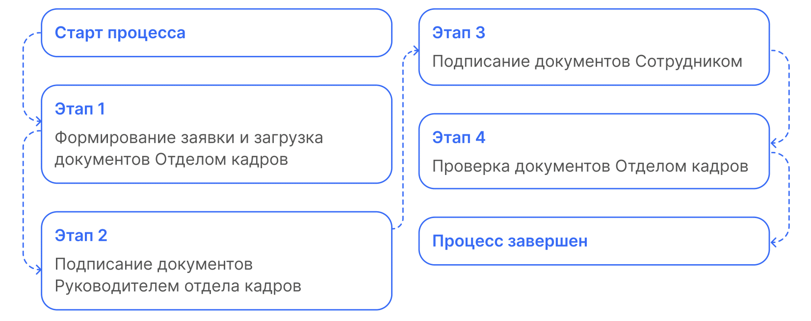

## Старт процесса

Процесс подписания приёма на работу Отдел кадров может стартовать со своей стороны с помощью **1С** или через **Сервисы компании веб-сервиса VK HR Tek**.

## Этап 1. Формирование заявки и загрузка документов Отделом кадров

## Работа через 1С

1. Сотрудник отдела кадров переходит в **1С** → **КЭДО** → **Рабочее место кадровика → Документы КЭДО**.

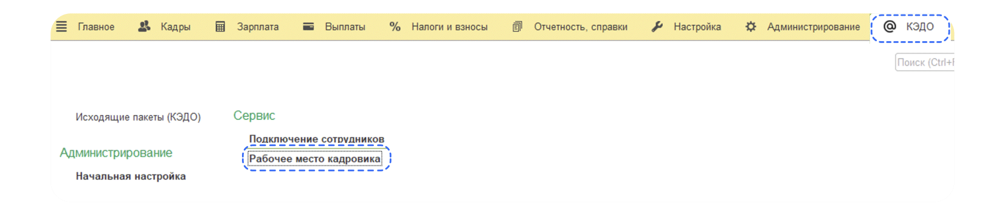

2. Сотрудник отдела кадров нажимает кнопку **Создать заявку**.
3. Заполняет поле **Сотрудник**.
4. Выбирает тип заявки **Прием на работу**.
5. Выбирает нужный документ 1С на компьютере.
6. Нажимает кнопку **Создать**.

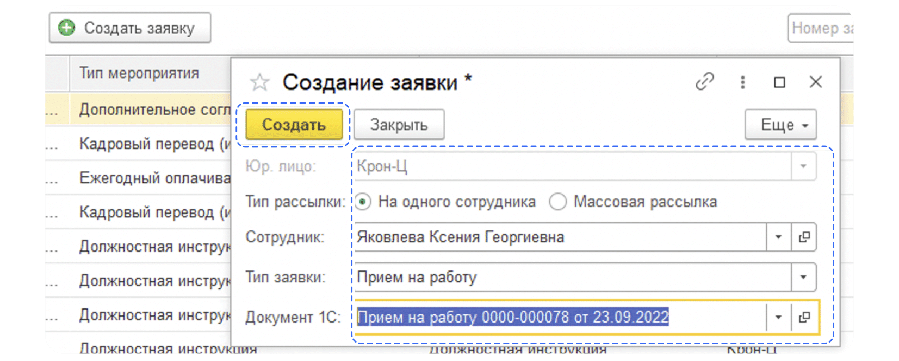

7. Указывает дату приёма на работу.
8. Нажимает кнопку **Загрузить**.

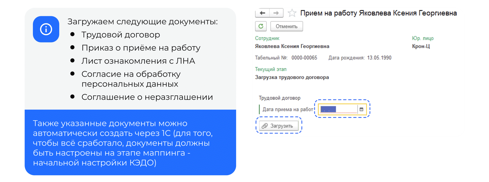

9. Переходит в нужную заявку и нажимает кнопку **Создать документ**.

## Работа через веб-сервис

1. Отдел кадров переходит в **Сервисы компании веб-сервиса VK HR Tek**.
2. Переходит в раздел **Заявки** и нажимает кнопку **Создать заявку**.

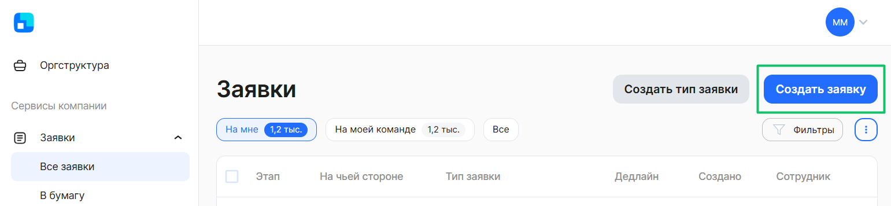

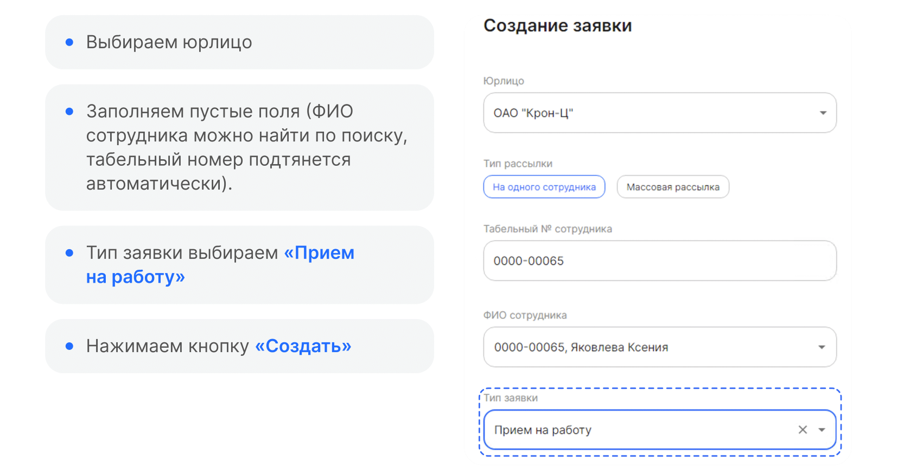

<warn>

На этом шаге нужно будет загрузить все документы, которые предусмотрены в этапе загрузки документов отделом кадров.

</warn>

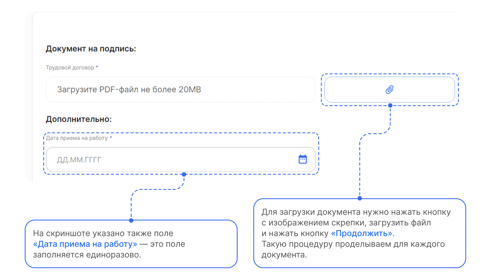

## Этап 2. Подписание документов Руководителем отдела кадров

Руководитель отдела кадров может работать с заявкой и в **1С**, и в **Сервисах компании веб-сервиса**.

## Работа через 1С

1. Сотрудник отдела кадров переходит в **1С** → **КЭДО** → **Рабочее место кадровика**.

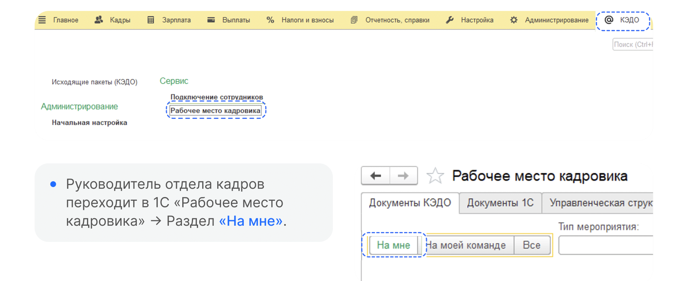

2. Открывает нужную заявку.
3. Нажимает кнопку **Подписать**.
4. Подтверждает кнопкой **Подписать**.

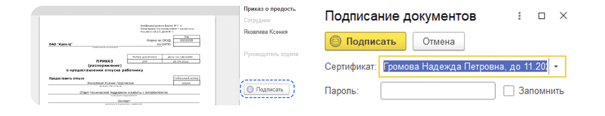

## Работа через веб-сервис

1. Руководитель отдела кадров переходит в **Сервисы компании веб-сервиса** → раздел **Заявки → На мне**.
2. Выбирает нужную заявку и нажимает кнопку **Подписать все**.

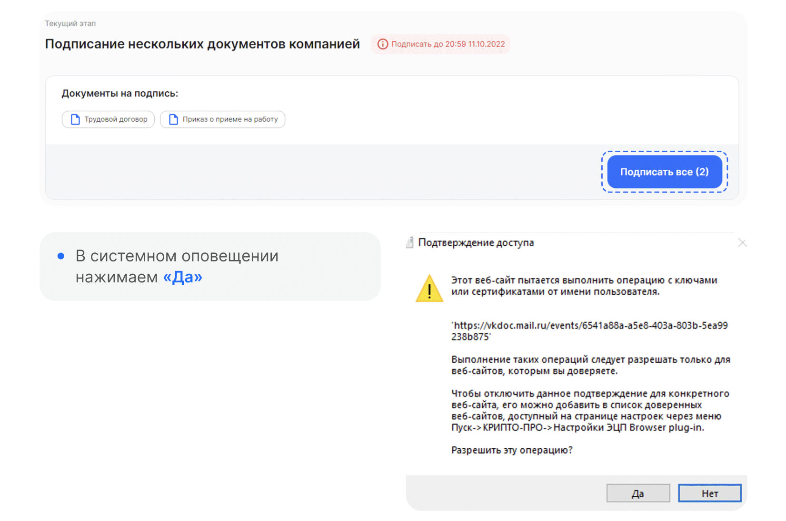

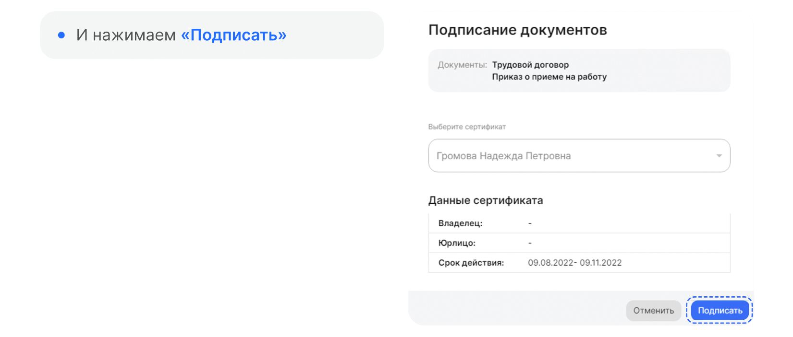

## Этап 3. Подписание документов Сотрудником

Сотруднику поступает уведомление на телефон о том, что нужно подписать документ.

## Работа через веб-сервис
1. Сотрудник переходит в **Сервисы сотрудника в веб-сервисе** и открывает заявку.

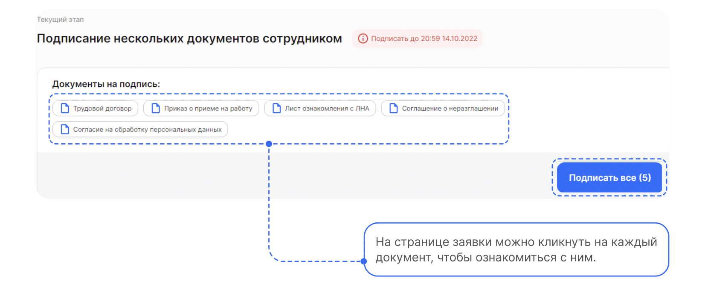

2. Нажимает кнопку **Подписать**.

## Этап 4. Проверка документов Отделом кадров

## Работа через 1С

1. Сотрудник отдела кадров переходит в **1С** → **КЭДО** → **Рабочее место кадровика**.

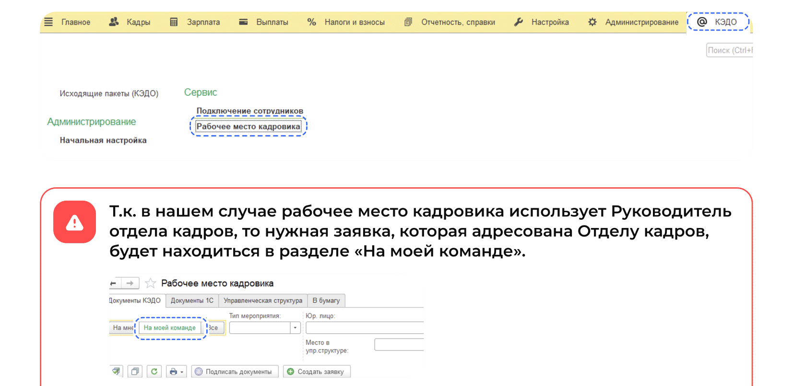

Если в рабочем месте кадровика будет работать сотрудник отдела кадров, то заявки будут отображаться в разделе **На мне**.

2. Сотрудник отдела кадров заходит внутрь заявки и нажимает кнопку **Подтвердить**.

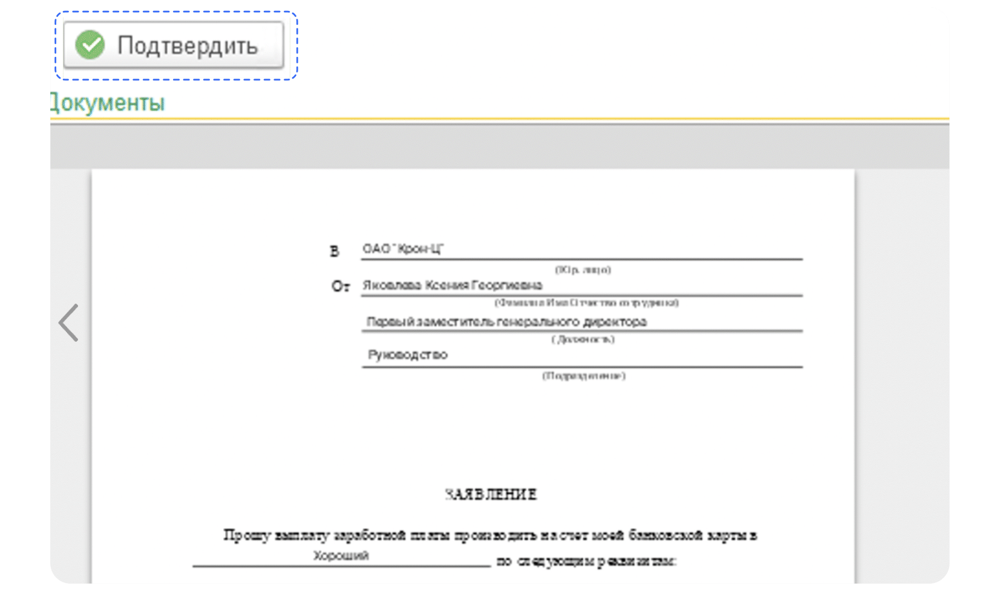

3. Переходит в **Сервисы компании веб-сервиса**, в раздел **Заявки**.
4. Выбирает нужную заявку и нажимает кнопку **Подтвердить**.

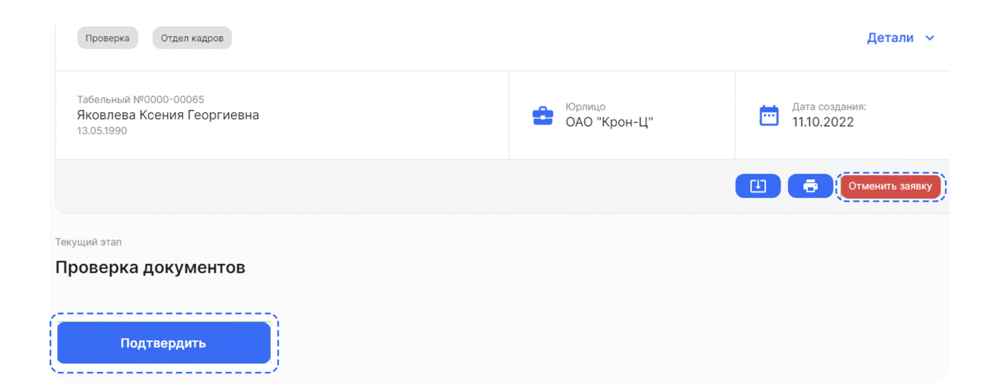
