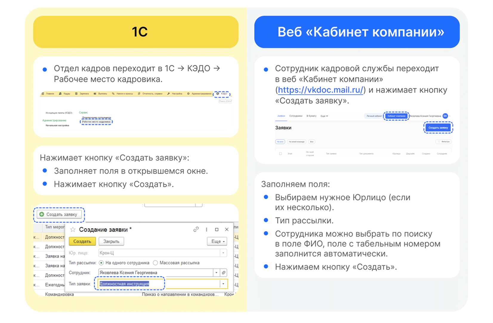

# Процесс «Должностная инструкция»

## Старт процесса

Процесс подписания дополнительного соглашения к трудовому договору Отдел кадров может стартовать со своей стороны с помощью **1С** или через **Сервисы компании веб-сервиса VK HR Tek**.

## Этап 1. Формирование заявки и загрузка документов Отделом кадров

## Этап 2. Подписание документов Руководителем отдела кадров

Руководитель отдела кадров может работать с заявкой и в **1С**, и в **Сервисах компании веб-сервиса VK HR Tek**.

## Этап 3. Подписание документов Сотрудником

1. Сотруднику поступает уведомление на телефон о том, что нужно подписать документ.
2. Сотрудник переходит в **Сервисы сотрудника в веб-сервисе**, в раздел **Заявки**.

3. Открывает заявку.
4. Нажимает кнопку **Подписать**.

5. Вводит код из смс и нажимает кнопку **Подписать**.

