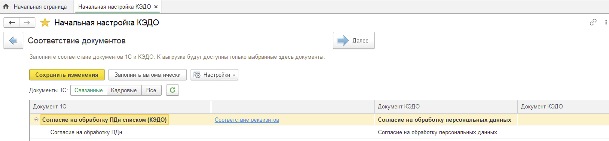
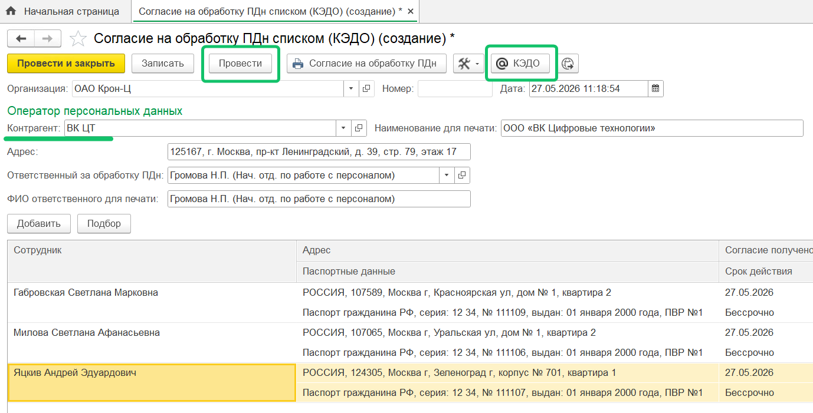
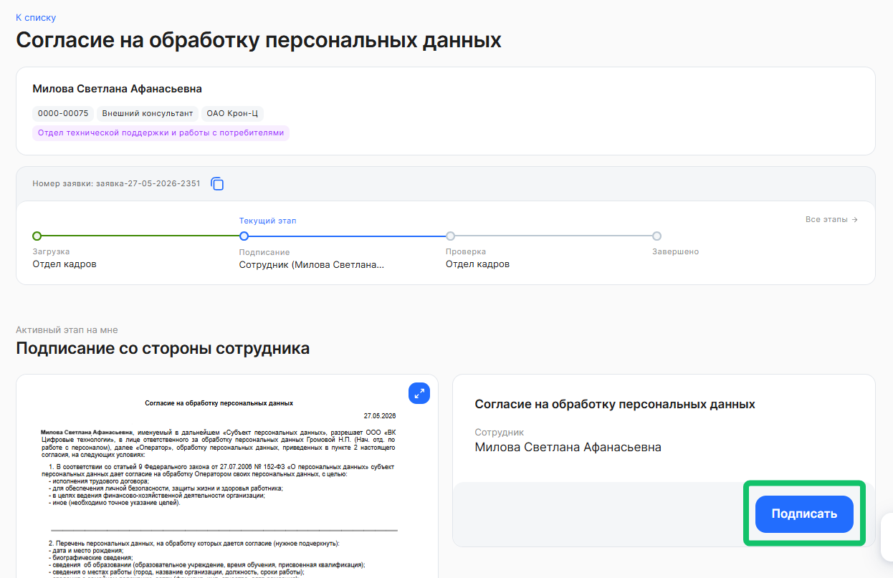
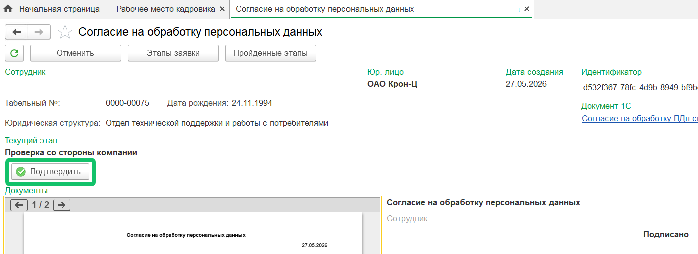
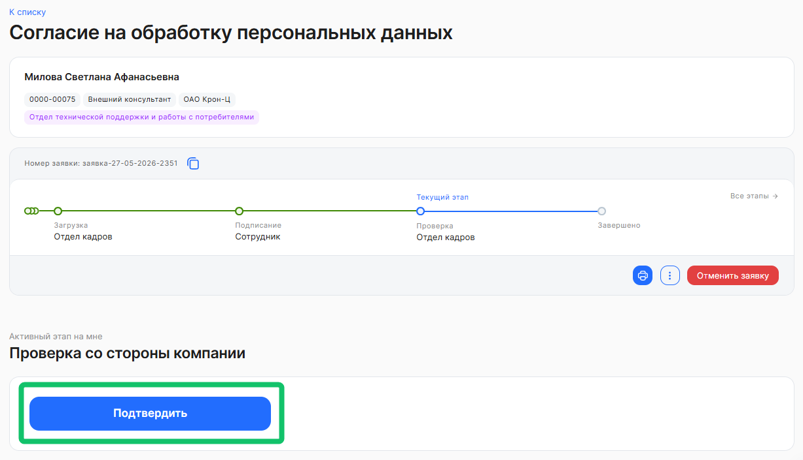

## Старт процесса

Процесс **Согласие на обработку персональных данных** Отдел кадров стартует со своей стороны в **1С**.

Для корректной работы бизнес-процесса, в разделе **КЭДО → Начальная настройка → Соответствие документов** сопоставьте документ 1С «Согласие на обработку ПДн списком (КЭДО)» с документом КЭДО «Согласие на обработку персональных данных».

## Этап 1. Загрузка документа Отделом кадров

Отдел кадров создает документ «Согласие на обработку ПДн списком (КЭДО)» для получения согласий сотрудников на использование КЭДО по списку сотрудников подразделения при юридической/управленческой оргструктуре. Сотрудникам будут отправлены печатные формы этих согласий через пакетную заявку в КЭДО.

В качестве оператора персональных данных в документе нужно выбрать контрагента ВК ЦТ, автоматически заполнится наименование для печати — ООО «ВК Цифровые технологии». По вопросу заполнения данных о контрагенте вы можете обратиться в [службу поддержки VK HR Tek](/ru/hr/support/contact_channels).

Чтобы создать этот документ, пользователь должен иметь хотя бы одну из ролей в 1С: «Рабочее место (КЭДО)», «Администратор (КЭДО)», «Полные права».

Проведите документ, а затем отправьте в КЭДО, используя кнопку **КЭДО**.

Массовая рассылка создается разово на группу сотрудников, при этом на каждого сотрудника формируется своя заявка.

## Этап 2. Подписание документа Сотрудником

1. Сотруднику поступает уведомление о том, что нужно подписать документ. 
2. Сотрудник переходит в раздел **Мои сервисы** → **Заявки** веб-сервиса.
3. Открывает заявку с согласием на обработку персональных данных.
4. Нажимает кнопку **Подписать**. Тип подписи: ПЭП.

## Этап 3. Проверка документа Отделом кадров

Отдел кадров может работать с заявкой и в 1С → **Рабочее место кадровика**, и в **Сервисaх компании** → **Заявки** веб-сервиса VK HR Tek.

На этапе проверки согласия специалист Отдела кадров нажимает кнопку **Подтвердить**.  

