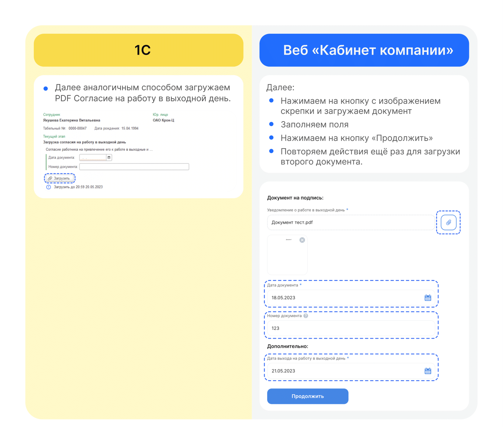

# Процесс «Работа в выходной день»

## Маппинг

1. На этапе формирования документов в заявке некоторые документы можно сформировать автоматически. Для этого в начальных настройках нужно проставить соответствие документов (маппинг). Сотрудник переходит в **КЭДО** → **Начальная настройка КЭДО** → **Соответствие документов**.
2. В колонке **Документ КЭДО** кликает два раза по полю напротив нужного документа 1С и нажимает троеточие.

3. Выбирает нужный процесс и нажимает **ОК**.
4. По тому же принципу выбирает документ.
5. Далее нажимает **Сохранить изменения**.

6. Если нужно удалить соответствие, кликает два раза на процессе, далее правой клавишей мыши и **Очистить**.

## Старт процесса

## Этап 1. Формирование заявки и загрузка документов Отделом кадров

Отдел кадров может работать с заявкой и в **1С** и в **Сервисах компании веб-сервиса VK HR Tek**.

## Этап 2. Подписание документов Руководителем отдела кадров

Руководитель отдела кадров может работать с заявкой и в **1С**, и в **Сервисах компании веб-сервиса VK HR Tek**.

## Этап 3. Подписание документов Сотрудником

1. Сотруднику поступает уведомление на телефон о том, что нужно подписать документ. 
2. Сотрудник переходит в **Сервисы сотрудника в веб-сервисе**.
3. Открывает заявку.
4. Нажимает **Подписать**.

<info>

В заявке указан дедлайн, до которого необходимо подписать документ.

 </info>

## Этап 4. Загрузка приказа отделом кадров

Отдел кадров может работать с заявкой и в **1С** и в вебе **Сервисах компании веб-сервиса VK HR Tek**.

## Работа через 1С

Чтобы загрузить документ в формате PDF файла, специалист должен нажать кнопку **Загрузить** в форме заявки.

Наиболее удобный вариант: использовать кнопку **Создать документ** для автоматического создания документа из 1С.

<info>

Чтобы увидеть кнопку **Создать документ**, необходимо прокрутить страницу вверх.

</info>

Специалист оформляет работу в выходной день:
1. Нажимает кнопку **Провести**.
2. Далее **КЭДО**.
3. В окне выбора нажимает **Отправить в КЭДО**.
4. Справа внизу появится сообщение **Отправка завершена**.

## Этап 5. Подписание приказа отделом кадров

Руководитель отдела кадров может работать с заявкой и в **1С**, и в **Сервисах компании веб-сервиса VK HR Tek**.

<warn>

</warn>

## Этап 5. Подписание приказа сотрудником

1. Сотруднику поступает уведомление на телефон о том, что нужно подписать документ. Сотрудник переходит в **Сервисы сотрудника в веб-сервисе**.
2. Открывает заявку.
3. Нажимает **Подписать**.

