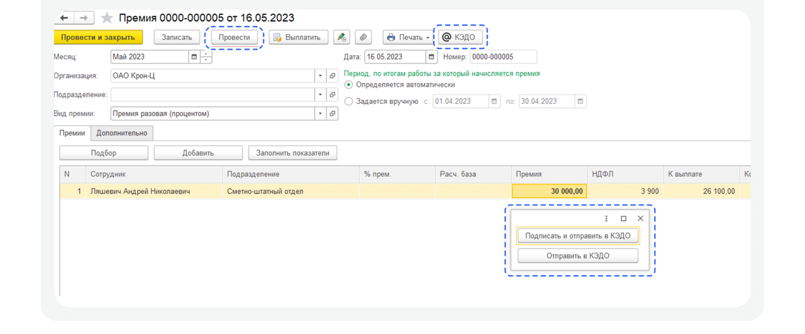
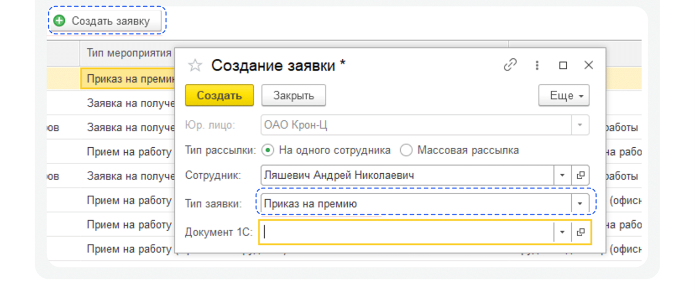
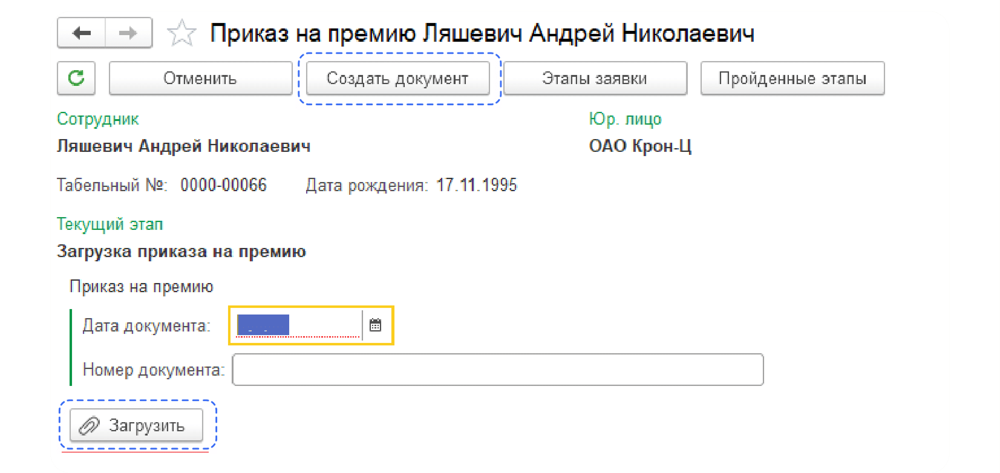
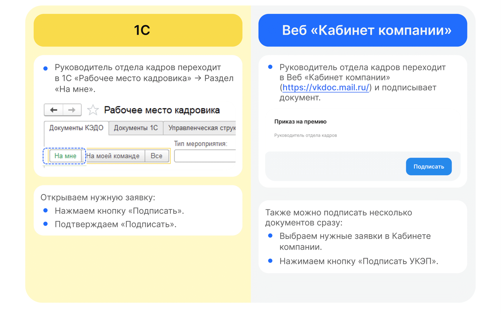
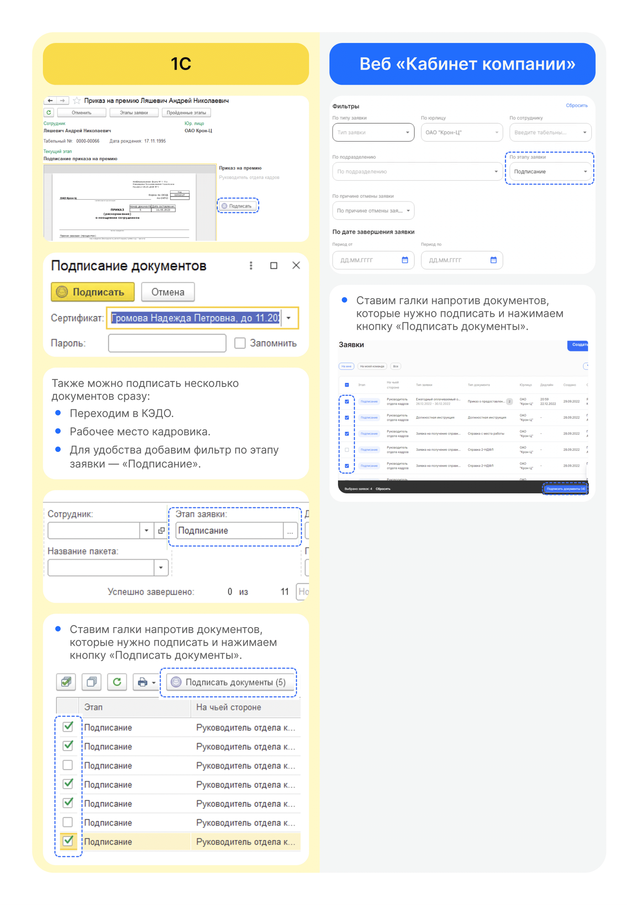

# Процесс «Приказ на премию»

## Этап 1. Загрузка приказа сотрудниками Отдела кадров
Есть два варианта добавления приказа в **1С**. С помощью создания документа через **1С** → раздел **Кадры → Премии** или с помощью кнопки **Создать заявку** в **Рабочем месте кадровика**.

## Вариант 1. Создание документа через 1С

1. Сотрудник отдела кадров переходит в **1С** → **Кадры** → **Премии**.
4. Открывает нужный документ и проводит премию.
5. Нажимает кнопку **КЭДО**.
6. И нажимает кнопку **Отправить в КЭДО**.

## Вариант 2. Создание документа через КЭДО

1. Сотрудник Отдела кадров заходит в **1С** → **КЭДО** → **Рабочее место кадровика**.
4. Нажимает кнопку **Создать заявку**.
5. В появившемся окне заполняет пустые поля **Сотрудник**, **Тип заявки** выбирает **Приказ на премию**.
6. Нажимает кнопку **Создать**.

7. Далее у сотрудника с ролью **Отдел кадров** есть возможность **Загрузить** приказ или **Создать документ**.

## Этап 2. Подписание приказа Руководителем отдела кадров

Руководитель отдела кадров может работать с заявкой и в **1С**, и в **Сервисах компании веб-сервиса VK HR Tek**.

## Этап 3. Подписание приказа Сотрудником

1. Сотруднику поступает уведомление на телефон о том, что нужно подписать документ. 
2. Сотрудник переходит в Личный кабинет в **Сервисы сотрудника в веб-сервисе**.
3. Открывает заявку.
4. Нажимает **Подписать**.

<warn>

В заявке справа Сотрудник ознакамливается с приказом. В заявке указан дедлайн, до которого необходимо подписать документ.

</warn>

Чтобы подтвердить подписание документа, на телефон подступит смс-сообщение, номер из которого Сотрудник вводит в открывшемся окне и нажимает кнопку **Подписать**.
