# Процесс «Заявление о совмещении»

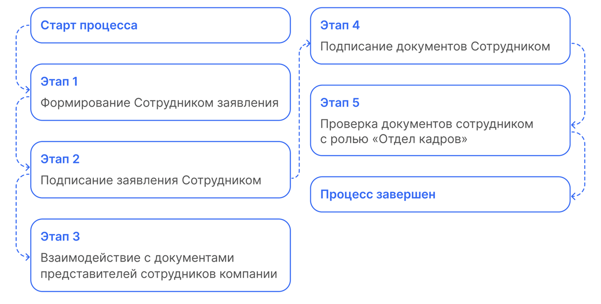

## Старт процесса

1. Чтобы подать заявление о совмещении Сотрудник заходит в **Сервисы сотрудника веб-сервиса VK HR Tek**, в раздел **Заявки**.
2. Нажимает кнопку **Создать заявку**.

3. Выбирает **Заявление о совмещении**.
4. Нажимает **Подтвердить**.

## Этап 1. Формирование Сотрудником заявления

1.  Сотрудник заполняет поля с должностью и датой совмещения.
6. Нажимает кнопку **Перейти к просмотру**.

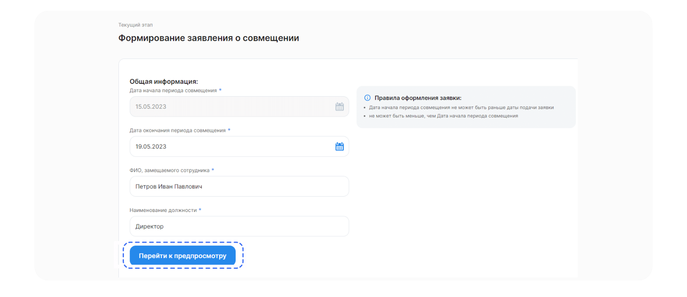

## Этап 2. Подписание заявления Сотрудником

1. Проверяет документ.
8. Нажимает **Подписать**.

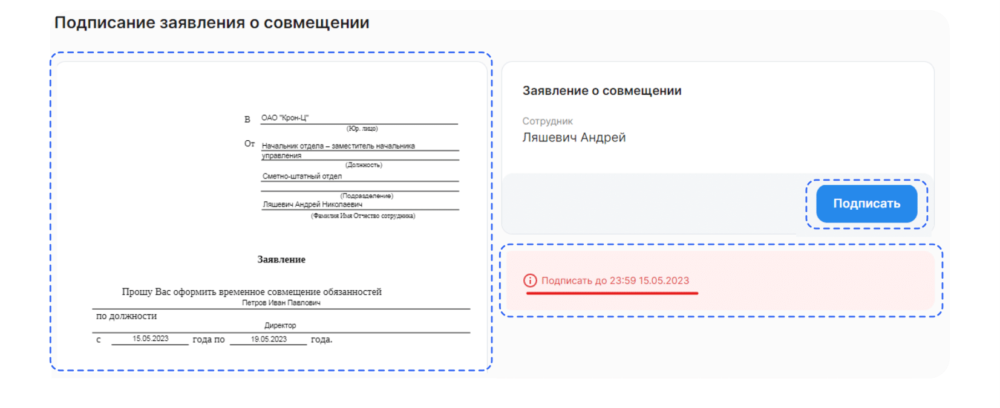

<info>

На странице расположены:
- Сформированный документ.
- Дедлайн, до которого нужно подписать документ.
- Кнопка **Подписать**.

</info>

3. Чтобы подтвердить подписание документа, на телефон поступит смс-сообщение, код из которого Сотрудник вводит в открывшемся окне и нажимает кнопку **Подписать**.

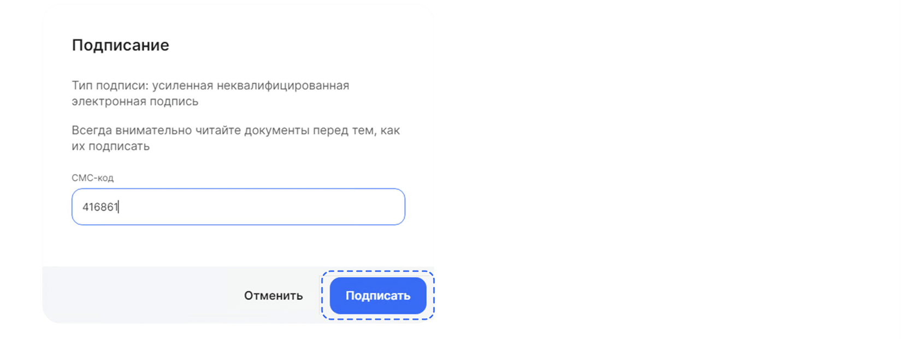

## Этап 3. Взаимодействие с документами представителей сотрудников компании

Сотрудники отдела кадров могут загружать документы двумя способами: через **1С** и через **Сервисы компании веб-сервиса**.

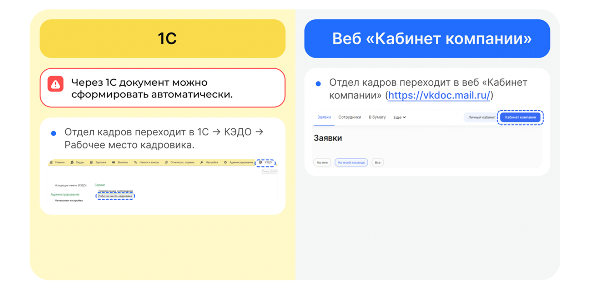

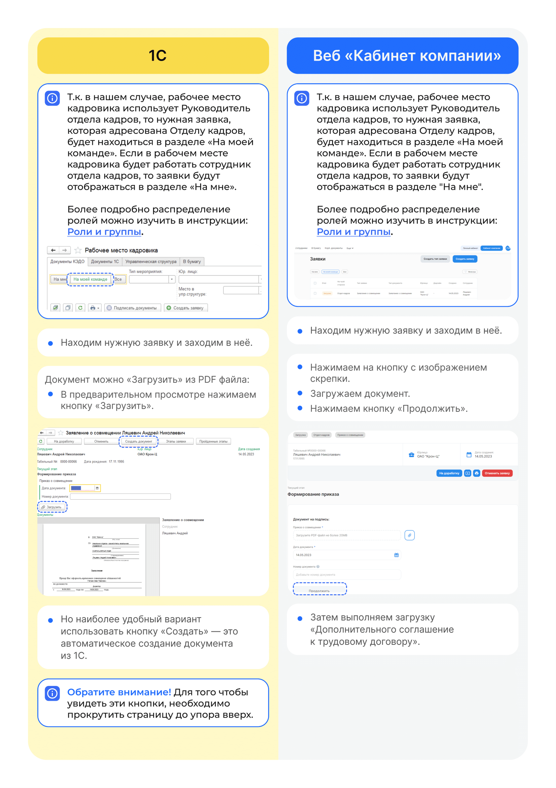

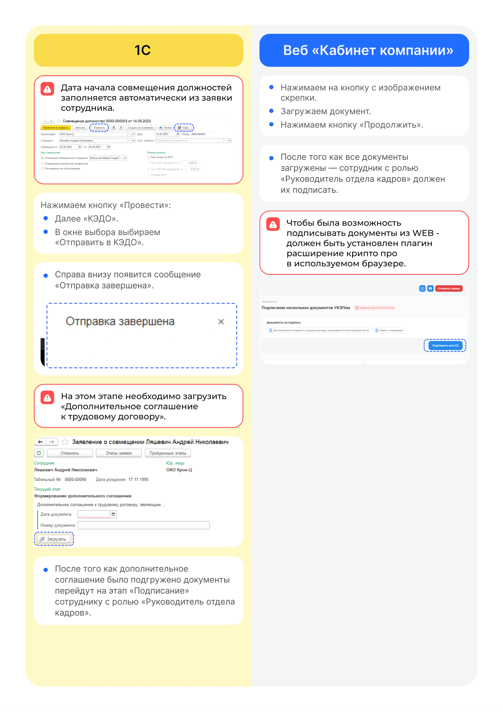

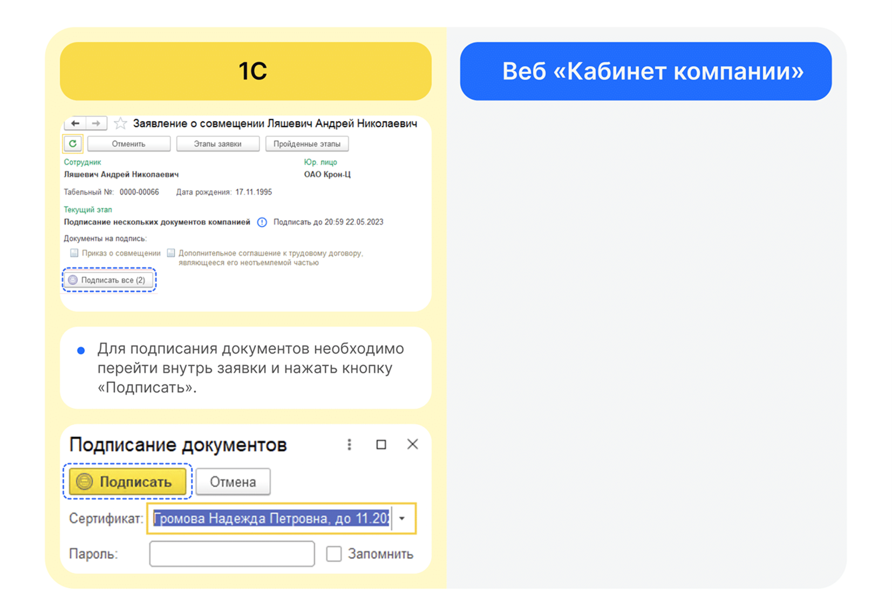

## Этап 4. Подписание документов Сотрудником

1. Сотруднику поступает уведомление на телефон о том, что нужно подписать документ. 
2. Сотрудник переходит в **Сервисы сотрудника в веб-сервисе**.
3. Открывает заявку.
4. Если всё верно, нажимает кнопку **Подписать все**.

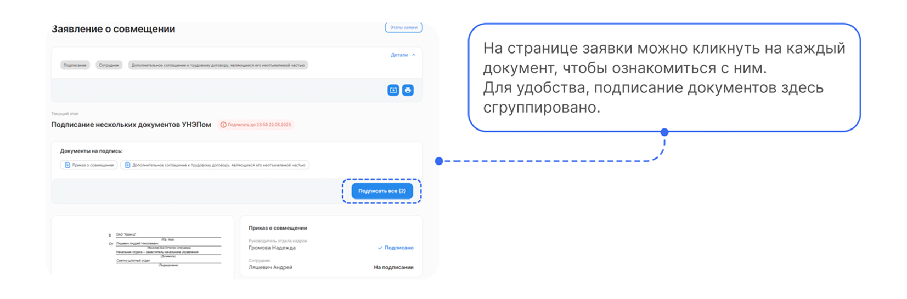

## Этап 5. Проверка документов сотрудником с ролью Отдел кадров

После подписания со стороны Сотрудника, этап перейдет на сотрудника с ролью **Отдел кадров** на ознакомление.

Сотруднику с ролью **Отдел кадров** переходит внутрь заявки и нажимает кнопку **Подтвердить**.

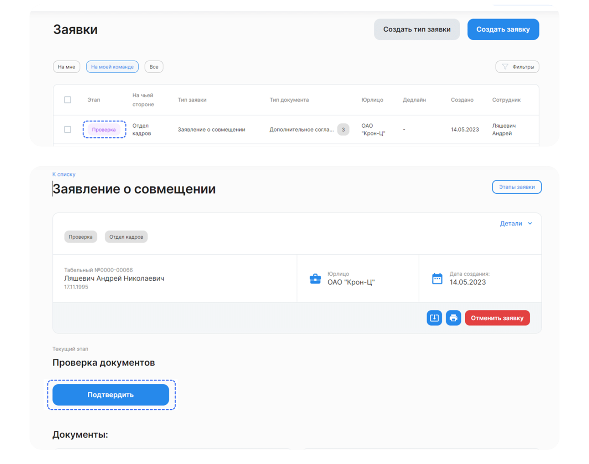

Аналогичные действия можно также выполнить через **1С** в **Рабочем месте кадровика**.

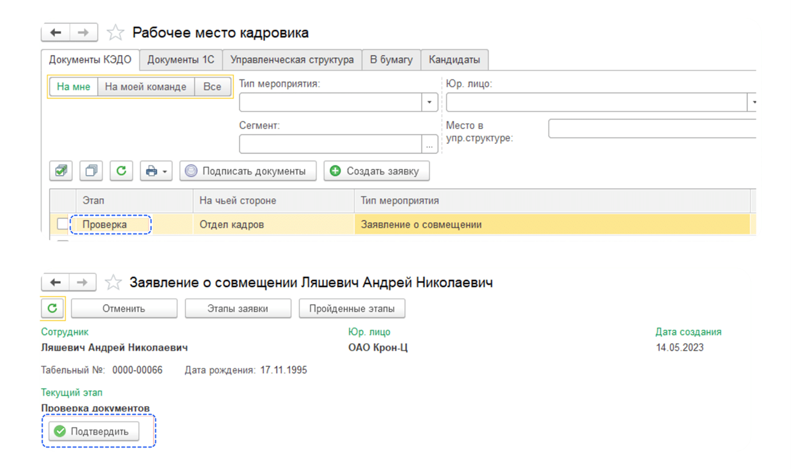