# Процесс «Заявление о совмещении»

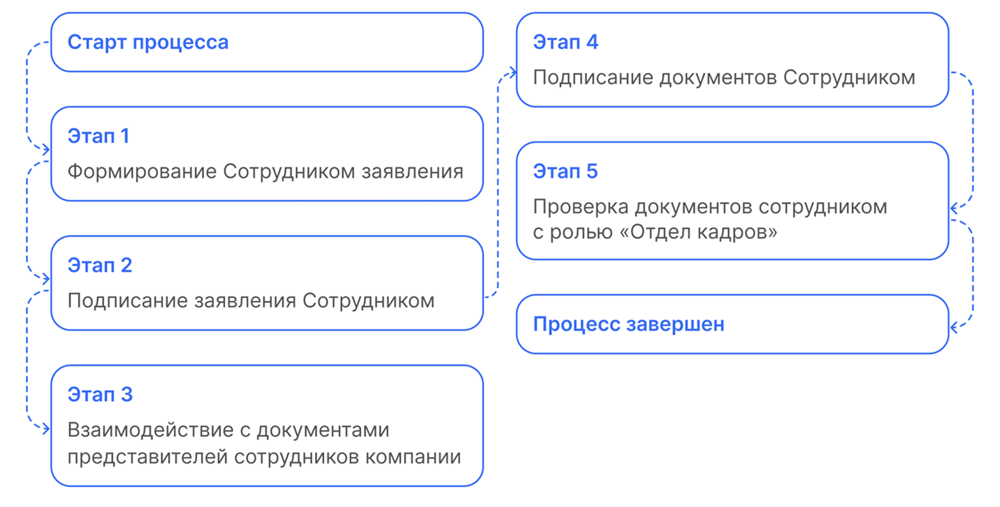

Для документа 1С **Премия** должен быть настроен следующий вариант маппинга:

## Старт процесса

1. Чтобы подать заявление о совмещении Сотрудник заходит в **Мои сервисы веб-сервиса VK HR Tek**, в раздел **Заявки**.
2. Нажимает кнопку **Создать заявку**.

3. Выбирает **Заявление о совмещении**.
4. Нажимает **Создать**.

## Этап 1. Формирование Сотрудником заявления

1. Сотрудник заполняет поля с должностью и датой совмещения.
6. Нажимает кнопку **Перейти к просмотру**.

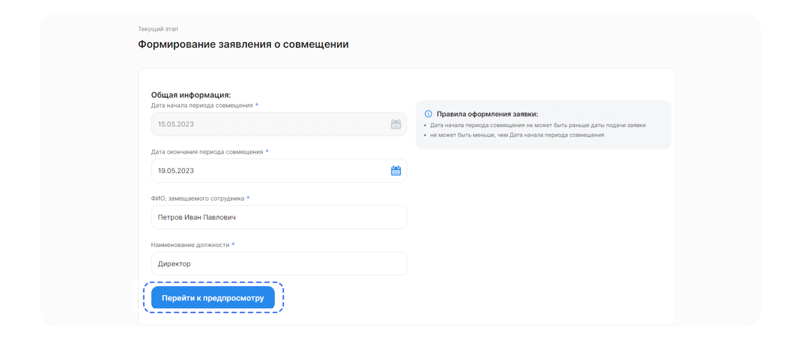

Шаблон заявления
 

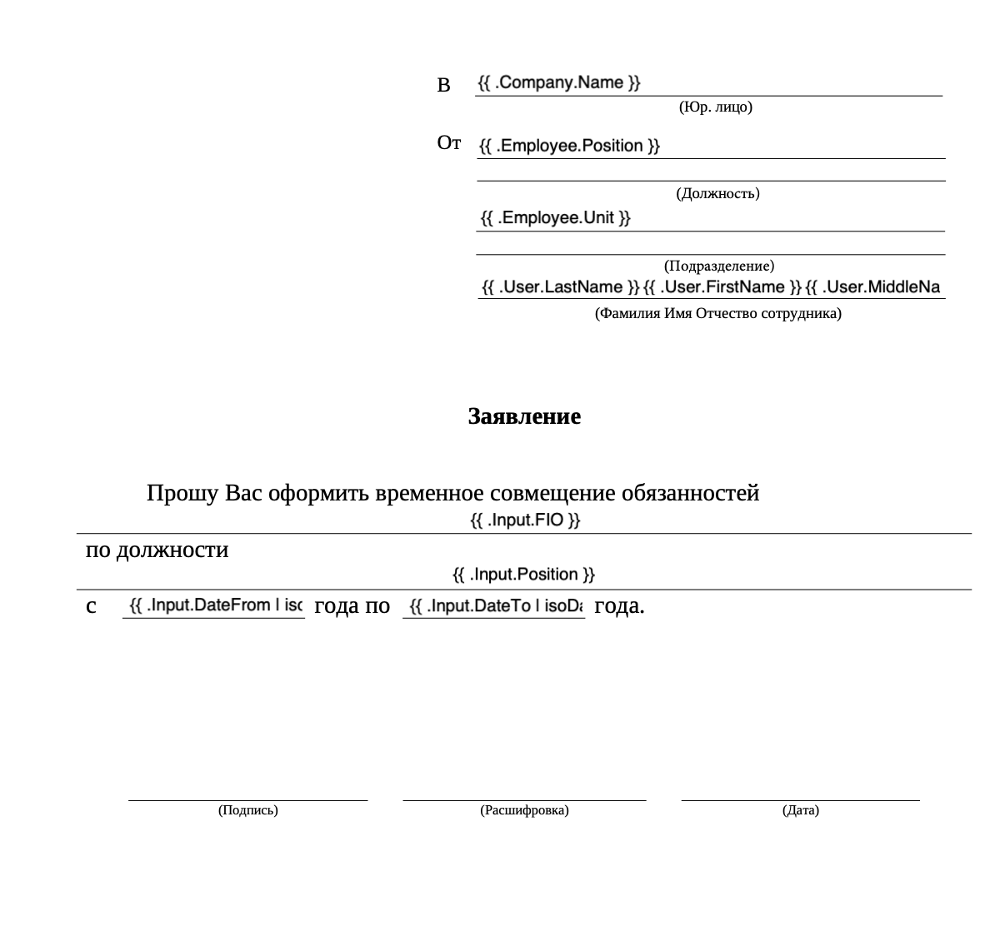

## Этап 2. Подписание заявления Сотрудником

1. Проверяет документ.
8. Нажимает **Подписать**. Тип подписи: ПЭП.

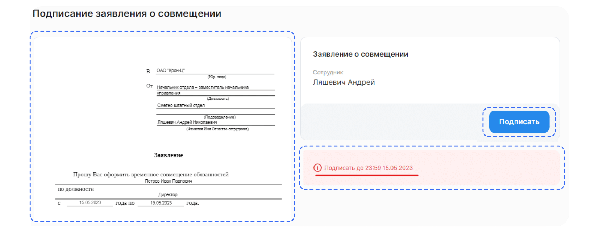

## Этап 3. Взаимодействие с документами представителей компании

Руководитель сотрудника проверяет и подтверждает заявку.

Специалисты Отдела кадров могут загружать документы двумя способами: через **1С** и через **Сервисы компании веб-сервиса**.

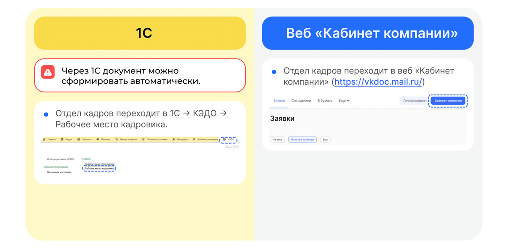

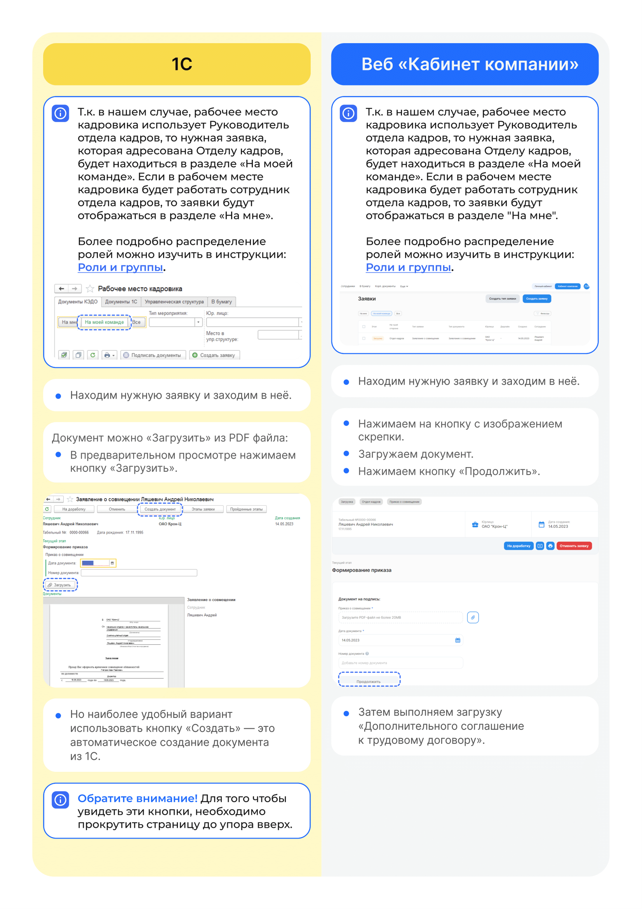

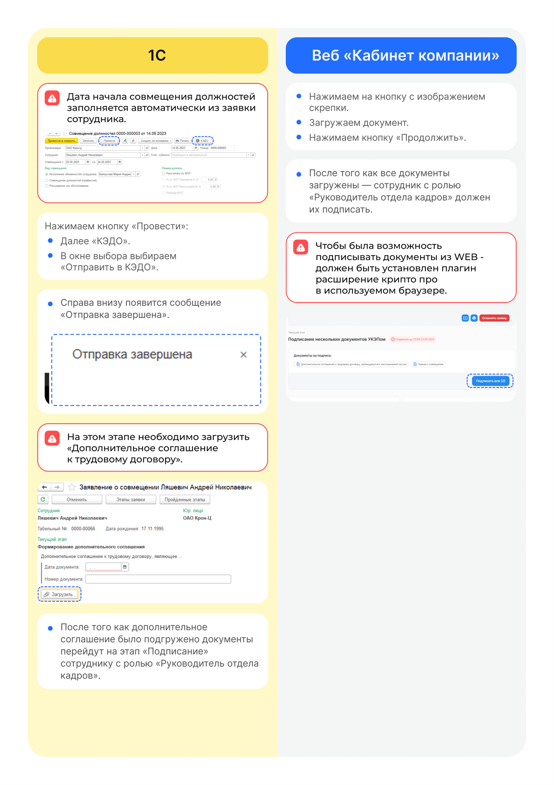

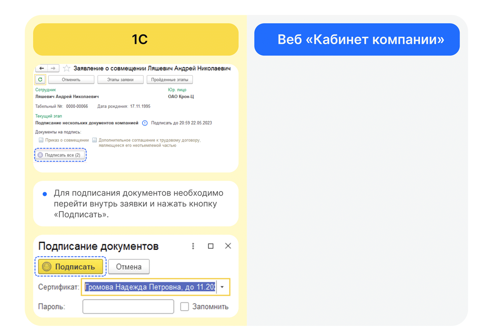

## Этап 4. Подписание документов Сотрудником

1. Сотруднику поступает уведомление на телефон о том, что нужно подписать документ. 
2. Сотрудник переходит в **Мои сервисы в веб-сервисе**, в раздел **Заявки**.
3. Открывает заявку.
4. Если всё верно, нажимает кнопку **Подписать все**.

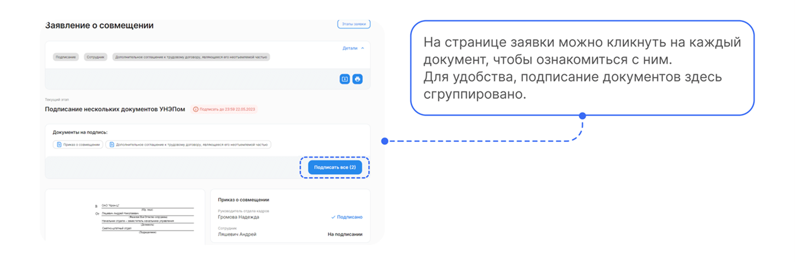

## Этап 5. Проверка документов Отделом кадров

После подписания со стороны Сотрудника, этап перейдет к **Отделу кадров** на ознакомление.

Специалист **Отдела кадров** открывает заявку и нажимает кнопку **Подтвердить**.

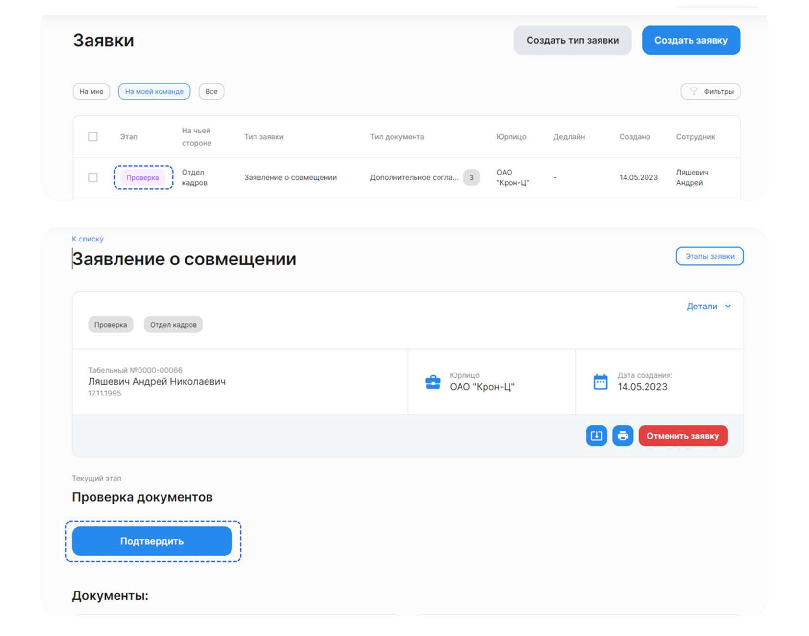

Аналогичные действия можно также выполнить через **1С** в **Рабочем месте кадровика**.

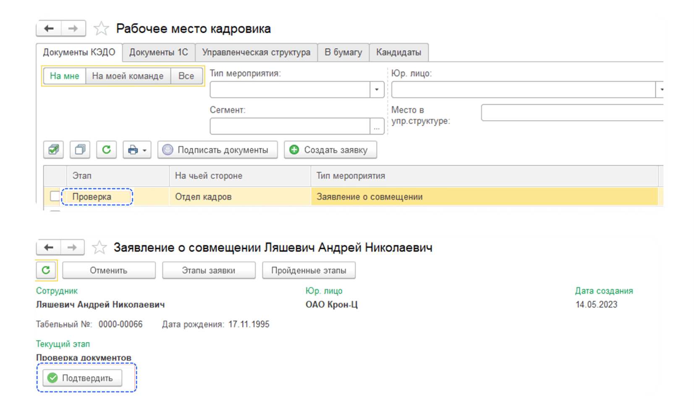