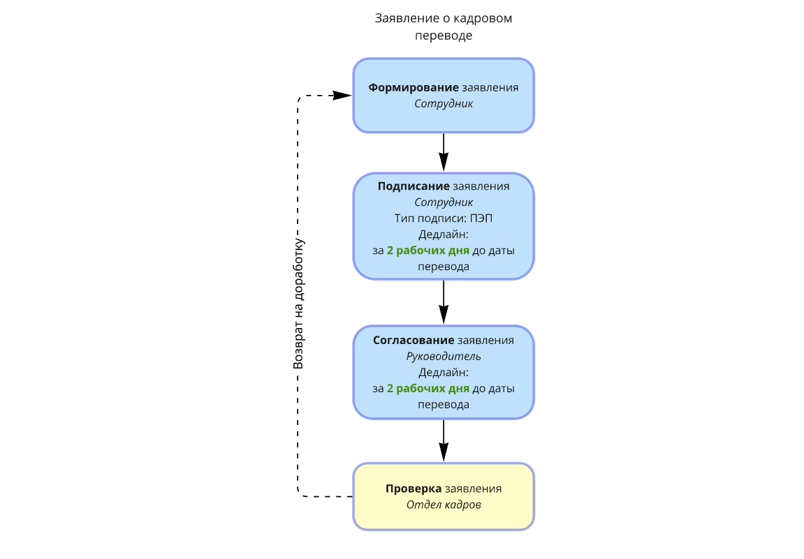
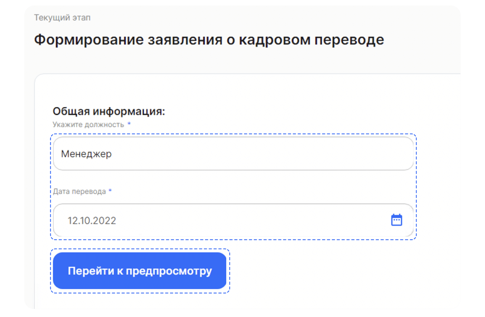
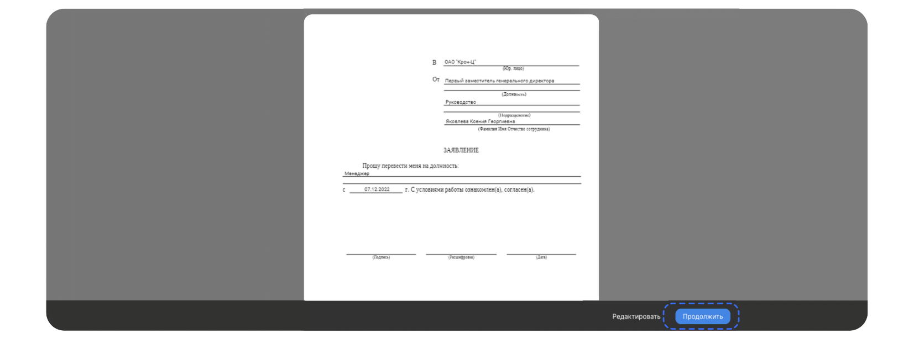
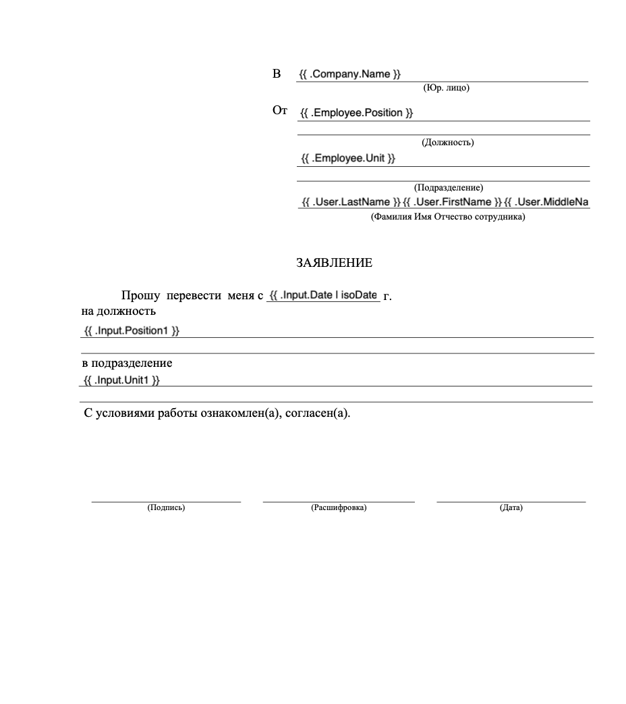
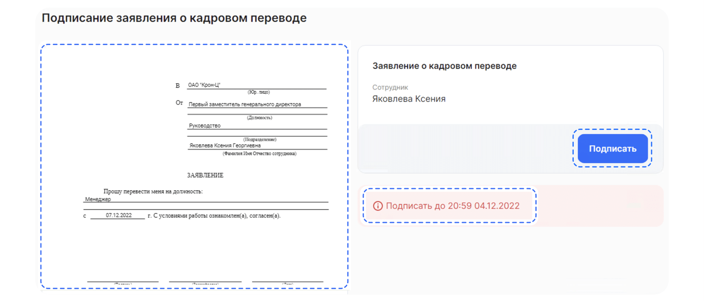
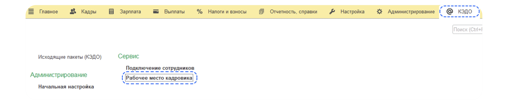
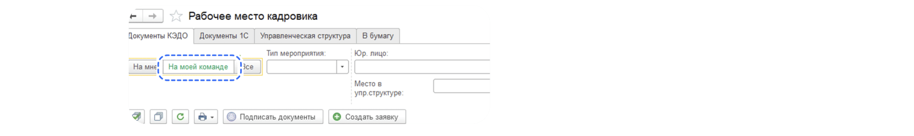
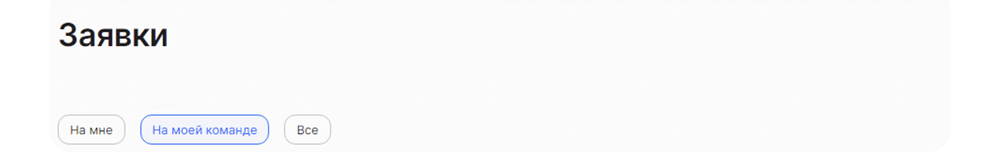
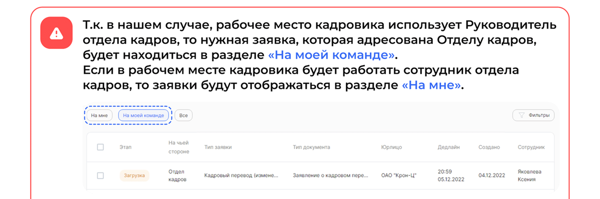
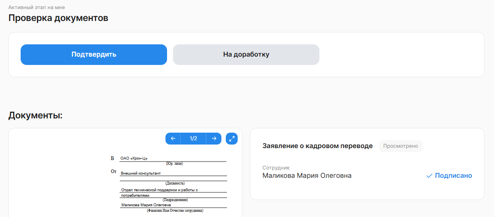

 

## Старт процесса

1. Чтобы подать заявление на кадровый перевод Сотрудник заходит в **Мои сервисы** веб-сервиса VK HR Tek, в раздел **Заявки**.
2. Нажимает кнопку **Создать заявку**.

3. Выбирает **Заявление о кадровом переводе**.
4. Нажимает **Создать**.

## Этап 1. Формирование Сотрудником заявления

1. Сотрудник заполняет поля с должностью, подразделением и датой перевода. Дата перевода не может быть раньше, чем через 2 рабочих дня после даты подачи заявки.
6. Нажимает **Перейти к предпросмотру**.

<info>

Данные по сотруднику в заявлении заполняются автоматически.

</info>

3. Нажимает кнопку **Продолжить**.

Шаблон заявления
 

## Этап 2. Подписание заявления Сотрудником

Сотрудник проверяет документ и нажимает кнопку **Подписать**. Тип подписи: ПЭП.

## Этап 3. Согласование заявления Руководителем

Руководитель сотрудника проверяет и подтверждает заявку в **Сервисах компании**.

Если у сотрудника по каким-то причинам отсутствует руководитель, то процесс сразу переходит на следующий этап — Проверка заявки Отделом кадров.

## Этап 4. Согласование заявления Отделом кадров

## Работа через 1С

1. Отдел кадров переходит в **1С** → **КЭДО** → **Рабочее место кадровика**.

<warn>

Если **Рабочее место кадровика** использует Руководитель отдела кадров, то нужная заявка, которая адресована Отделу кадров, будет находиться на вкладке **На моей команде**. Если в **Рабочем месте кадровик** будет работать сотрудник отдела кадров, то заявки будут отображаться на вкладке **На мне**.

</warn>

2. Кадровый специалист находит нужную заявку и заходит в неё.
3. Нажимает кнопку **Подтвердить** — если заявление корректно, или **На доработку** — если в заявлении есть ошибки.

## Сервисы компании веб-сервиса VK HR Tek

1. Отдел кадров переходит в **Сервисы компании веб-сервиса**, в раздел **Заявки**.

2. Находит нужную заявку и заходит в неё.
3. Нажимает кнопку **Подтвердить** — если заявление корректно, или **На доработку** — если в заявлении есть ошибки.

