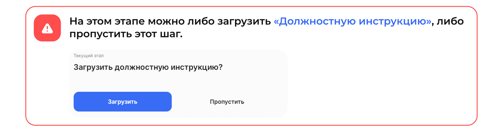
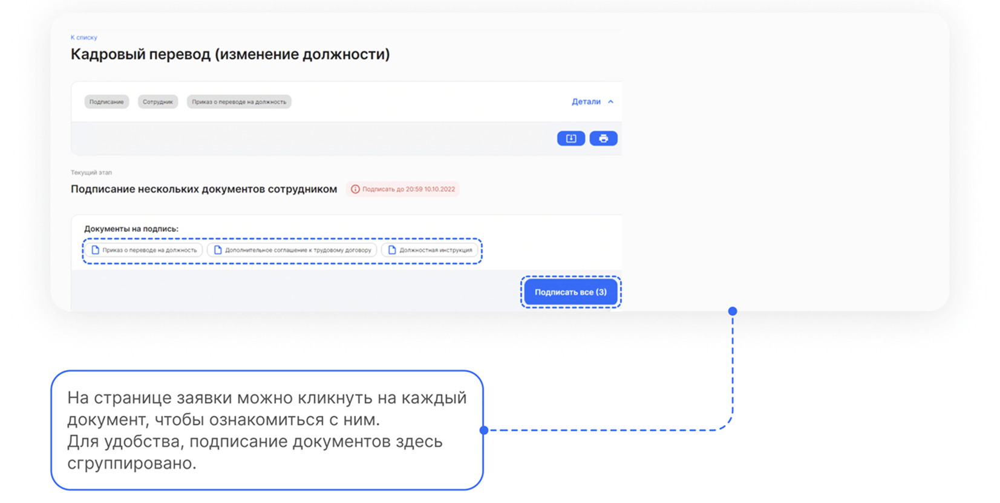

# Процесс «Кадровый перевод»

 

## Старт процесса

1. Чтобы подать заявление на кадровый перевод Сотрудник заходит в **Сервисы сотрудника веб-сервиса VK HR Tek**, в раздел **Заявки**.
2. Нажимает кнопку **Создать заявку**.

3. Выбирает **Кадровый перевод**.
4. Нажимает **Подтвердить**.

## Этап 1. Формирование Сотрудником заявления

1. Сотрудник заполняет поля с должностью и датой перевода.
6. Нажимает **Перейти к предпросмотру**.

<info>

Данные по сотруднику в заявлении заполняются автоматически.

</info>

3. Нажимает кнопку **Продолжить**.

## Этап 2. Подписание заявления Сотрудником

1. Проверяет документ и нажимает кнопку **Подписать**.

<info>

На странице расположены:
- Сформированный документ.
- Дедлайн, до которого нужно подписать документ.
- Кнопка **Подписать**.

</info>

9. Вводит код из смс и нажимает кнопку **Подписать**.

## Этап 3. Загрузка документов Отделом кадров

Сотрудники отдела кадров могут загружать документы двумя способами: через **1С** и через **Сервисы компании веб-сервиса VK HR Tek**.

<warn>

Через 1С документ можно сформировать автоматически.

</warn>

## Работа через 1С

1. Отдел кадров переходит в **1С** → **КЭДО** → **Рабочее место кадровика**.

<warn>

Если **Рабочее место кадровика** использует Руководитель отдела кадров, то нужная заявка, которая адресована Отделу кадров, будет находиться на вкладке **На моей команде**. Если в **Рабочем месте кадровик** будет работать сотрудник отдела кадров, то заявки будут отображаться на вкладке **На мне**.

</warn>

2. Кадровый специалист находит нужную заявку и заходит в неё.
3. Документ можно **Загрузить** из PDF файла.
4. В предварительном просмотре нажимает кнопку **Загрузить**.

5. Наиболее удобный вариант использовать кнопку **Создать документ** для автоматического создания документа из 1С.

<info>

Чтобы увидеть кнопку **Создать документ**, необходимо прокрутить страницу вверх заявки.

</info>

6. Нажимает кнопку **Провести**.
7. Нажимает кнопку **КЭДО**.
7. В открывшемся окне выбирает действие **Отправить в КЭДО**.

9. Справа внизу появится сообщение **Отправка завершена**.

<warn>

На этом этапе можно либо загрузить **Должностную инструкцию**, либо пропустить этот шаг.

</warn>

Если нажать кнопку **Пропустить**, то заявка перейдет на следующий этап *Подписание документов Руководителем отдела кадров*.

Чтобы загрузить должностную инструкцию специалист нажимает кнопку **Загрузить** и выбирает документ формата PDF на компьютере.

## Сервисы компании веб-сервиса VK HR Tek

1. Отдел кадров переходит в веб **Сервисы компании веб-сервиса**, в раздел **Заявки**.

2. Находит нужную заявку и заходит в неё.
3. Нажимает на кнопку с изображением **Скрепки**.

4. Загружает документ.
5. Нажимает кнопку **Продолжить**.

6. Если специалист нажимает кнопку **Пропустить**, то заявка перейдет на следующий этап *Подписание документов Руководителем отдела кадров*.
7. Если специалист нажимает кнопку **Загрузить**, то необходимо выбрать документ формата PDF на компьютере. После чего, нажимает кнопку **Продолжить**.

## Этап 4. Подписание документов Руководителем отдела кадров

Руководитель отдела кадров может работать с заявкой и в 1С, и в **Сервисах компании веб-сервиса**.

 

## Этап 5. Подписание документов Сотрудником

1. Сотруднику поступает уведомление на телефон о том, что нужно подписать документ. 
2. Переходит в Личный кабинет в **Сервисы сотрудника в веб-сервисе**.
3. Открывает заявку.
4. Если всё верно, нажимает кнопку **Подписать все**.

