# Процесс «Выписка из табеля учета рабочего времени»

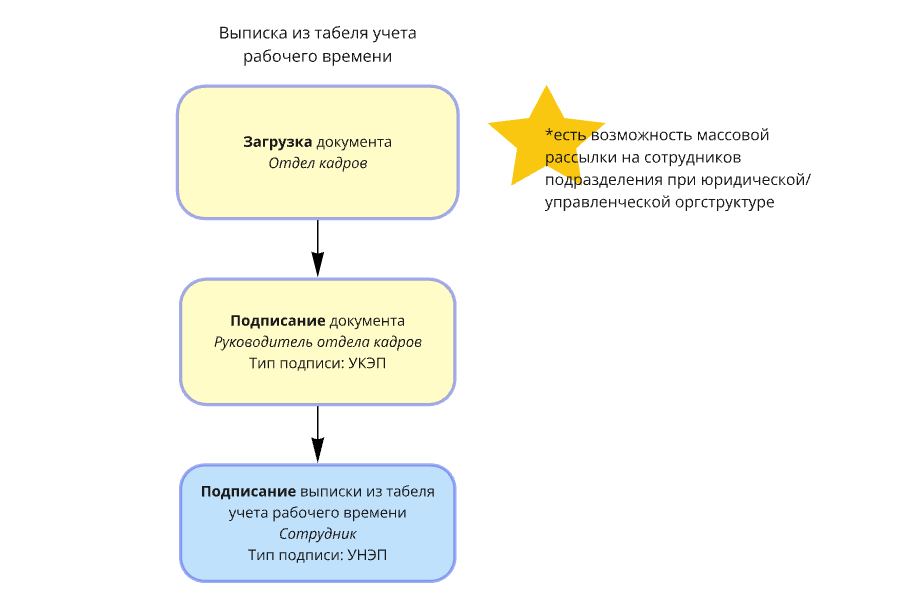

## Маппинг. Соответствие документов

1. На этапе формирования документов в заявке некоторые документы можно сформировать автоматически. Для этого в начальных настройках Сотрудник проставляет соответствие документов (маппинг).
2. Переходит в **КЭДО** → **Начальная настройка КЭДО** → **Соответствие документов**.
3. В колонке **Документ КЭДО** кликает два раза по полю напротив нужного документа **1С** и нажимает троеточие.

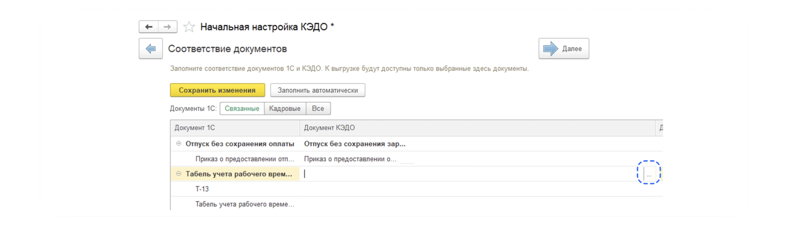

4. Для документа 1С **Табель учета рабочего времени** выбирает процесс **Выписка из табеля учета рабочего времени**.

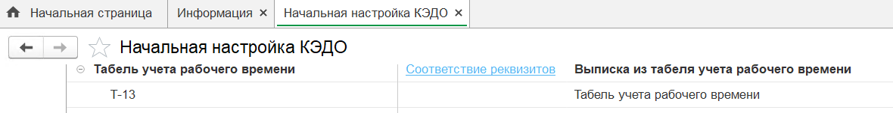

5. Далее **Сохранить изменения**.

 

## Старт процесса

1. Чтобы подать заявку на расчетный листок специалист Отдела кадров переходит в **Сервисы компании** веб-сервиса VK HR Tek.
2. Нажимает кнопку **Создать заявку**.
3. Выбирает тип заявки **Выписка из табеля учета рабочего времени**.
4. Нажимает **Создать**.

## Этап 1. Загрузка приказа сотрудниками Отдела кадров

Отдел кадров может работать с заявкой и в **1С**, и в **Сервисах компании веб-сервиса**.

## Работа через 1С
1. Отдел кадров переходит в **1С** → **КЭДО** → **Рабочее место кадровика**.

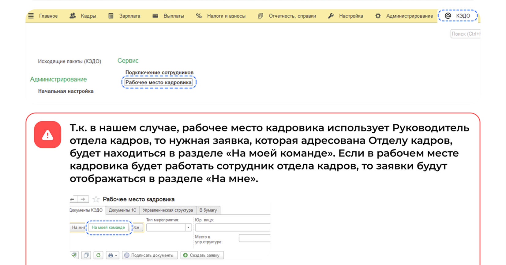

2. Находит нужную заявку и заходит в неё.

3. На этом этапе сотрудник отдела кадров может **Отменить** заявку. Чтобы отменить заявку, Сотрудник выбирает **Причину отмены** и добаляет комментарий.

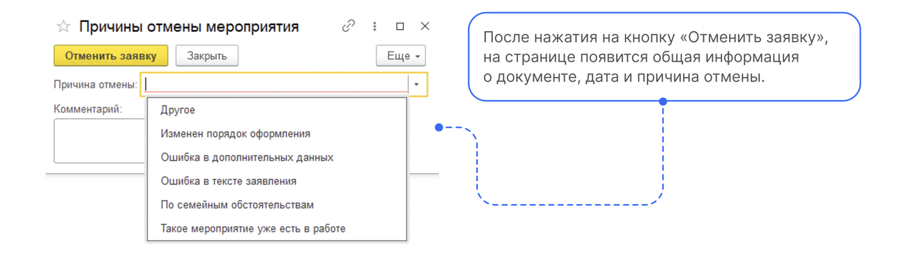

4. Документ можно **Загрузить** из PDF файла или сформировать из 1С.

### Если документ загрузить вручную

1. Нажимает на поле файла.

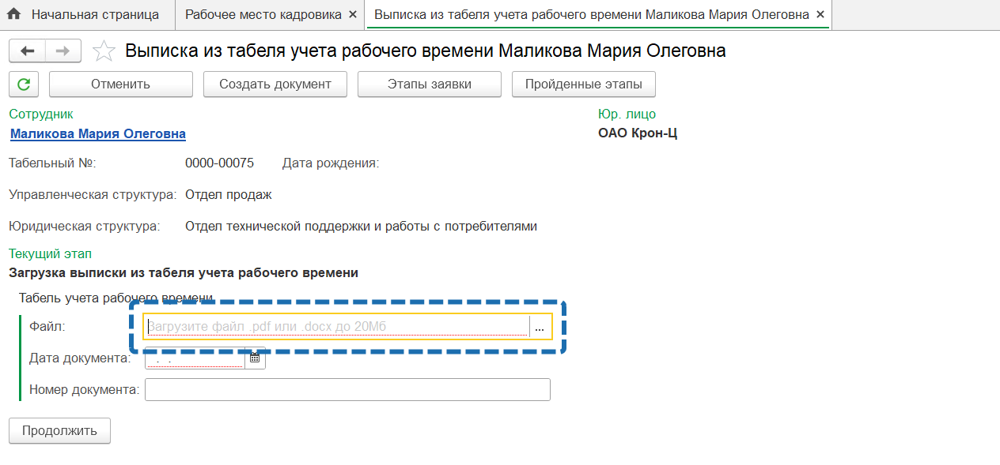

2. Просматривает документ, если всё корректно ещё раз нажимает **ОК**.

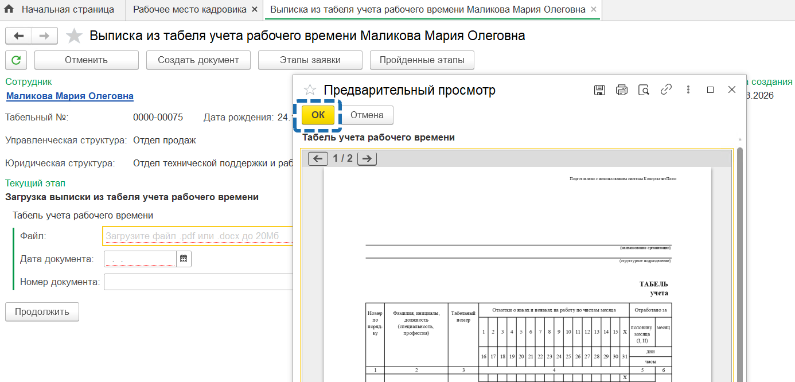

### Если документ нужно сформировать из 1С

1. Нажимает **Создать документ**.

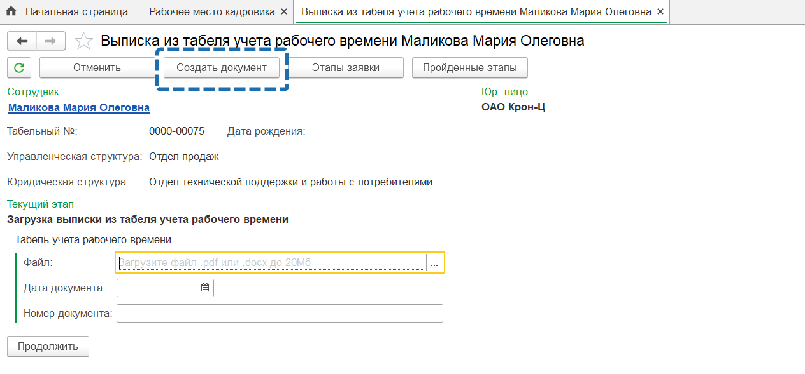

2. Открывается создание табеля. Заполняет табель нажимает **Провести**.
3. Далее нажимает кнопку **КЭДО**.

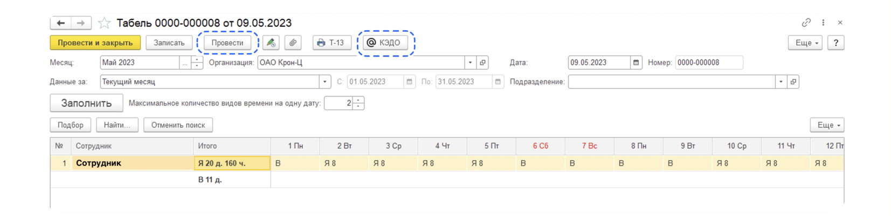

4. Выбирает **Подписать и отправить** или  **Отправить в КЭДО**.

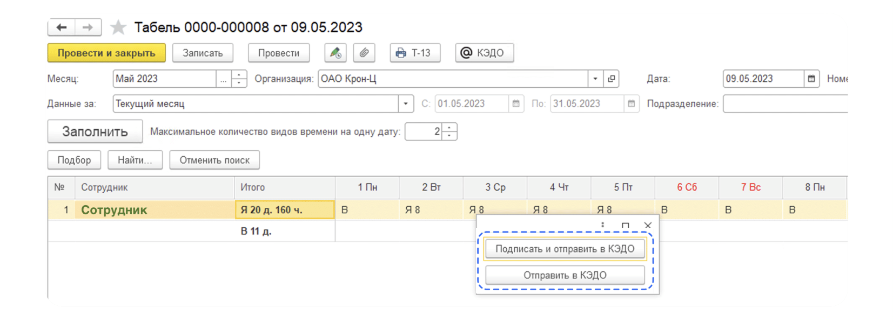

5. Если выбрали **Отправить в КЭДО**, документ нужно подписать.

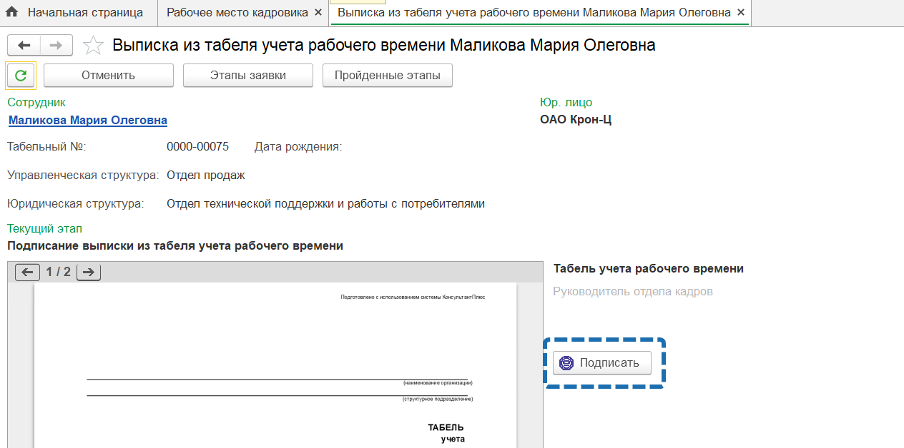

### Если отправить уже сформированный документ в КЭДО

В случае если документ уже есть и нужно его отправить в КЭДО на подпись сотруднику, кадровый специалсит переходит в документ и нажимает кнопку **КЭДО**.

Далее выбирает **Подписать и отправить** или **Отправить в КЭДО**.

Если при отправке документа в КЭДО, появилось сообщение «Нет доступных действий над документом в КЭДО», то устраните причины его возникновения.

**Возможные причины появления сообщения**:
1. Некорректно настроено сопоставление документов. Убедитесь, что маппинг документов 1С и КЭДО установлен корректно в разделе **КЭДО** → **Начальная настройка** → **Соответствие документов** (см. [статью](/ru/1C/user/mapping)).
2. Данный документ уже был ранее отправлен в КЭДО, повторная отправка невозможна.
3. Сотрудник, чей документ пытаетесь отправить, не подключен к КЭДО. Подробнее о подключении сотрудника см. в [статье](/ru/1C/user/employees/connect).
4. У пользователя, который отправляет документ, нет нужных прав. Проверьте, назначены ли для пользователя необходимые роли в КЭДО (раздел **Сервисы компании** → **Настройки** → **Роли сотрудников**) и группы доступа в настройке 1С (**Администрирование**  → **Настройки пользователей и прав**).
5. Неверный этап отправки документа. Например, если маппинг настроен на процесс «Заявление на отпуск (старт от сотрудника)», а вы пытаетесь сразу отправить приказ, система запретит выполнить это действие, т.к. сначала должно быть сформировано заявление от сотрудника.

## Сервисы компании веб-сервиса VK HR Tek

1. Отдел кадров переходит в **Сервисы компании веб-сервиса**, в раздел **Заявки**.

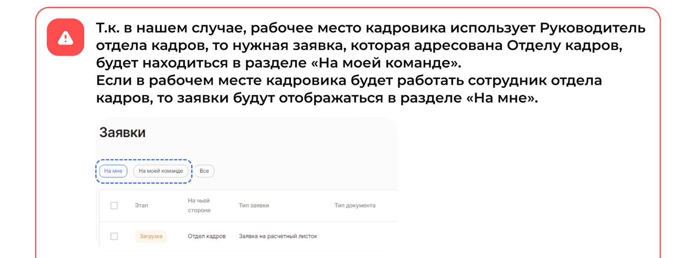

2. Находит нужную заявку и заходит в неё.

3. На этом этапе сотрудник отдела кадров может **Отменить** заявку.
Чтобы отменить заявку нужно выбрать **Причину отмены** и можно добавить комментарий.

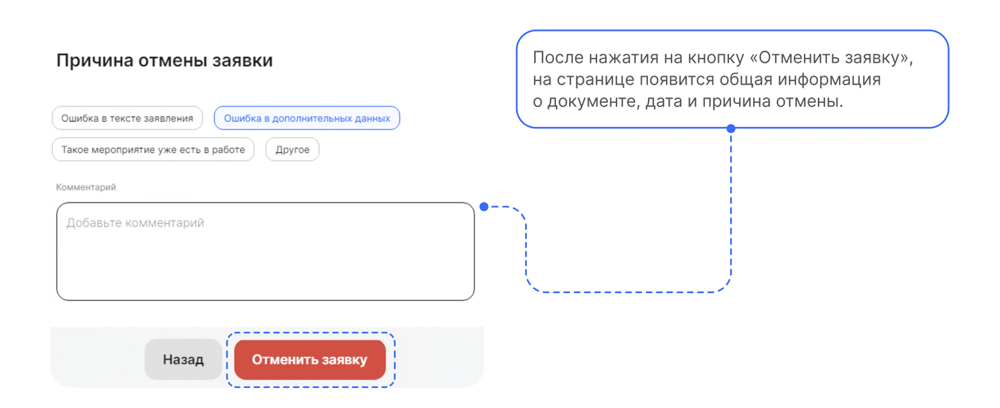

4. Открывает нужную заявку. Загрузка документа через веб-сервис производится только вручную.
5. Нажимает на кнопку с изображением скрепки.

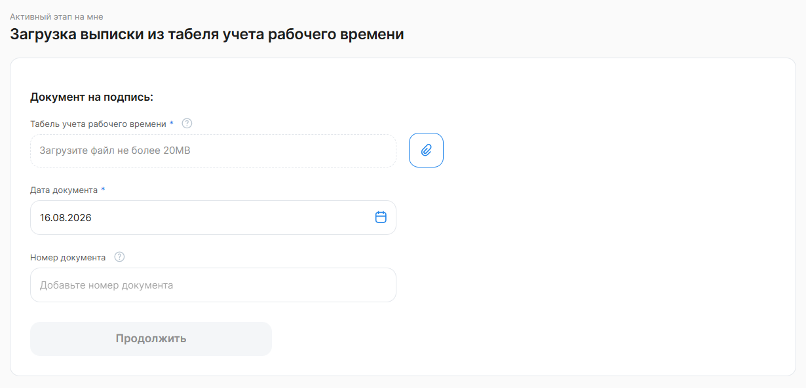

6. После добавления документа нажимает кнопку **Продолжить**.

## Этап 2. Подписание приказа Руководителем отдела кадров

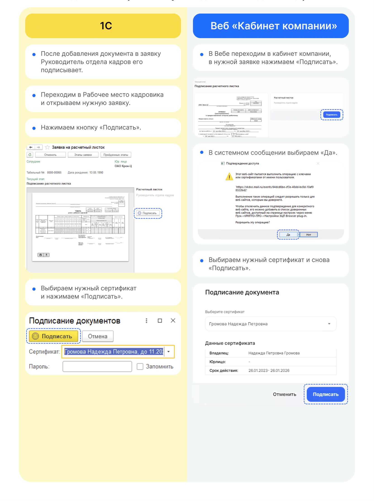

## Этап 3. Подписание документа Сотрудником

1. Сотрудник переходит в **Сервисы сотрудника в веб-сервисе**, в раздел **Заявки**.
2. Открывает нужную заявку и нажимает **Подписать**.

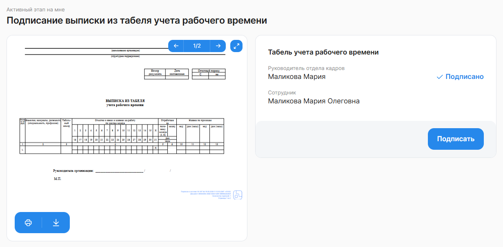