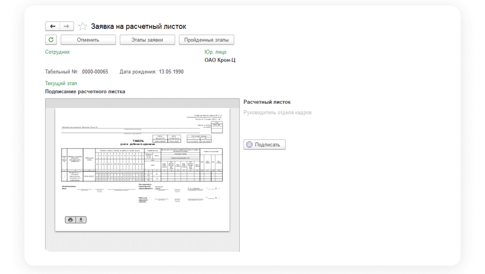

# Процесс «Выписка из табеля учета рабочего времени»

## Маппинг. Соответствие документов

1. На этапе формирования документов в заявке некоторые документы можно сформировать автоматически. Для этого в начальных настройках Сотрудник проставляет соответствие документов (маппинг).
2. Переходит в **КЭДО** → **Начальная настройка КЭДО** → **Соответствие документов**.
3. В колонке **Документ КЭДО** кликает два раза по полю напротив нужного документа **1С** и нажимает троеточие.

4. Выбирает нужный процесс.
5. Нажимает **ОК**.

6. Далее **Сохранить изменения**.

7. Если нужно удалить соответствие, кликнает два раза на процессе, далее правой клавишей мыши и **Очистить**.

 

## Старт процесса

1. Чтобы подать заявку на расчетный листок Сотрудник переходит в **Сервисы сотрудника веб-сервиса VK HR Tek**.
2. Нажимает кнопку **Создать заявку**.

3. Выбирает **Заявка на расчетный листок**.
4. Нажимает **Подтвердить**.

## Этап 1. Формирование Сотрудником заявления

5. Указывает период, за который нужно сформировать справку.
6. Нажимает **Подтвердить**.

 

## Этап 2. Загрузка приказа сотрудниками Отдела кадров

Отдел кадров может работать с заявкой и в **1С**, и в **Сервисах компании веб-сервиса**.

## Работа через 1С
1. Отдел кадров переходит в **1С** → **КЭДО** → **Рабочее место кадровика**.

2. Находит нужную заявку и заходит в неё.

3. На этом этапе сотрудник отдела кадров может **Отменить** заявку. Чтобы отменить заявку, Сотрудник выбирает **Причину отмены** и добаляет комментарий.

4. Документ можно **Загрузить** из PDF файла или сформировать из 1С.

### Если загружаем документ вручную

1. Нажимает кнопку **Загрузить**.

2. Просматривает документ, если всё корректно ещё раз нажимает **Загрузить**.

### Если документ нужно сформировать из 1С

1. Нажимает **Создать документ**.

2. Открывается создание табеля. Заполняет табель нажимает **Провести**.
3. Далее нажимает кнопку **КЭДО**.

4. Выбирает **Подписать и отправить** или  **Отправить в КЭДО**.

5. Если выбрали **Отправить в КЭДО**, документ нужно подписать.

### Если отправить уже сформированный документ в КЭДО

В случае если документ уже есть и нужно его отправить в КЭДО на подпись сотруднику, кадровый специалсит переходит в документ и нажимает кнопку **КЭДО**.

Далее выбирает **Подписать и отправить** или **Отправить в КЭДО**.

## Сервисы компании веб-сервиса VK HR Tek

1. Отдел кадров переходит в **Сервисы компании веб-сервиса**, в раздел **Заявки**.

2. Находит нужную заявку и заходит в неё.

3. На этом этапе сотрудник отдела кадров может **Отменить** заявку.
Чтобы отменить заявку нужно выбрать **Причину отмены** и можно добавить комментарий.

4. Открывает нужную заявку. Загрузка документа через веб-сервис производится только вручную.
5. Нажимает на кнопку с изображением скрепки.

6. После добавления документа нажимает кнопку **Продолжить**.

## Этап 3. Подписание приказа Руководителем отдела кадров

## Этап 4. Проверка документов Сотрудником

1. Сотрудник переходит в **Сервисы сотрудника в веб-сервисе**, в раздел **Заявки**.
2. Открывает нужную заявку и нажимает **Подтвердить**.

