# Процесс «Приказ на кадровый перевод»

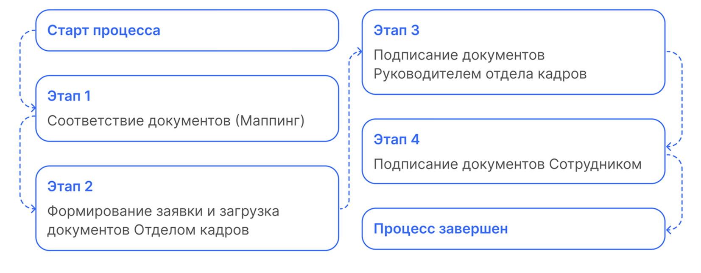

## Старт процесса

Процесс подписания дополнительного соглашения к трудовому договору Отдел кадров может стартовать со своей стороны с помощью **1С** или через **Сервисы компании веб-сервиса VK HR Tek**.

## Этап 1. Соответствие документов (Маппинг)

1. На этапе формирования документов в заявке некоторые документы можно сформировать автоматически. Для этого в начальных настройках нужно проставить соответствие документов (маппинг).
2. Кадровый специалист переходит в **КЭДО** → **Начальная настройка КЭДО** → **Соответствие документов**.

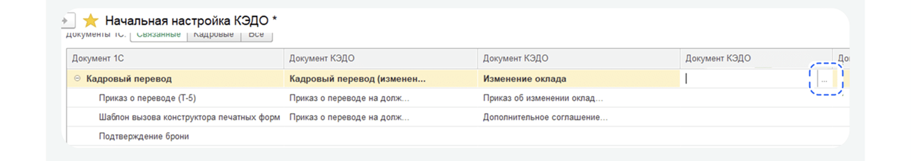

3. В колонке **Документ КЭДО** кликает два раза по полю напротив нужного документа 1С и нажимает троеточие.
4. Выбирает процесс **Приказ на кадровый перевод**. Этот процесс нужно указать именно для списочного документа.

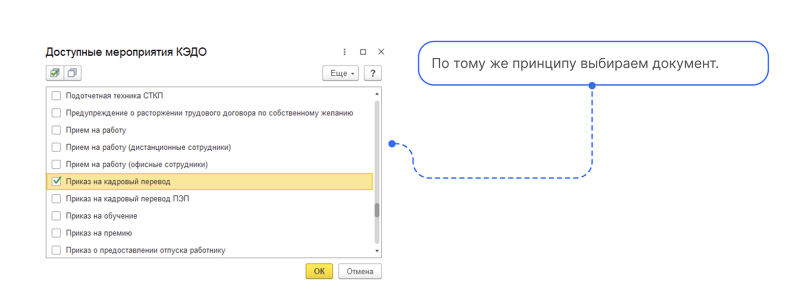

5. Далее **Сохранить изменения**.

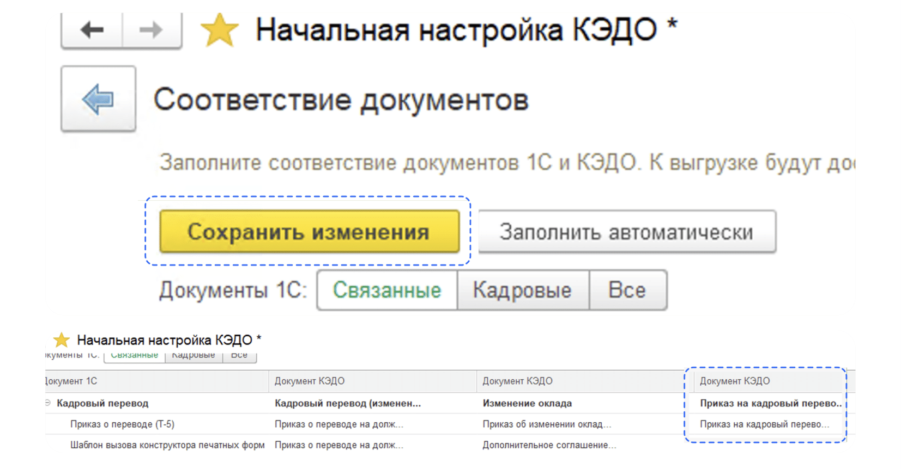

## Этап 2. Формирование заявки и загрузка документов Отделом кадров

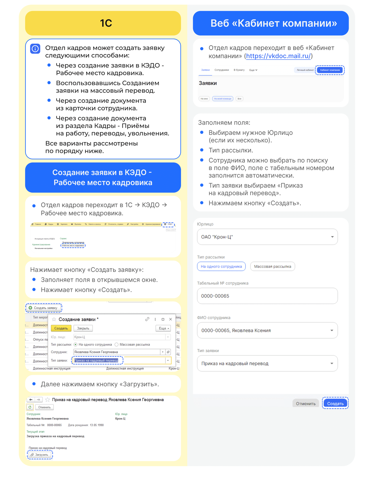

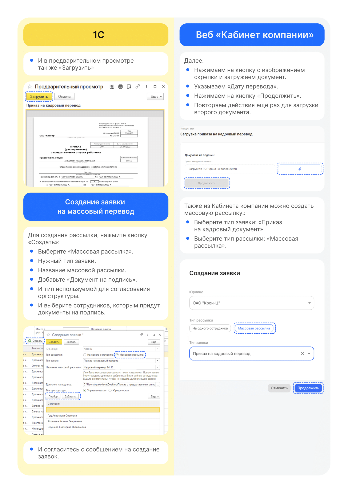

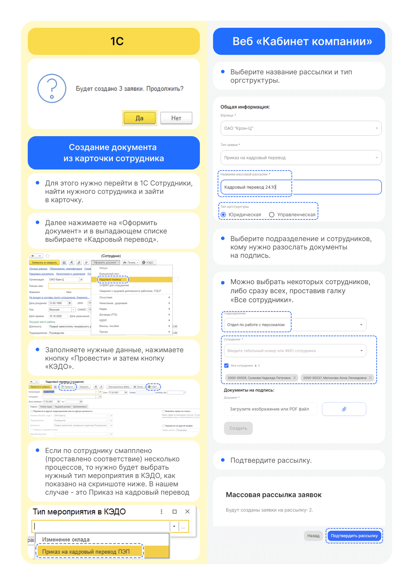

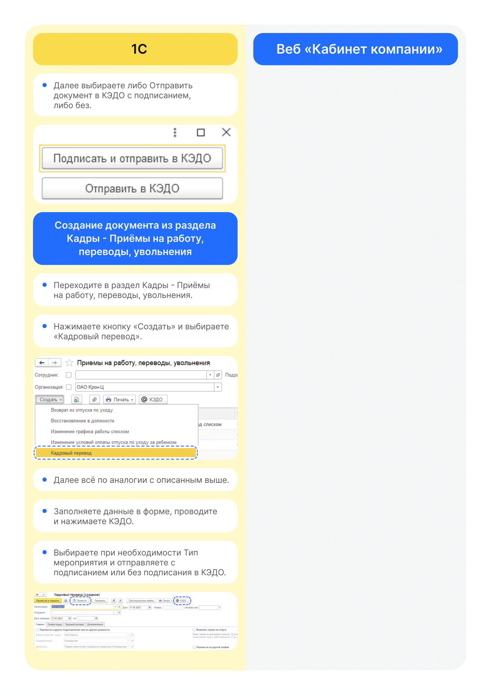

## Этап 3. Подписание документов Руководителем отдела кадров

Руководитель отдела кадров может подписывать заявку и в **1С**, и в **Сервисах компании веб-сервиса**. Тип подписи: УКЭП.

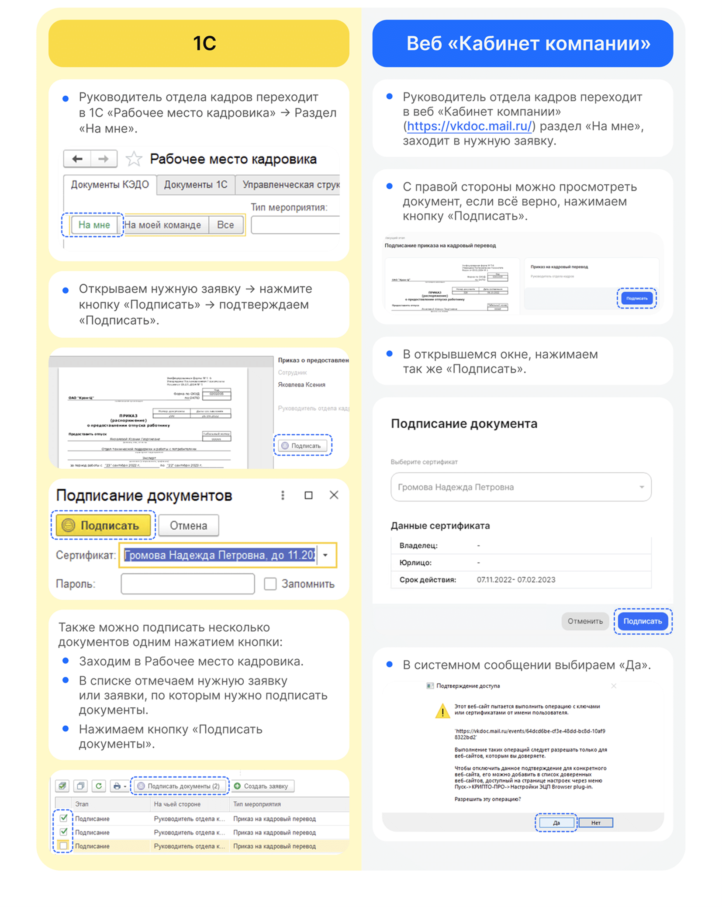

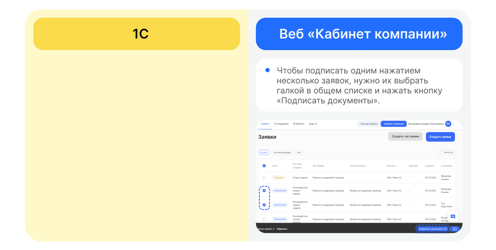

## Этап 4. Подписание документов Сотрудником

1. Сотруднику поступает уведомление на телефон о том, что нужно подписать документ.
2. Сотрудник переходит  в **Мои сервисы** в веб-сервисе, в раздел **Заявки**.
3. Открывает заявку.
4. Нажимает кнопку **Подписать**.

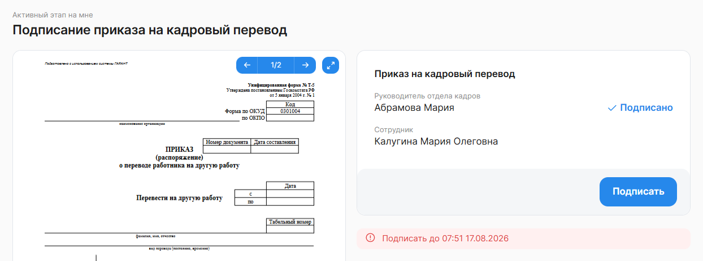

5. Вводит код из СМС и нажимает кнопку **Подписать**. Тип подписи: УНЭП.

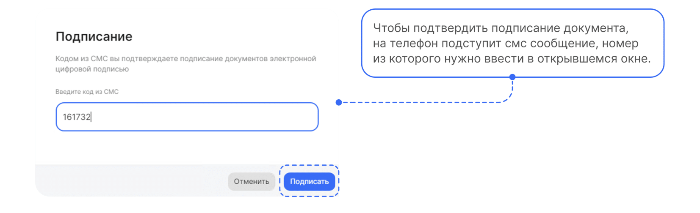
