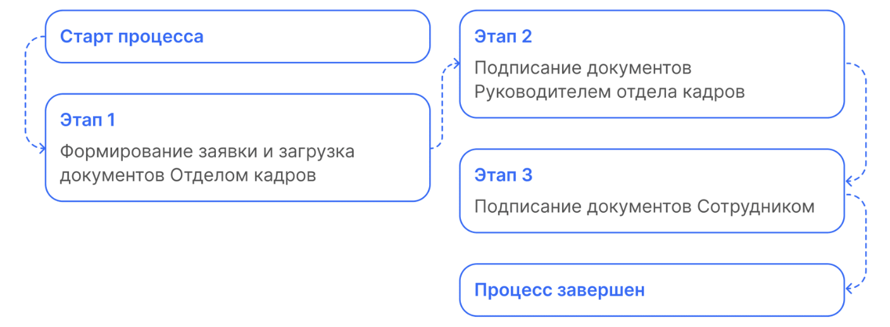
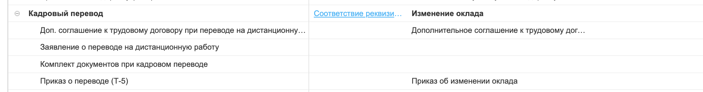
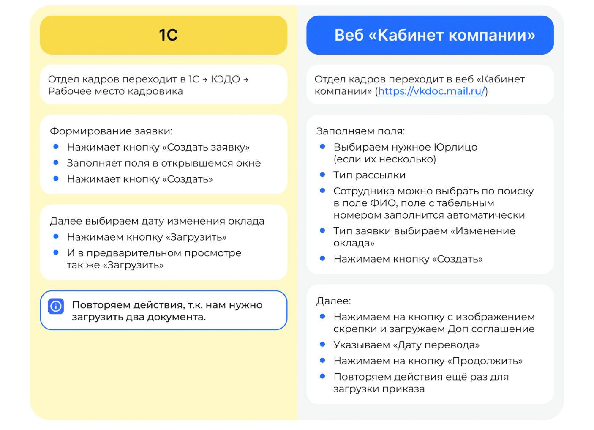
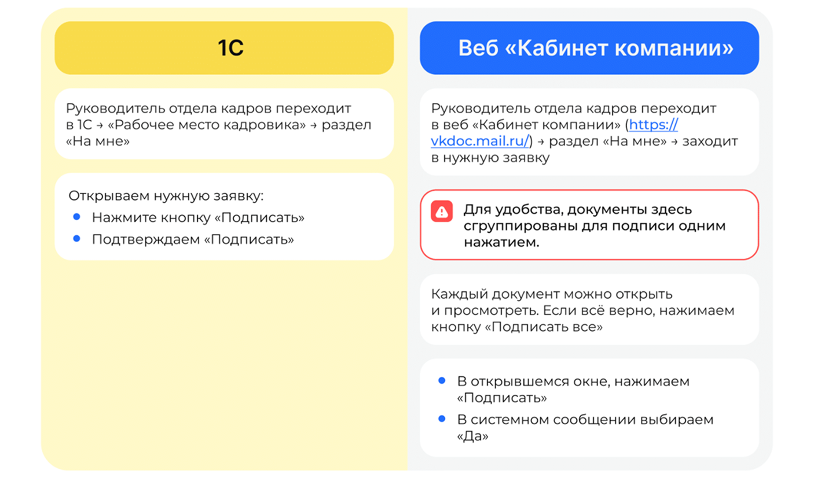

# Процесс «Изменение оклада»

 

## Старт процесса

Процесс изменения оклада Отдел кадров может стартовать со своей стороны с помощью **1С** или через **Сервисы компании** веб-сервиса VK HR Tek.

Можно настроить следующий вариант маппинга:

Обратите внимание! Если в 1С у клиента документ на изменение оклада расположен в другом месте, маппинг должен быть настроен под индивидуальную потребность клиента.

## Этап 1. Формирование заявки и загрузка документов Отделом кадров

 

## Этап 2. Подписание документов Руководителем отдела кадров

Руководитель отдела кадров может подписать заявку с помощью УКЭП и в **1С**, и в **Сервисах компании** веб-сервиса VK HR Tek. Тип подписи: УКЭП.

## Этап 3. Подписание документов Сотрудником

1. Сотруднику поступает уведомление на телефон о том, что нужно подписать документ.
2. Сотрудник переходит в **Мои сервисы** веб-сервиса, в раздел **Заявки**.
3. Открывает заявку. На странице заявки можно кликнуть на каждый документ, чтобы ознакомиться с ним. Для удобства, подписание документов сгруппировано.
4. Если всё верно, нажимает кнопку **Подписать все**. Тип подписи: УНЭП.