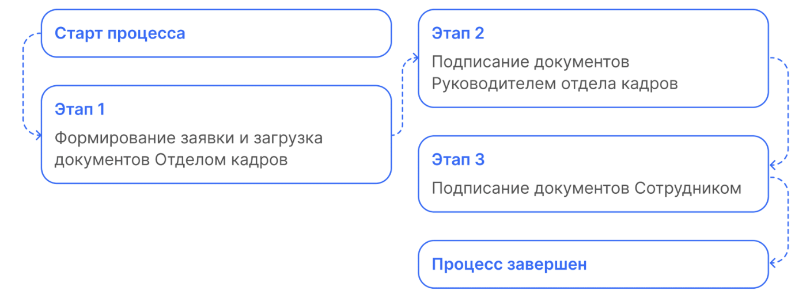

# Процесс «Изменение оклада»

 

## Старт процесса

Процесс изменения оклада Отдел кадров может стартовать со своей стороны с помощью **1С** или через **Сервисы компании веб-сервиса VK HR Tek**.

## Этап 1. Формирование заявки и загрузка документов Отделом кадров

 

## Этап 2. Подписание документов Руководителем отдела кадров

Руководитель отдела кадров может работать с заявкой и в **1С**, и в **Сервисах компании веб-сервиса VK HR Tek**.

## Этап 3. Подписание документов Сотрудником

1. Сотруднику поступает уведомление на телефон о том, что нужно подписать документ.
2. Сотрудник переходит в в **Сервисы сотрудника в веб-сервисе** → раздел **Заявки**.
3. Открывает заявку. На странице заявки можно кликнуть на каждый документ, чтобы ознакомиться с ним. Для удобства, подписание документов здесь сгруппировано.
4. Если всё верно, нажимает кнопку **Подписать все**.