# Процесс «Кадровый перевод (изменение должности)»

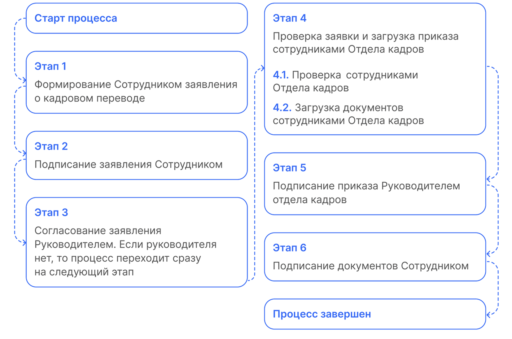

## Старт процесса

Чтобы подать заявление на кадровый перевод Сотрудник:
1. Заходит в **Мои сервисы** веб-сервиса VK HR Tek, раздел **Заявки**.
2. Нажимает кнопку **Создать заявку**.
3. Выбирает **Кадровый перевод (изменение должности)**.
4. Нажимает **Подтвердить**.

Для документа 1С **Кадровый перевод** должен быть настроен следующий вариант маппинга:

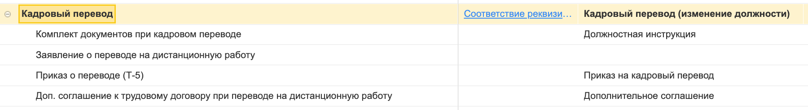

**Приказ о переводе** и **Доп. соглашение** — обязательные документы, **Должностная инструкция** — необязателньый документ, может быть не настроен в соответствии и не отправляться сотруднику.

## Этап 1. Формирование Сотрудником заявления о кадровом переводе

1. Сотрудник заполняет **Должность**, **Подразделение** и **Дату перевода**.  Дата перевода не может быть раньше, чем через 2 рабочих дня после даты подачи заявки.
2. Нажимает кнопку **Перейти к предпросмотру**.

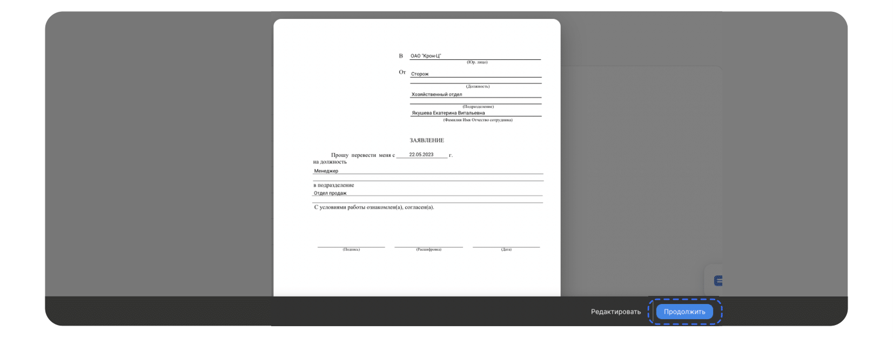

3. Нажимает **Продолжить**.

Шаблон заявления
 

## Этап 2. Подписание заявления Сотрудником

Сотрудник подписывает документ. Тип подписи: ПЭП. Дедлайн подписания: за 2 рабочих для до даты перевода.

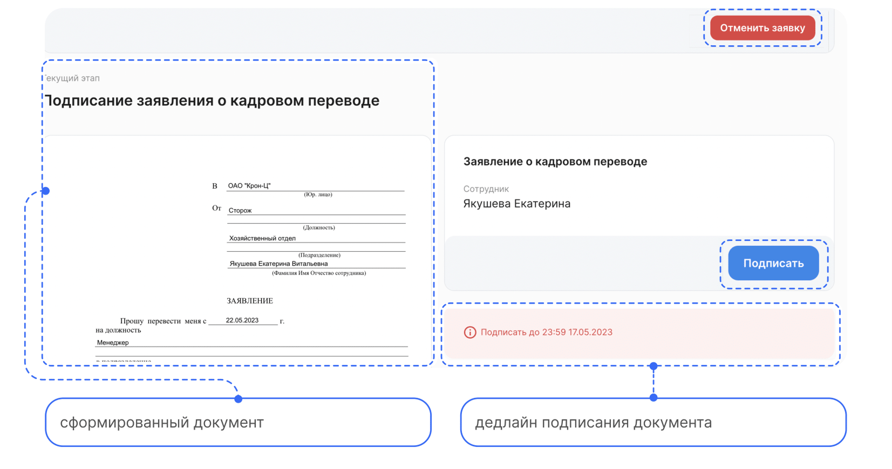

## Этап 3. Согласование заявления Руководителем

Руководитель переходит в **Сервисы компании в веб-сервисе**.

Если у сотрудника по каким-то причинам отсутствует руководитель, то процесс сразу переходит на следующий этап — Проверка заявки Отделом кадров.

<info>

На данном этапе Руководитель может либо **Подтвердить**, либо **Отменить заявку**. В случае отмены заявки, процесс стартует с первого этапа формирования заявления сотрудником.

</info>

1. Руководитель открывает нужную заявку.
2. Нажимает кнопку **Подтвердить**.

## Этап 4. Проверка заявки и загрузка приказа сотрудниками Отдела кадров

**4.1. Проверка заявки сотрудниками Отдела кадров**

Отдел кадров может работать с заявкой и в **1С**, и в **Сервисах компании веб-сервиса VK HR Tek**.

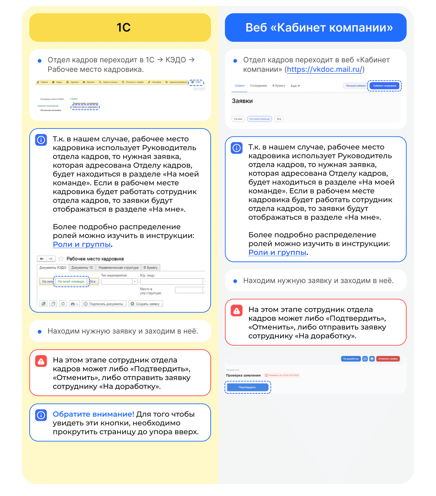

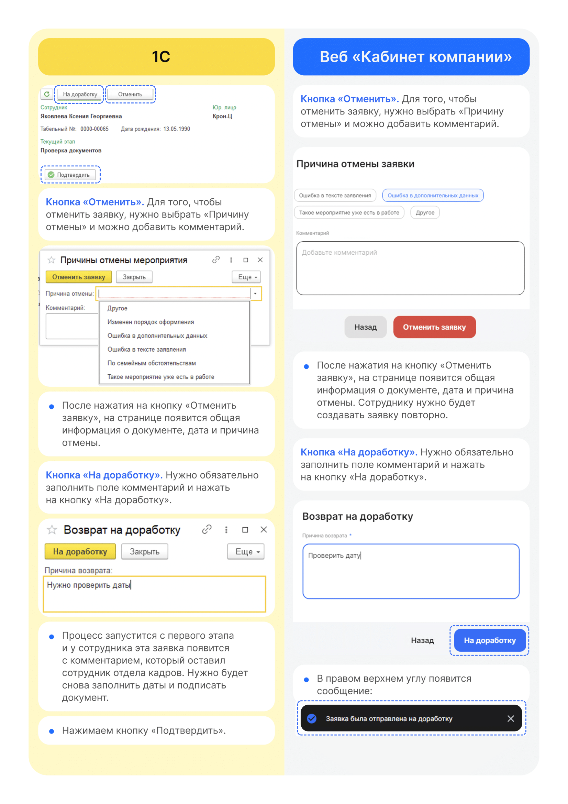

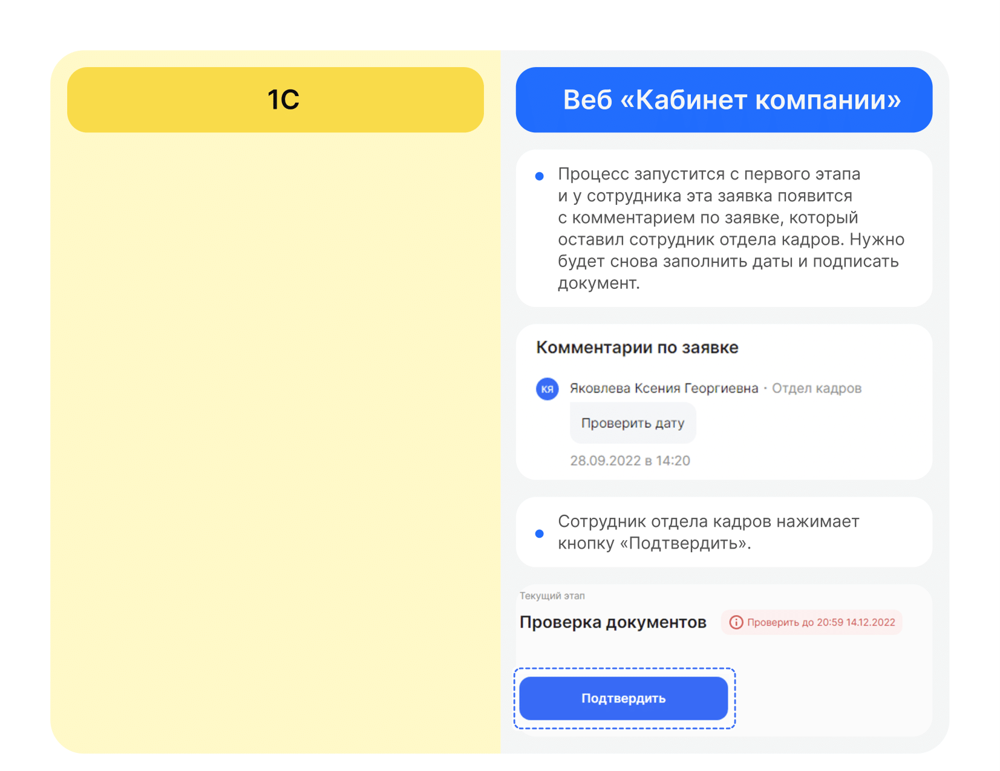

**4.2. Загрузка документов сотрудниками Отдела кадров**

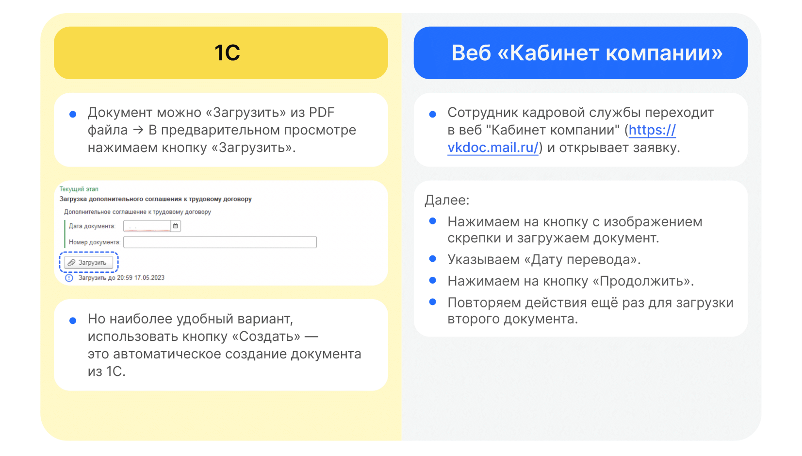

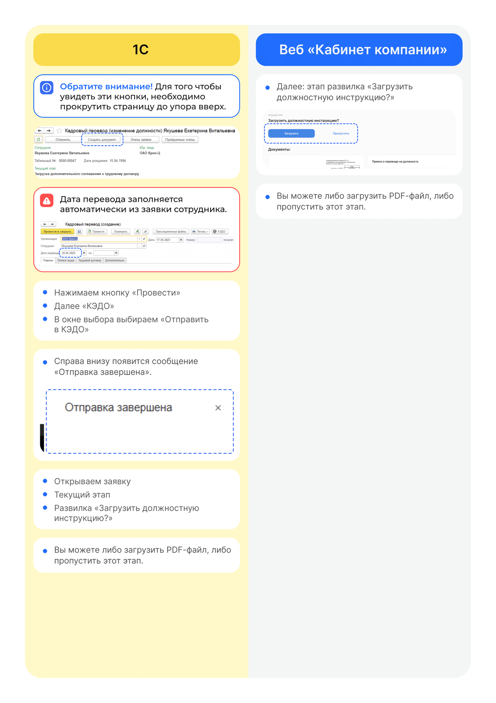

## Этап 5. Подписание приказа Руководителем отдела кадров

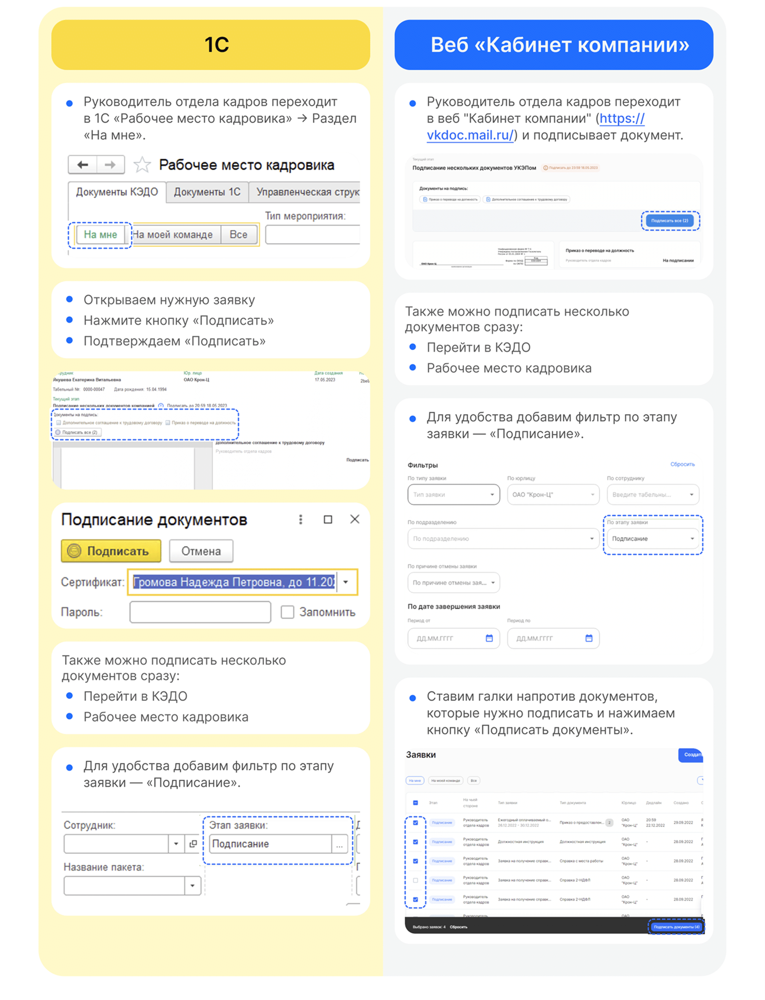

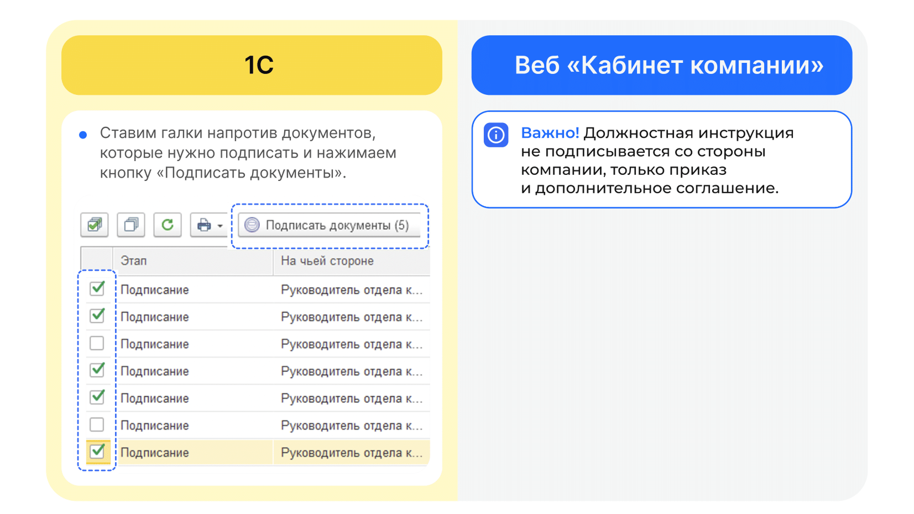

## Этап 6. Подписание документов Сотрудником

1. Сотруднику поступает уведомление на телефон о том, что нужно подписать документ. 
2. Сотрудник переходит  в **Мои сервисы в веб-сервисе**, в раздел **Заявки**.
3. Открывает заявку.
4. Нажимает кнопку **Подписать**. Тип подписи: УНЭП.

