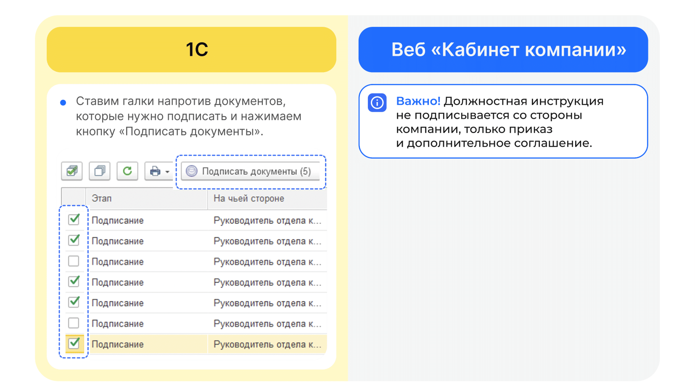

# Процесс «Кадровый перевод (изменение должности)»

## Старт процесса

Чтобы подать заявление на кадровый перевод Сотрудник:
1. Заходит в **Сервисы сотрудника веб-сервиса VK HR Tek**, раздел **Заявки**.
2. Нажимает кнопку **Создать заявку**.
3. Выбирает **Кадровый перевод (изменение должности)**.
4. Нажимает **Подтвердить**.

## Этап 1. Формирование Сотрудником заявления о кадровом переводе

1. Сотрудник заполняет **Должность**, **Подразделение** и **Дату перевода**.
2. Нажимает кнопку **Перейти к предпросмотру**.

3. Нажимает **Продолжить**.

## Этап 2. Подписание заявления Сотрудником
1. Сотрудник проверяет документ.

2. Нажимает кнопку **Подписать**.

## Этап 3. Согласование заявления Руководителем

Руководитель переходит в **Сервисы компании в веб-сервисе**.

<info>

На данном этапе Руководитель может либо **Подтвердить**, либо **Отменить заявку**. В случае отмены заявки, процесс стартует с первого этапа формирования заявления сотрудником.

</info>

1. Открывает нужную заявку.
2. Нажимает кнопку **Подтвердить**.

## Этап 4. Проверка заявки и загрузка приказа сотрудниками Отдела кадров

**4.1. Проверка заявки сотрудниками Отдела кадров**

Отдел кадров может работать с заявкой и в **1С**, и в **Сервисах компании веб-сервиса VK HR Tek**.

**4.2. Загрузка документов сотрудниками Отдела кадров**

## Этап 5. Подписание приказа Руководителем отдела кадров

## Этап 6. Подписание документов Сотрудником

1. Сотруднику поступает уведомление на телефон о том, что нужно подписать документ. 
2. Сотрудник переходит  в **Сервисы сотрудника в веб-сервисе**, в раздел **Заявки**.
3. Открывает заявку.
4. Нажимает кнопку **Подписать**.

