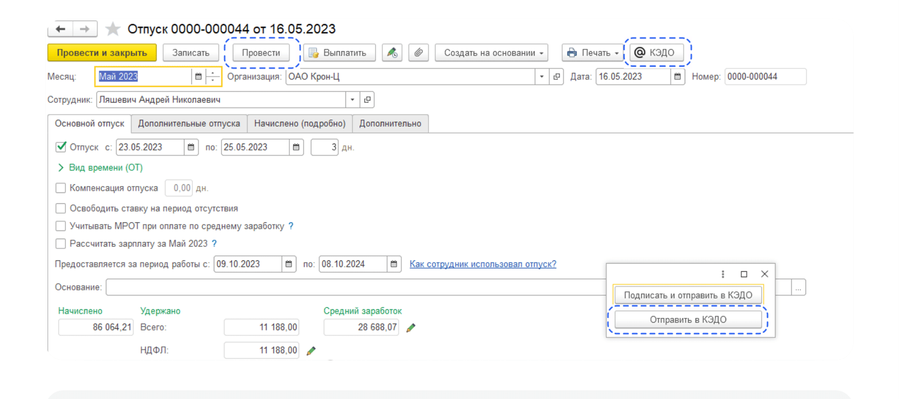
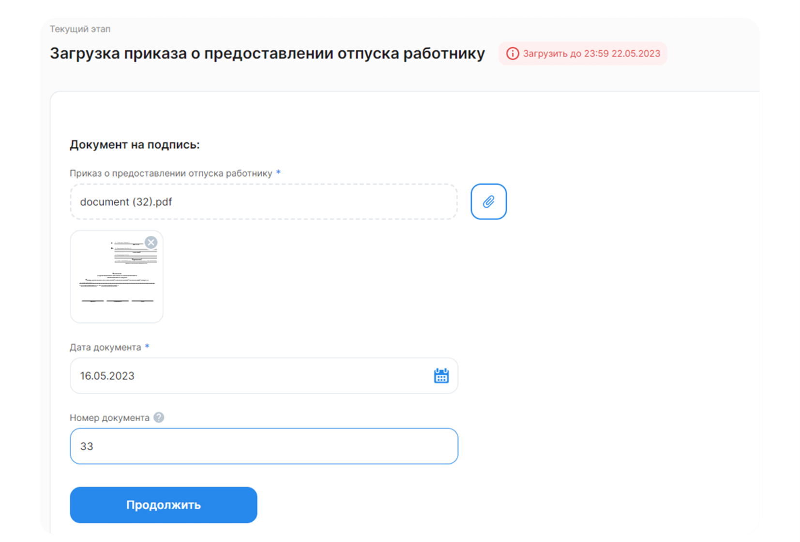

# Процесс «Ежегодный дополнительный оплачиваемый отпуск»

## Старт процесса

Чтобы подать заявление на ежегодный дополнительный оплачиваемый отпуск, Сотрудник:
1. Заходит в **Сервисы сотрудника веб-сервиса VK HR Tek**, в раздел **Заявки**.
2. Нажимает кнопку **Создать заявку**.
3. Выбирает **Ежегодный дополнительный оплачиваемый отпуск**.
4. Нажимает **Подтвердить**.

## Этап 1. Формирование Сотрудником заявления о предоставлении ежегодного оплачиваемого отпуска (не по графику)

<warn>

В заявке указывается количество доступных дней отпуска у сотрудника. Обратите внимание на **Правила оформления заявки**, расположенные справа от указания дат отпуска.

</warn>

1. Сотрудник выбирает **Дату начала отпуска** и **Дату окончания отпуска**.
6. Далее **Перейти к предпросмотру**.
7. Нажимает **Продолжить**.

## Этап 2. Подписание заявления Сотрудником

1. Сотрудник проверяет документ.
9. Нажимает **Подписать**.
10. Чтобы подтвердить подписание документа, на телефон подступит смс-сообщение, код из которого Сотрудник вводит в открывшемся окне и нажимает кнопку **Подписать**.

 

## Этап 3. Проверка заявки и загрузка приказа сотрудниками Отдела кадров

**3.1. Проверка отпуска сотрудниками Отдела кадров**

1. Отдел кадров может работать с заявкой и в **1С**, и в **Сервисы компании веб-сервиса VK HR Tek**.

**3.2. Загрузка приказа сотрудниками Отдела кадров**

1. Документ можно **Загрузить** из PDF файла.
3. Специалист в предварительном просмотре нажимает кнопку **Загрузить**.

Наиболее удобный вариант использовать кнопку **Создать** для автоматического создания документа из 1С.

3. Специалист нажимает кнопку **Провести**.
5. Нажимает кнопку **КЭДО**.
6. В открывшемся окне выбирает **Отправить в КЭДО**.

6. Справа внизу появится сообщение **Отправка завершена**.

## Сервисы компании веб-сервиса VK HR Tek

1. Специалист нажимает кнопку с изображением скрепки.
11. Загружает документ.
12. Нажимает кнопку **Продолжить**.

## Этап 4. Подписание приказа Руководителем отдела кадров

Руководитель отдела кадров может работать с заявкой и в **1С**, и в **Сервисах компании веб-сервиса VK HR Tek**.

## Этап 5. Подписание приказа Сотрудником

1. Сотруднику поступает уведомление на телефон о том, что нужно подписать документ. 
2. Сотрудник переходит в **Сервисы сотрудника в веб-сервисе**.
3. Открывает заявку.
4. Нажимает **Подписать**.

5. Чтобы подтвердить подписание документа, на телефон поступит смс-сообщение, номер из которого Сотрудник вводит в открывшемся окне и нажимает кнопку **Подписать**.

## Этап 6. Проверка документов Отделом кадров

## Работа через 1С

1. Специалист переходит в **Рабочее место кадровика**.
2. Далее в раздел **На моей команде**.
3. Открывает нужную заявку.
4. Нажимает **Подтвердить**.

## Сервисы компании веб-сервиса VK HR Tek

1. Сотрудник Отдела кадров переходит в **Сервисы компании веб-сервиса**, в раздел **Заявки**.
2. Нажимает кнопку **Подтвердить** в нужной заявке.

