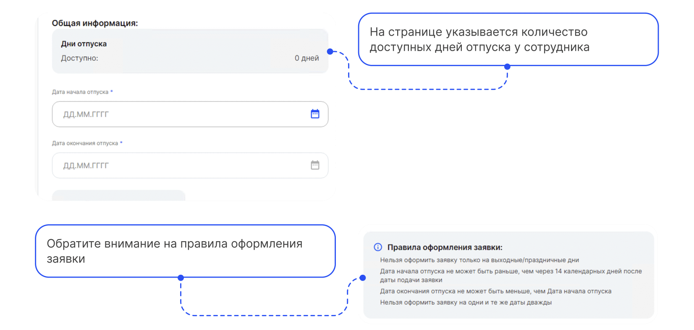

# Процесс «Ежегодный оплачиваемый отпуск (не по графику)»

 

## Старт процесса

Чтобы подать заявление на ежегодный оплачиваемый отпуск Сотрудник:
1. Заходит в **Сервисы сотрудника веб-сервиса VK HR Tek**, в раздел **Заявки**.
2. Нажимает кнопку **Создать заявку**.
3. Выбирает **Ежегодный оплачиваемый отпуск (не по графику)**.
4. Нажимает **Подтвердить**.

 

## Этап 1. Формирование Сотрудником заявления

1. Сотрудник выбирает **Дату начала отпуска** и **Дату окончания отпуска**.

2. Нажимает кнопку **Перейти к предпросмотру**.

3. Далее нажимает **Продолжить**.

 

## Этап 2. Подписание заявления Сотрудником

1. Сотрудник видит **дедлайн**, до которого надо подписать документ.

2. Проверяет документ и нажимает кнопку **Подписать**.

 

## Этап 3. Согласование заявления Руководителем

<warn>

Если по какой-то причине у сотрудника нет руководителя, то процесс переходит сразу на следующий этап *Загрузка приказа* Отделом кадров.

</warn>

Руководитель переходит в **Сервисы компании** веб-сервиса VK HR Tek.

<info>

На данном этапе Руководитель может либо **Подтвердить**, либо **Отменить заявку**. В случае отмены заявки, процесс стартует с первого этапа формирования заявления сотрудником.

</info>

Руководитель открывает нужную заявку и нажимает **Подтвердить**.

 

## Этап 4. Загрузка приказа сотрудниками Отдела кадров 

**4.1. Проверка отпуска сотрудниками Отдела кадров**

Отдел кадров может работать с заявкой и в **1С**, и в **Сервисах компании веб-сервиса VK HR Tek**.

 

**4.2. Загрузка приказа сотрудниками Отдела кадров**

 

## Этап 5. Подписание приказа Руководителем отдела кадров

Отдел кадров может работать с заявкой и в **1С**, и в **Сервисах компании веб-сервиса VK HR Tek**.

 

## Этап 6. Подписание приказа Сотрудником

Сотруднику поступает уведомление на телефон о том, что нужно подписать документ.
1. Переходит в Личный кабинет в **Сервисы сотрудника в веб-сервисе**, в раздел **Заявки**.
2. Открывает заявку.

3. Нажимает **Подписать**.

 

## Этап 7. Проверка документов Отделом кадров

Отдел кадров может работать с заявкой и в **1С**, и в **Сервисаз компании веб-сервиса VK HR Tek**.

 

## Процесс завершен

Отдел кадров видит, что документ подписан Сотрудником и Руководителем.

В личной кабинете Сотрудника заявка будет отображаться со статусом **Завершено**.

 