# Процесс «Выписка из графика отпусков»

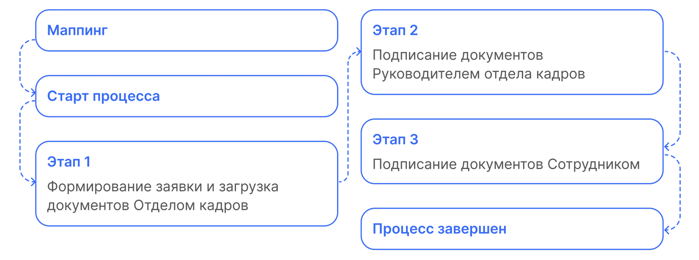

 

## Маппинг

1. На этапе формирования документов в заявке некоторые документы можно сформировать автоматически. Для этого в начальных настройках нужно проставить соответствие документов (маппинг). Кадровый специалист переходит в **КЭДО** → **Начальная настройка КЭДО** → **Соответствие документов**.
2. В колонке **Документ КЭДО** кликает два раза по полю напротив нужного документа **1С** и нажимает троеточие.

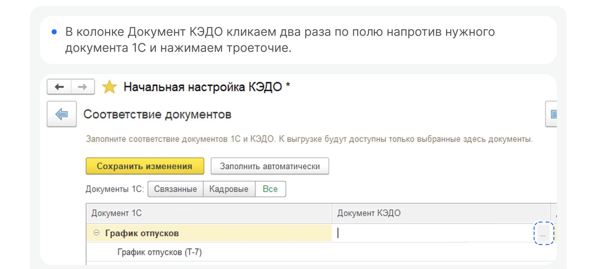

3. Выбирает нужный процесс и нажимаем **ОК**.
4. По тому же принципу выбирает документ.

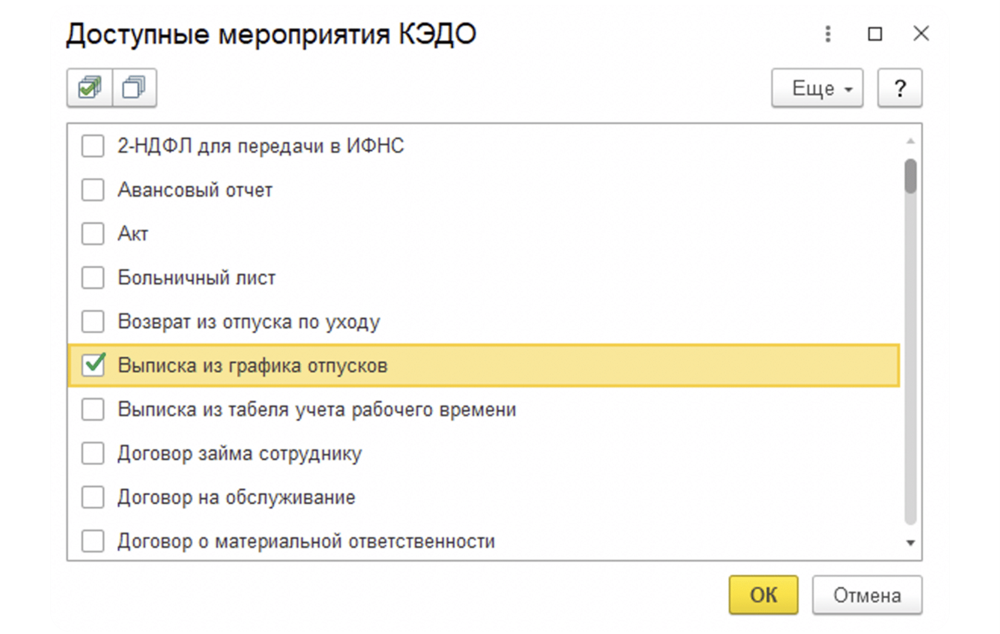

5. Далее нажимает **Сохранить изменения**.

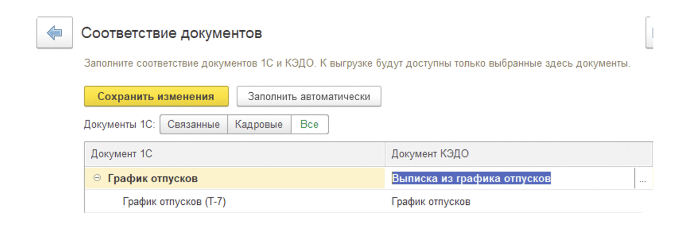

 

## Этап 1. Формирование заявки и загрузка документов Отделом кадров

Отдел кадров может создавать заявки и в **1С**, и в **Сервисах компании веб-сервиса**, и отправлять документ на одного сотрудника или массовой рассылки на сотрудников подразделения при юридической/управленческой оргструктуре.

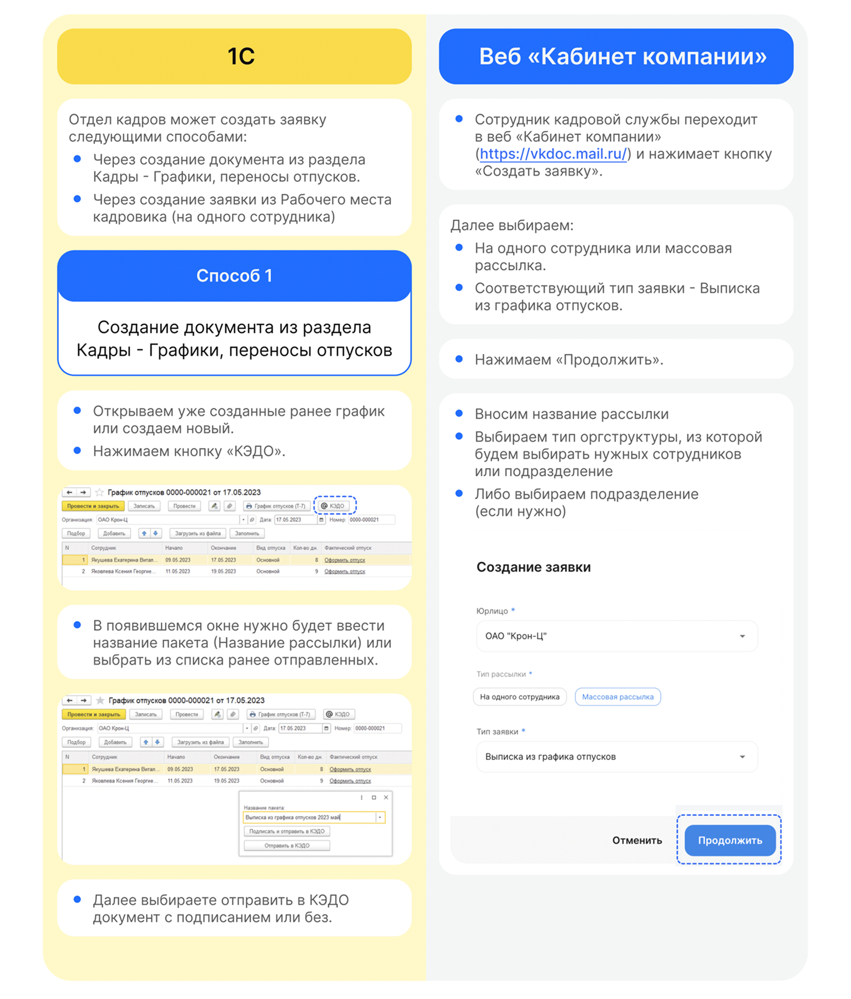

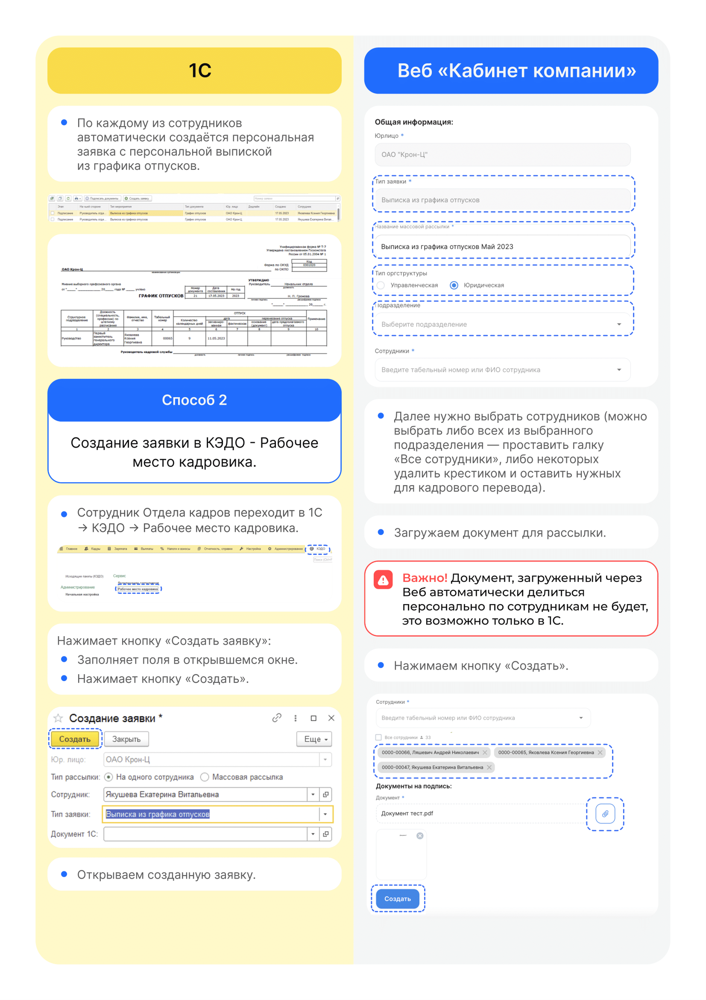

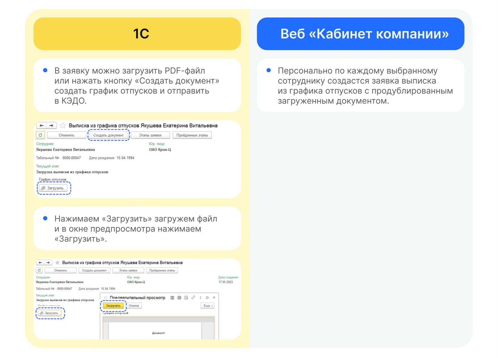

 

## Этап 2. Подписание документов Руководителем отдела кадров

Руководитель отдела кадров может работать с заявкой и в **1С**, и в **Сервисах компании** веб-сервиса.

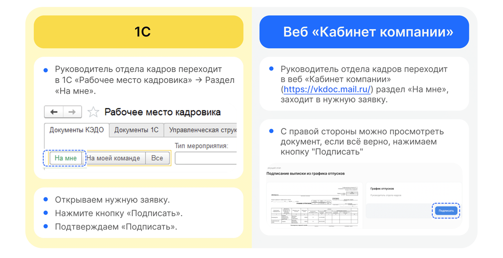

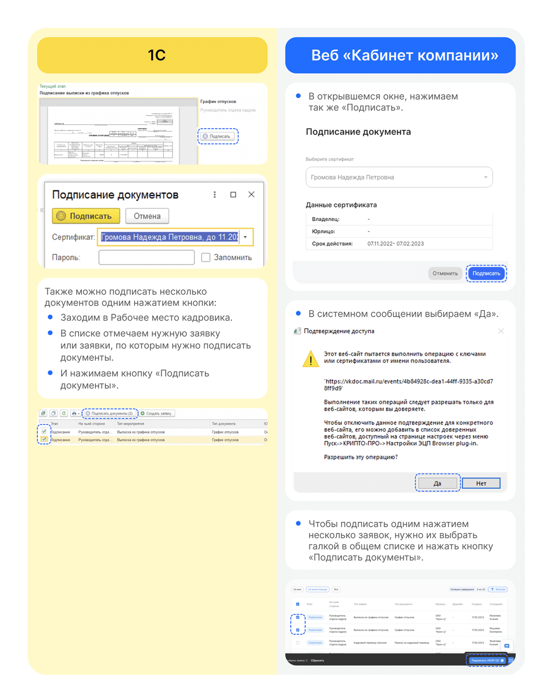

 

## Этап 3. Подписание документов сотрудником

1. Сотруднику поступает уведомление на телефон о том, что нужно подписать документ. Переходит в Личный кабинет в **Сервисы сотрудника в веб-сервисе**, в раздел **Заявки**.
2. Открывает заявку.
3. Нажимает кнопку **Подписать**.

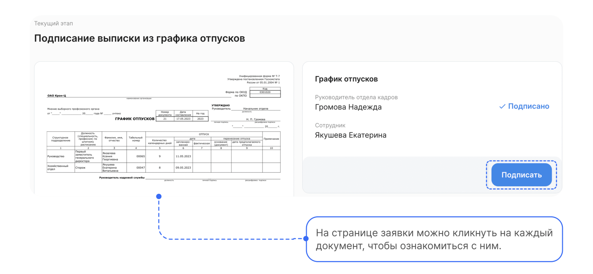

4. Вводит код из смс и нажимает кнопку **Подписать**.

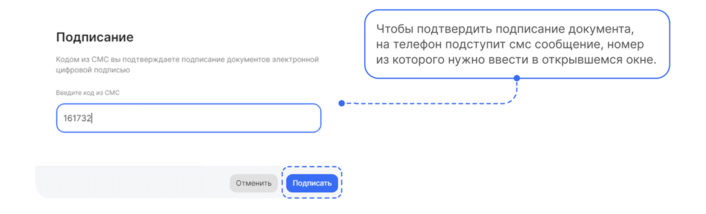
