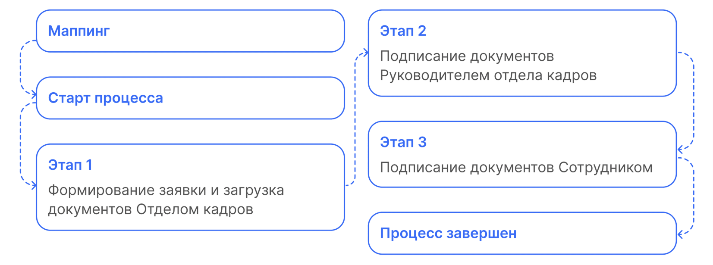
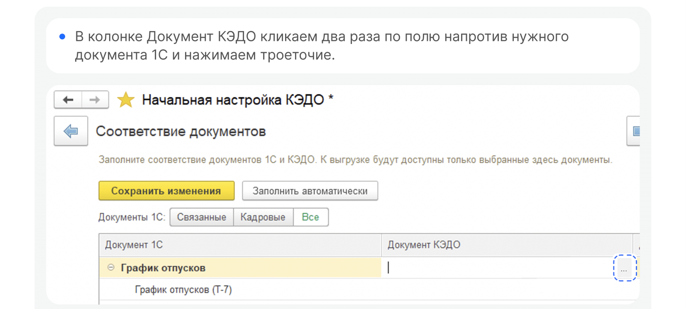
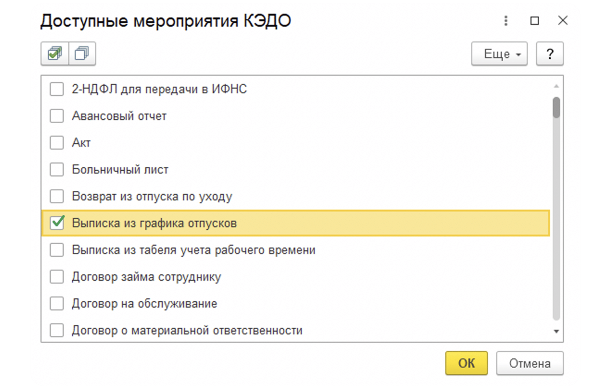
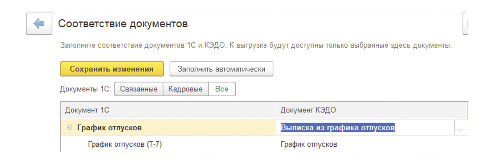
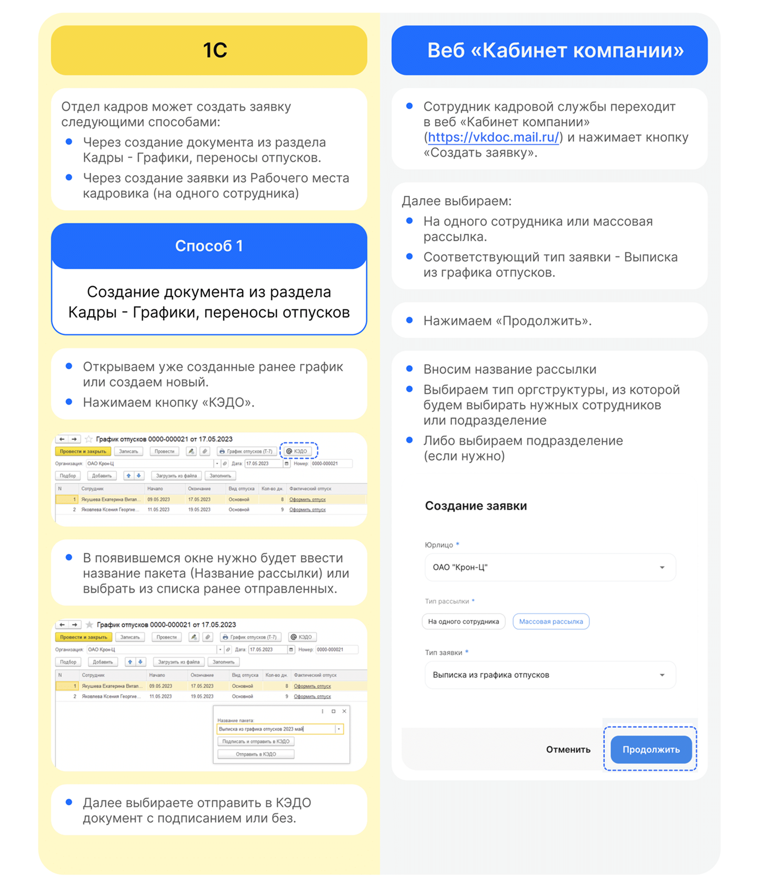
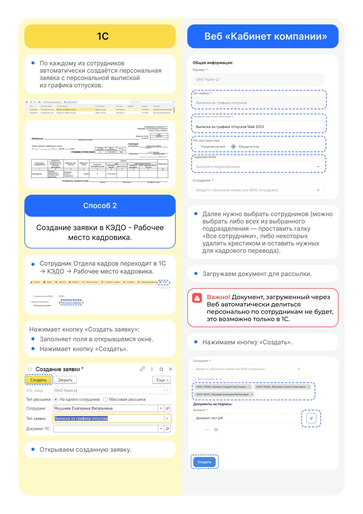
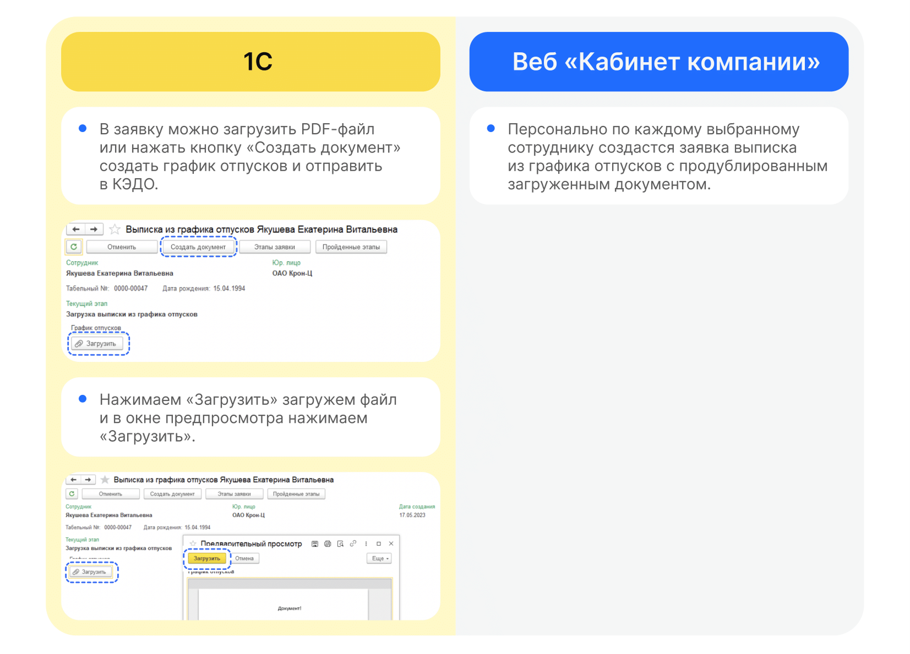
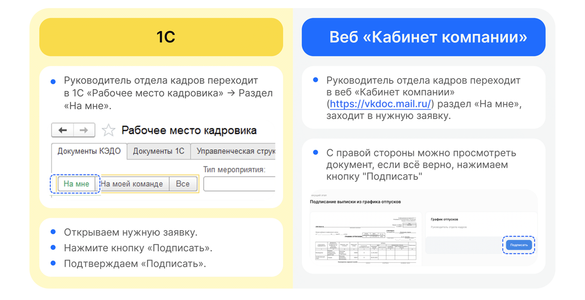
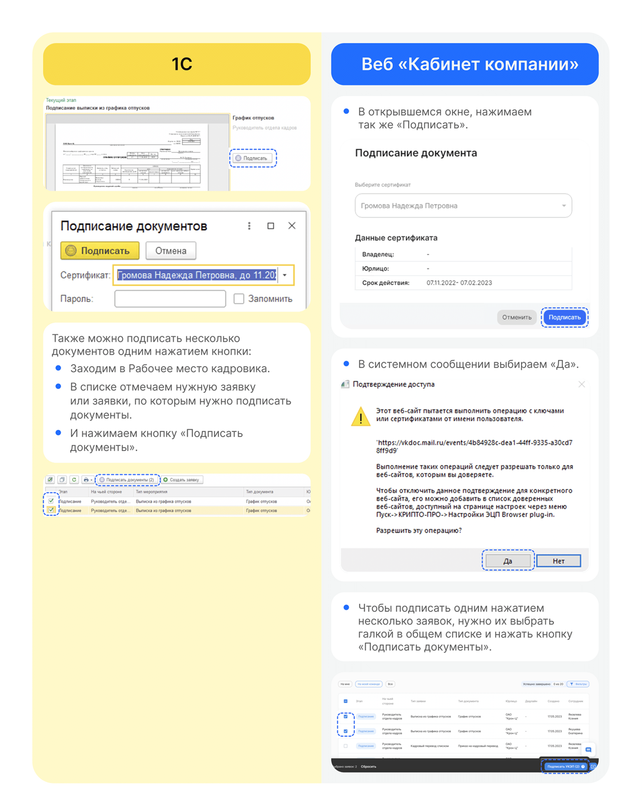
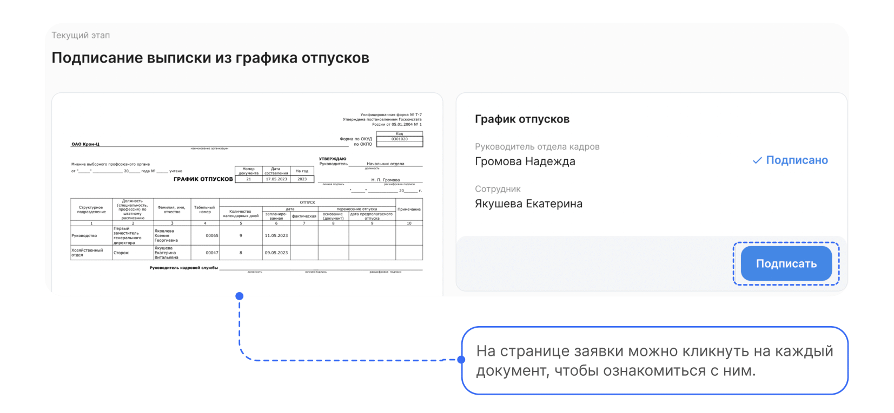

# Процесс «Выписка из графика отпусков»

 

## Маппинг

Перед началом формирования документов в заявке некоторые документы можно сформировать автоматически. Для этого в начальных настройках нужно проставить соответствие документов (маппинг). 

1. Кадровый специалист переходит в **КЭДО** → **Начальная настройка КЭДО** → **Соответствие документов**.
2. В колонке **Документ КЭДО** нажимает два раза по полю напротив документа 1С **График отпусков**, нажимает троеточие и выбирает **Выписка из графика отпусков**.

3. Выбирает нужные печатные формы.
4. Нажимает **Сохранить изменения**.

 

## Этап 1. Формирование заявки и загрузка документов Отделом кадров

Отдел кадров может создавать заявки и в **1С**, и в **Сервисах компании веб-сервиса**, и отправлять документ на одного сотрудника или массовой рассылки на сотрудников подразделения при юридической/управленческой оргструктуре.

 

## Этап 2. Подписание документов Руководителем отдела кадров

Руководитель отдела кадров может подписывать заявки и в **1С**, и в **Сервисах компании** веб-сервиса, с помощью УКЭП.

 

## Этап 3. Подписание документов сотрудником

1. Сотруднику поступает уведомление на телефон о том, что нужно подписать документ. Он переходит в Личный кабинет в **Мои сервисы**, в раздел **Заявки**.
2. Открывает нужную заявку.
3. Нажимает кнопку **Подписать**. Тип подписи: ПЭП.

