# Процесс «Уведомление о начале отпуска»

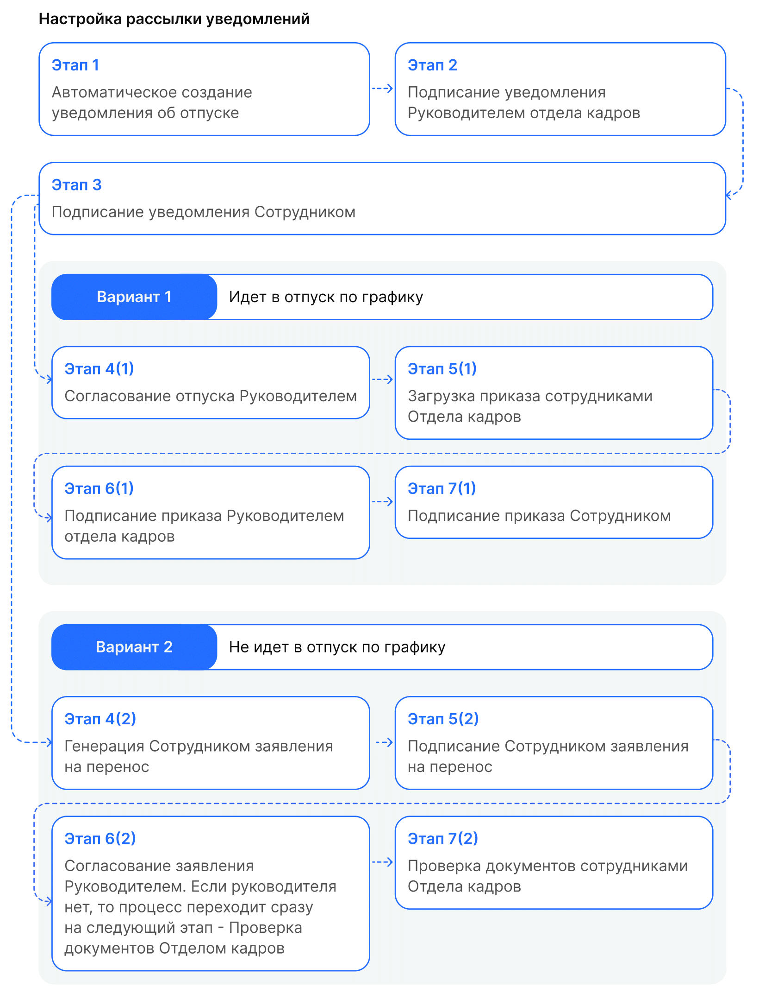

 

## Настройка рассылки уведомлений

Чтобы настроить рассылку уведомлений, кадровый специалист:

1. Заходит в 1С, в раздел **КЭДО** → **Начальная настройка**.

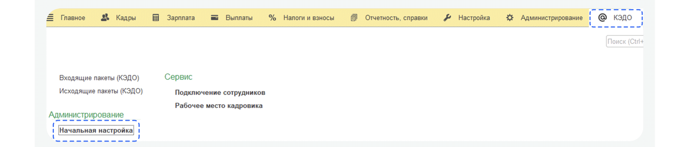

2. Нажимает **Далее**

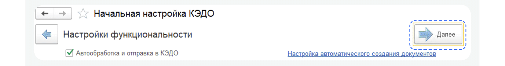

4. Снова нажимает **Далее**.
5. Выбирает пункт **Рассылка уведомлений по графикам отпусков**.

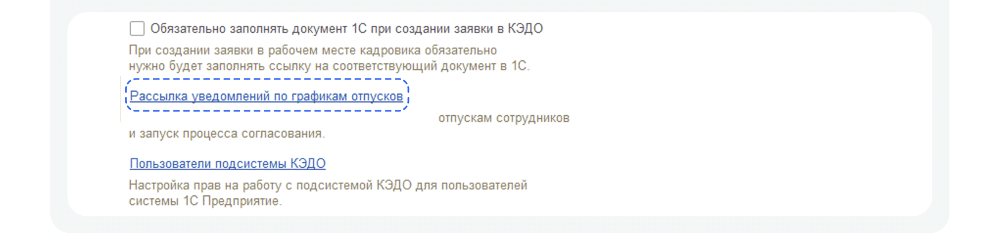

 

<warn>

Очень важно актуально вести график отпусков, так как данные будут браться именно из него

</warn>

6. Выбирает за сколько дней (рабочих, календарных) будет генерироваться уведомление.
7. Выбирает исполнителя. Это может быть любой сотрудник отдела кадров из списка, данные поле нужно заполнить для автоматической генерации уведомления (указанному исполнителю, ничего не нужно будет делать дополнительно).
8. Выбирает документ КЭДО **Уведомление о начале отпуска**.
9. Записивает выбранные данные и закрывает форму настройки.

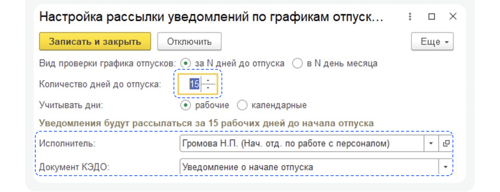

 

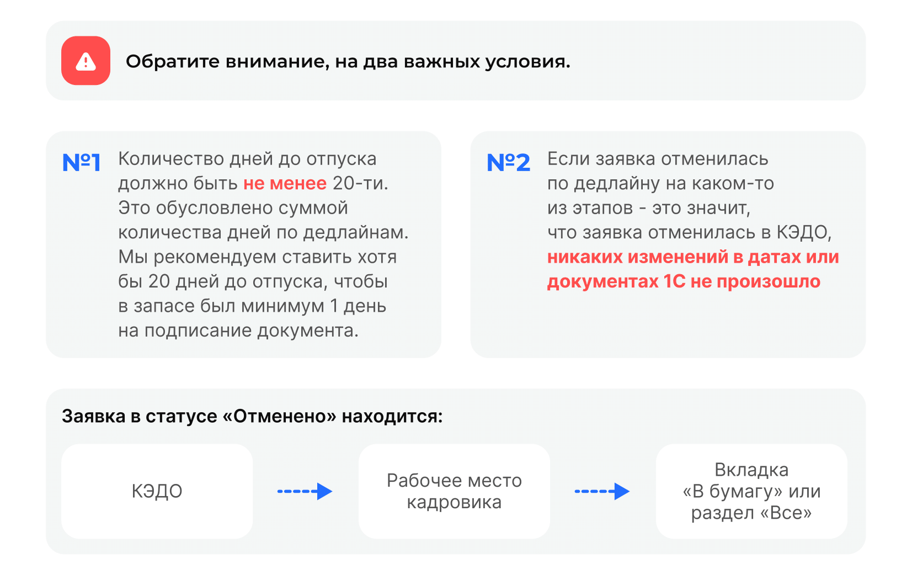

 

<info>

В разделе **Все** отмененные заявки находятся в статусе **Отменено**, если на вкладке **В бумагу** выбрать заявку и нажать кнопку **В бумагу** (для подписания на бумаге), то тогда у такой заявки поменяется статус в разделе **Все**, статус будет **В бумагу**.
Раздел **В бумагу** сделан для контроля сотрудником отдела кадров отмененных заявок, его нужно проверять и принимать решение по каждой из заявок: переводить их в бумагу и подписывать
на бумаге, либо не трогать с пониманием, что заявка отменилась и удалить и провести нужные 1С документы.

</info>

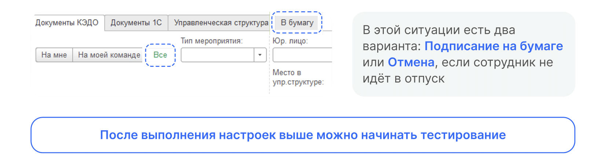

 

## Этап 1. Автоматическое создание уведомления об отпуске
Чтобы протестировать этот процесс, Сотрудник:
1. Создает тестовый график отпусков и выставляет в настройках за сколько дней должно приходить уведомление (пример: 20 календарных дней).

<warn>

Дедлайн подписания уведомления работником — за 18 календарных дней до даты начала отпуска. Не берем дату подачи заявки и считаем 20 календарных дней. 20-тый календарный день будет считаться началом отпуска.

</warn>

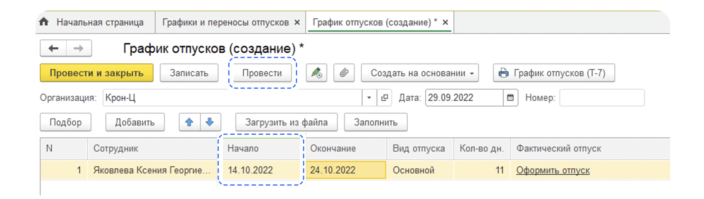

2. После указания даты начала и окончания отпуска, нажимает **Провести**.

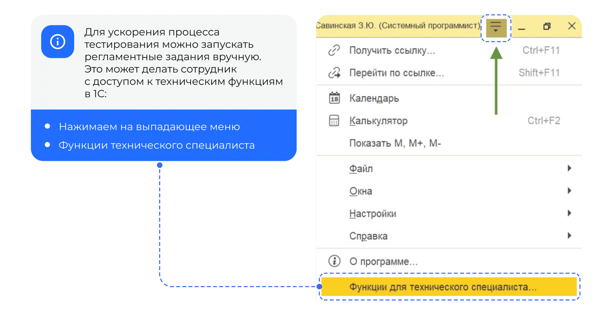

3. Переходит в **Функции технического специалиста**. В поиске набирает **КЭДО**.
4. И выбирает пункт **Дата последней рассылки уведомлений по графикам отпусков (КЭДО)**.

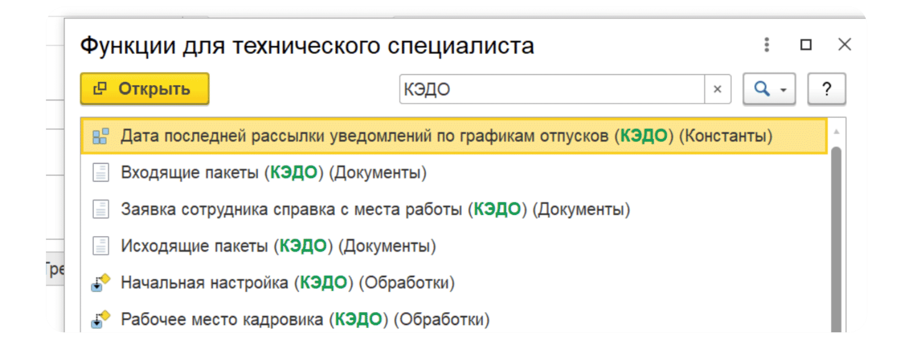

5. Убирает дату в окне.
6. Нажимает **Записать и закрыть**.

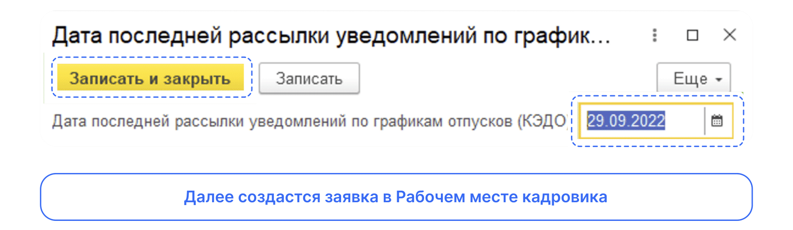

<info>

Заявка создаётся по всем сотрудникам, кто удовлетворяет условиям по настроенному расписанию (т.е. создан график отпусков
с подключенными к КЭДО сотрудниками) и кто подключен к КЭДО (т.е.авторизовался в сервисе и выпустил УНЭП).

</info>

## Этап 2. Подписание уведомления Руководителем отдела кадров

<warn>

Дедлайны в заявке **1С** НЕ отображаются. Дедлайн можно просмотреть только в заявке веб-сервиса.

</warn>

Руководитель Отдела кадров может работать с заявкой и в **1С**, и в **Сервисах компании веб-сервиса**.

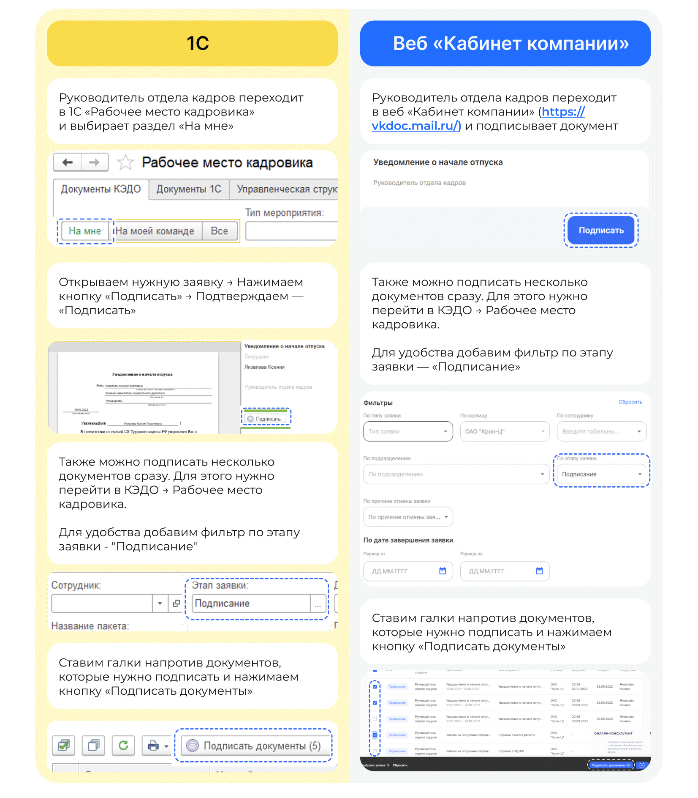

 

## Этап 3. Подписание уведомления Сотрудником

1. Сотруднику поступает уведомление на телефон о том, что нужно подписать документ. 
2. Для этого Сотрудник переходит в **Сервисы сотрудника в веб-сервисе**, в раздел **Заявки**.
3. Открывает заявку.
4. Нажимает **Подписать**.

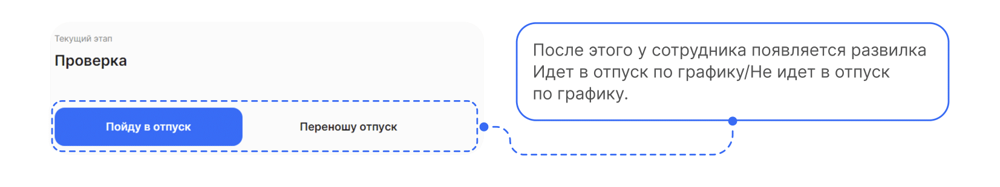

 

## Вариант 1. Сотрудник идет в отпуск по графику

### Этап 4(1). Согласование отпуска Руководителем

<warn>

Этап с возможностью пропуска **Skip**. Возможность нужна для того, чтобы Руководитель был информирован обо всех заявках по его подчинённым. Даже если кнопку **Подтвердить** на этом этапе не нажмут, то после истечения срока дедлайна заявка автоматически пройдёт дальше.

</warn>

Руководитель переходит в **Сервисы компании в веб-сервисе**, в раздел **Заявки**.

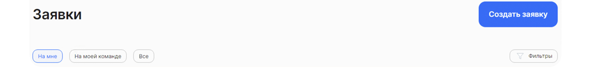

 

<info>

На данном этапе Руководитель может либо **Подтвердить**, либо **Отменить заявку**. Если руководитель отменяет заявку, то тогда сотруднику нужно подать **Заявление на перенос отпуска**, на согласованные с руководителем даты.

</info>

1. Руководитель открывает нужную заявку.
2. Нажимает **Подтвердить**.

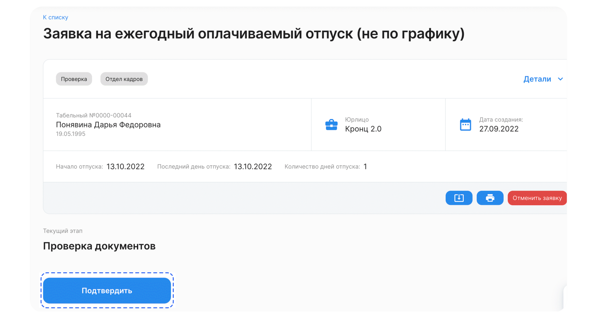

 

### Этап 5(1). Загрузка приказа сотрудниками Отдела кадров

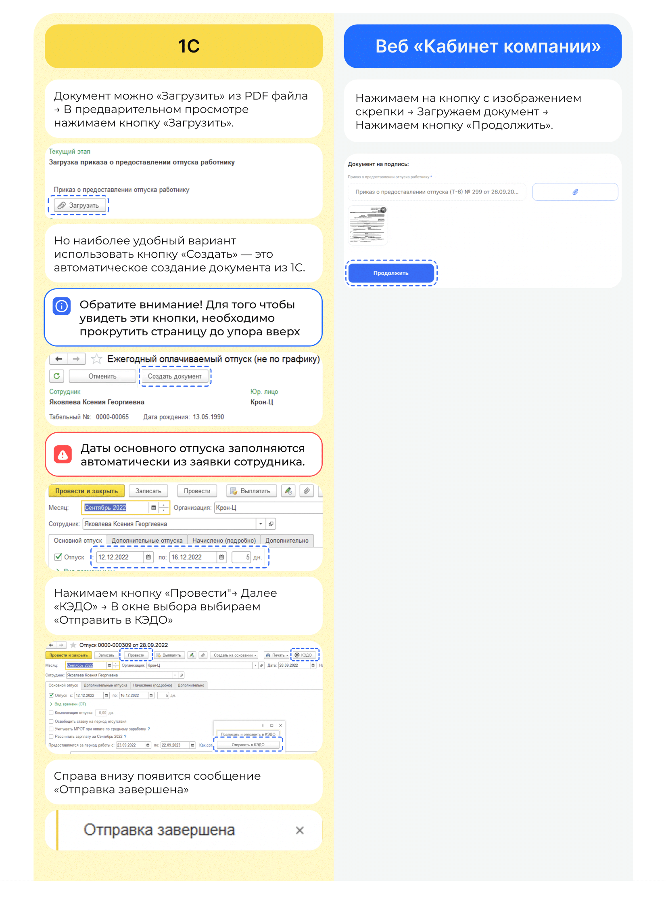

 

### Этап 6(1). Подписание приказа Руководителем отдела кадров

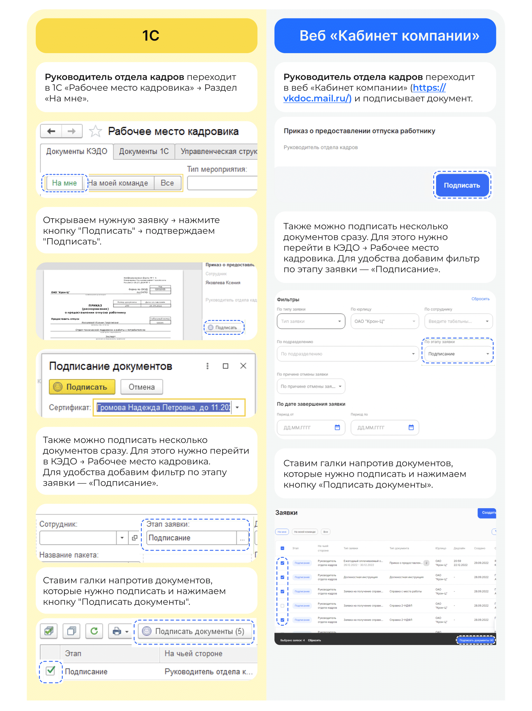

 

### Этап 7(1). Подписание приказа Сотрудником

1. Сотруднику поступает уведомление на телефон о том, что нужно подписать документ. 
2. Сотрудник переходит в Личный кабинет в **Сервисы сотрудника в веб-сервисе**.
3. Открывает заявку.
4. Нажимает **Подписать**.

### Процесс завершен

## Вариант 2. Сотрудник не идет в отпуск по графику

### Этап 4(2). Генерация Сотрудником заявления на перенос

1. Если сотрудник выберет не идти в отпуск, тогда формирует и подписывает Заявление на перенос отпуска.

2. Сотрудник указывает **Изначальную дату начала отпуска** и **Изначальную дату окончания отпуска**.

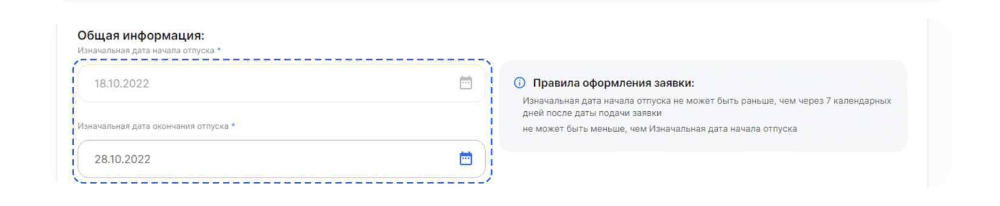

3. Далее указывает **Новую дату начала отпуска** и **Новую дату окончания отпуска**.

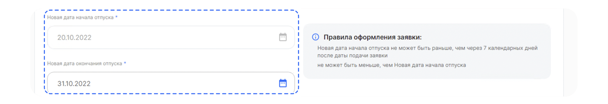

 

### Этап 4(2). Генерация Сотрудником заявления на перенос

1. Выбирает причину переноса.
2. Нажимает **Перейти к предпросмотру**.

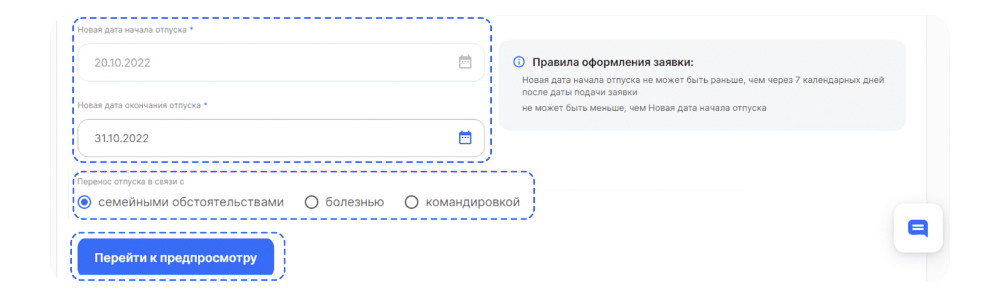

3. Нажимает **Продолжить**.

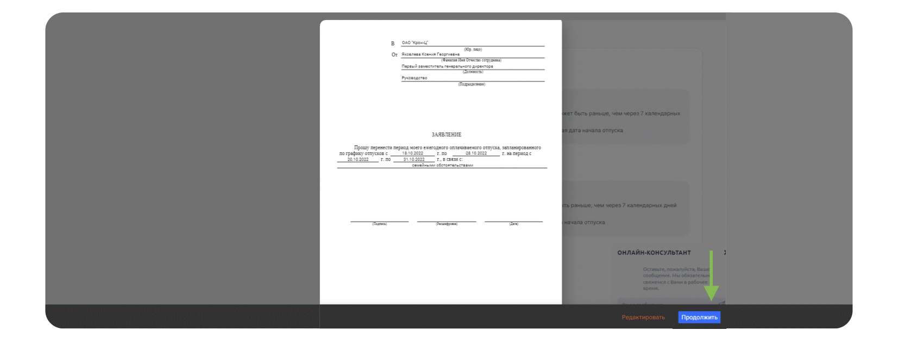

 

### Этап 5(2). Подписание Сотрудником заявления на перенос

1. Сотруднику поступает уведомление на телефон о том, что нужно подписать документ. Для этого Сотрудник переходит в **Сервисы сотрудника в веб-сервисе**, в раздел **Заявки**.
2. Открывает заявку.
3. Нажимает **Подписать**.

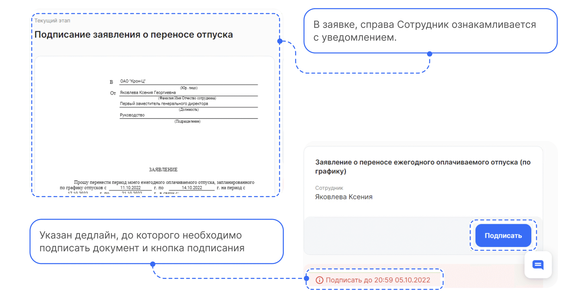

4. Проверяет документ.
5. Нажимает **Подписать**.

 

### Этап 6(2). Согласование заявления Руководителем

<warn>

Если по какой-то причине у сотрудника нет руководителя, то процесс переходит сразу на следующий этап *Проверка документов* Отделом кадров.

Руководитель переходит в **Сервисы компании в веб-сервисе**, в раздел **Заявки**.

</warn>

<warn>

На данном этапе Руководитель может либо **Подтвердить**, либо **Отменить заявку**.
В случае отмены заявки, процесс стартует с первого этапа формирования заявления сотрудником.

</warn>

Руководитель открывает нужную заявку и нажимает **Подтвердить**.

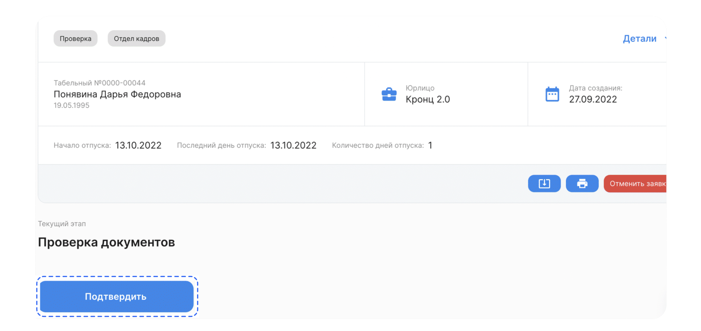

 

### Этап 7(2). Проверка документов сотрудниками Отдела кадров

Отдел кадров может работать с заявкой и в **1С**, и в **Сервисах компании веб-сервиса VK HR Tek**.

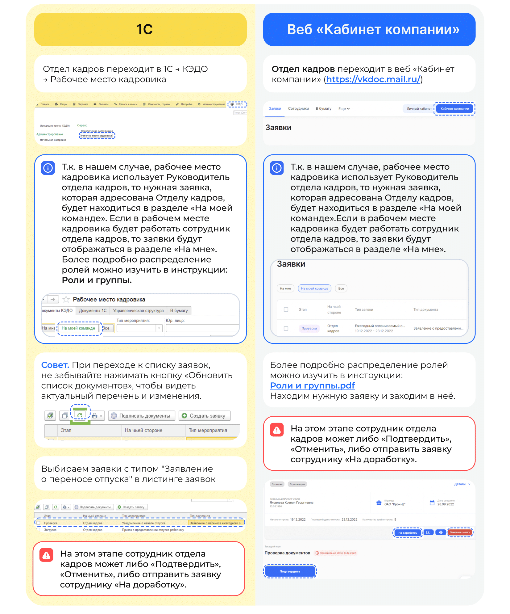
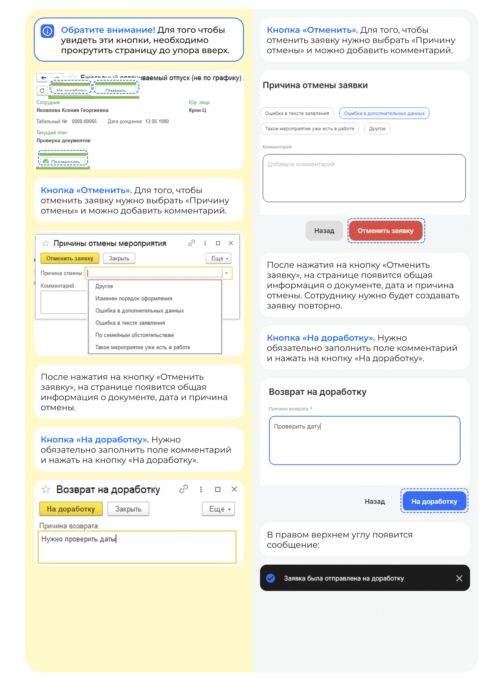
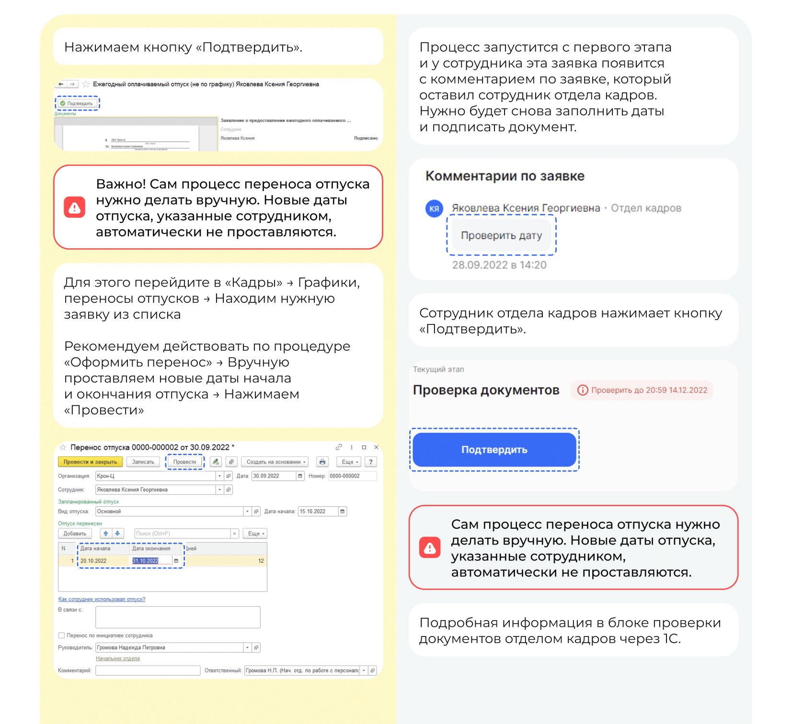
