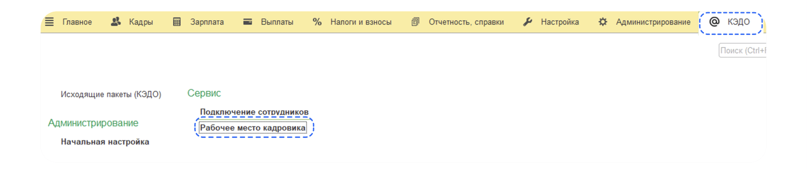
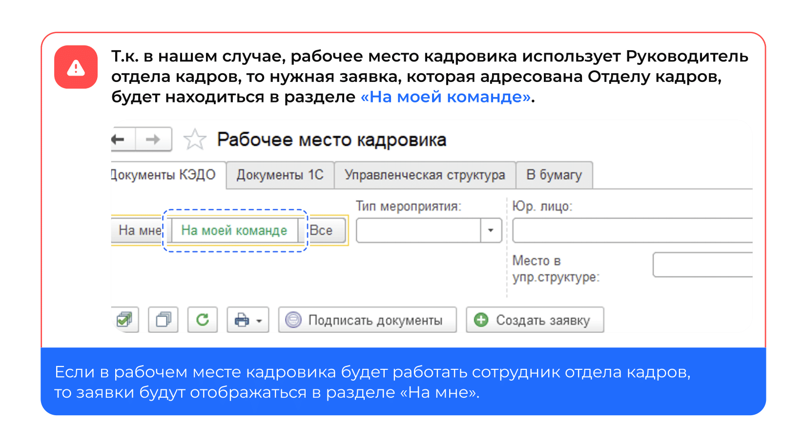
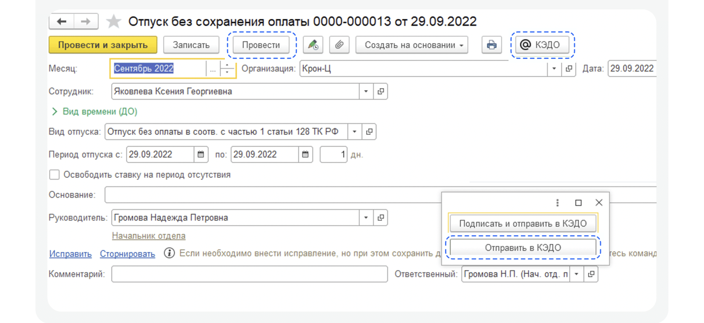
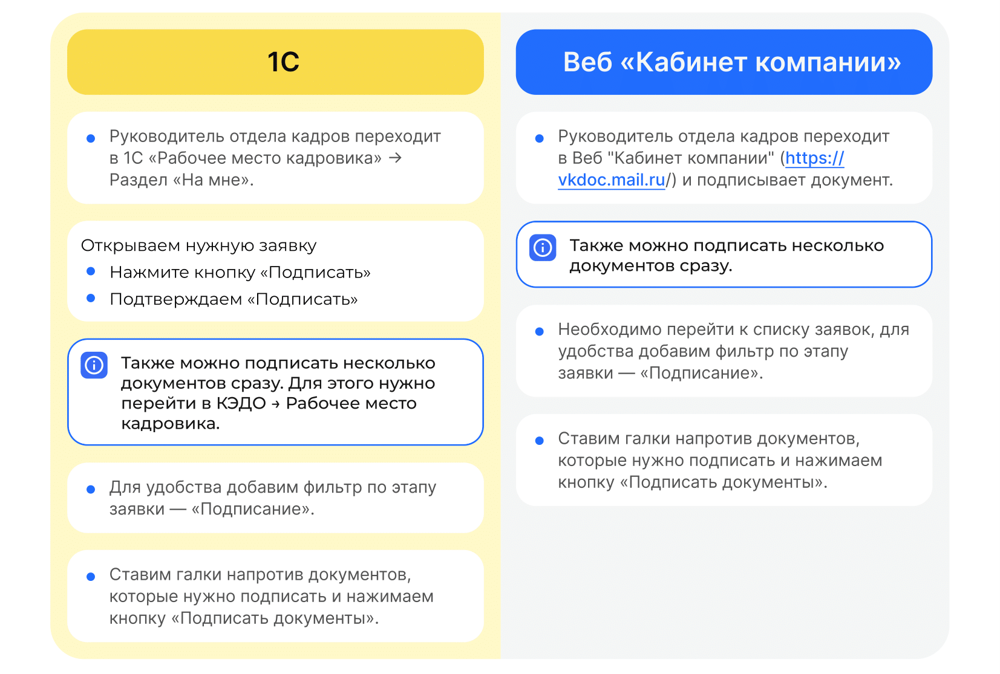

# Процесс «Ежегодный отпуск без сохранения заработной платы»

## Старт процесса

1. Чтобы подать заявление на отпуск без сохранения заработной платы, Сотрудник заходит в **Сервисы сотрудника веб-сервиса VK HR Tek**, в раздел **Заявки**.
2. Нажимает кнопку **Создать заявку**.
3. Выбирает **Отпуск без сохранения заработной платы**.
4. Нажимает кнопку **Подтвердить**.

## Этап 1. Формирование Сотрудником заявления о предоставлении ежегодного отпуска без сохранения заработной платы

1. На странице указывается количество доступных дней отпуска у сотрудника. Обратите внимание на **Правила оформления заявки**, расположенные справа от указания дат отпуска.
2. Сотрудник выбирает **Дату начала отпуска** и **Дату окончания отпуска**.
3. Далее **Перейти к предпросмотру**.
4. Нажимает кнопку **Продолжить**.

## Этап 2. Подписание заявления Сотрудником 

Сотрудник проверяет документ и нажимает кнопку **Подписать** до наступления дедлайна.

## Этап 3. Согласование заявления Руководителем
Если по какой-то причине у сотрудника нет руководителя, то процесс переходит сразу на следующий этап *Загрузка приказа* Отделом кадров.

1. Руководитель переходит в **Сервисы компании веб-сервиса**, в раздел **Заявки**.

<warn>

На этапе согласования Руководитель может либо **Подтвердить**, либо **Отменить** заявку.
В случае отмены заявки, процесс стартует с первого этапа формирования заявления сотрудником.

</warn>

2. Руководитель открывает нужную заявку.
3. Нажимает **Подтвердить**.

## Этап 4. Загрузка приказа сотрудниками Отдела кадров

<info>

Дедлайны в заявке **1С** НЕ отображаются. Просмотреть дедлайн можно только в заявке веб-сервиса.

</info>

Отдел кадров может работать с заявкой и в **1С**, и в **Сервисах компании веб-сервиса**.

1. Сотрудник отдела кадров переходит в **1С** → **КЭДО** → **Рабочее место кадровика**.

<info>

При переходе к списку заявок не забывайте нажимать кнопку **Обновить список документов**, чтобы видеть актуальный перечень и изменения.

</info>

Наиболее удобный вариант использовать кнопку **Создать** для автоматического создания документа из **1С**.

2. Даты основного отпуска заполняются автоматически из заявки сотрудника.

3. Кадровый специалист нажимает кнопку **Провести**.
5. Нажимает кнопку **КЭДО**.
6. В открывшемся окне выбирает **Отправить в КЭДО**.

Справа внизу появится сообщение **Отправка завершена**.

6. Нажимает на кнопку с изображением скрепки.
8. Загружает документ.
9. Нажимает кнопку **Продолжить**.

## Этап 5. Подписание приказа Руководителем отдела кадров

## Этап 6. Подписание приказа Сотрудником

Сотруднику поступает уведомление на телефон о том, что нужно подписать документ.

1. Сотрудник переходит в **Сервисы сотрудника в веб-сервисе**, в раздел **Заявки**.
2. Открывает заявку.
3. Нажимает кнопку **Подписать**.

