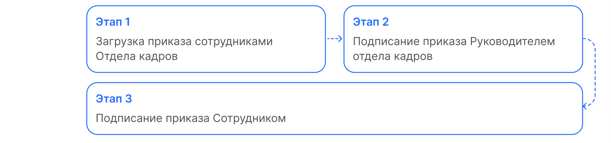
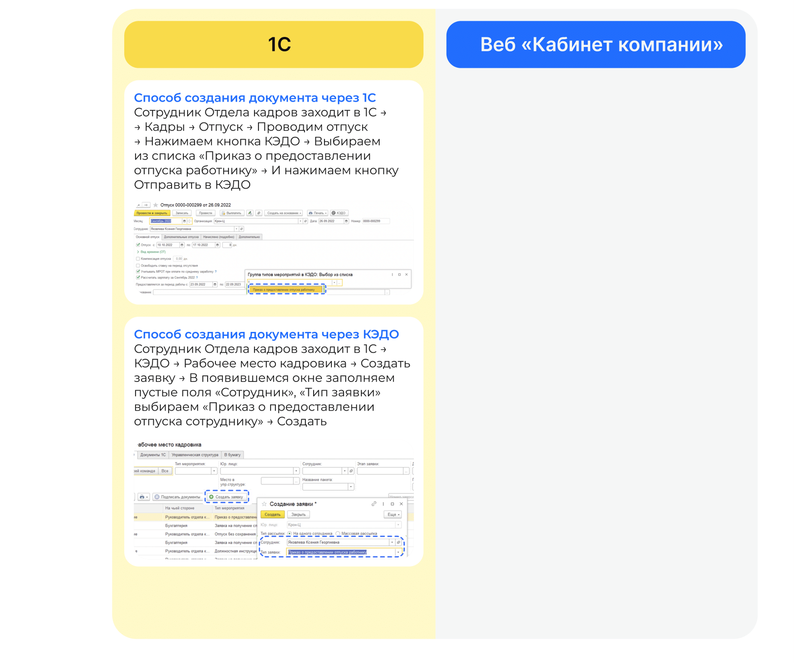
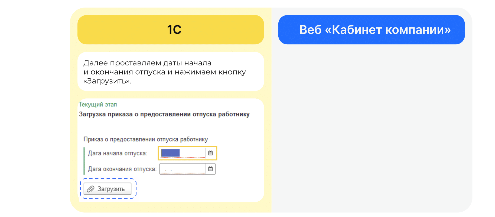
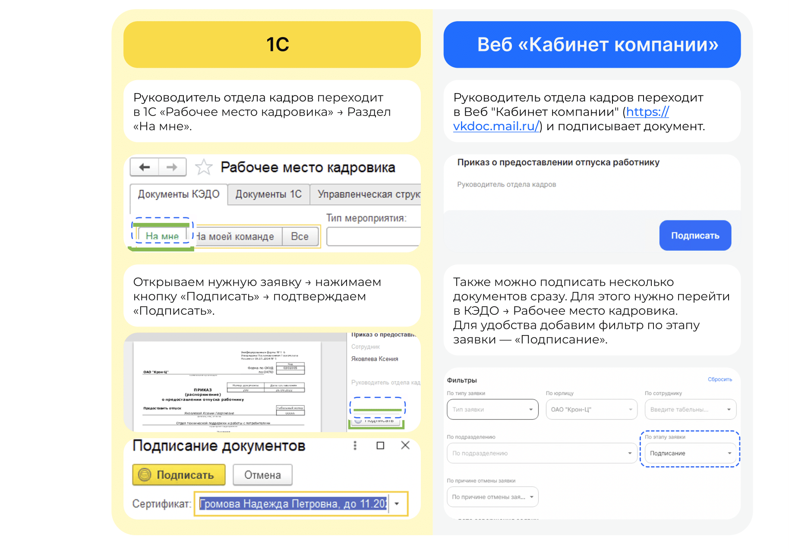
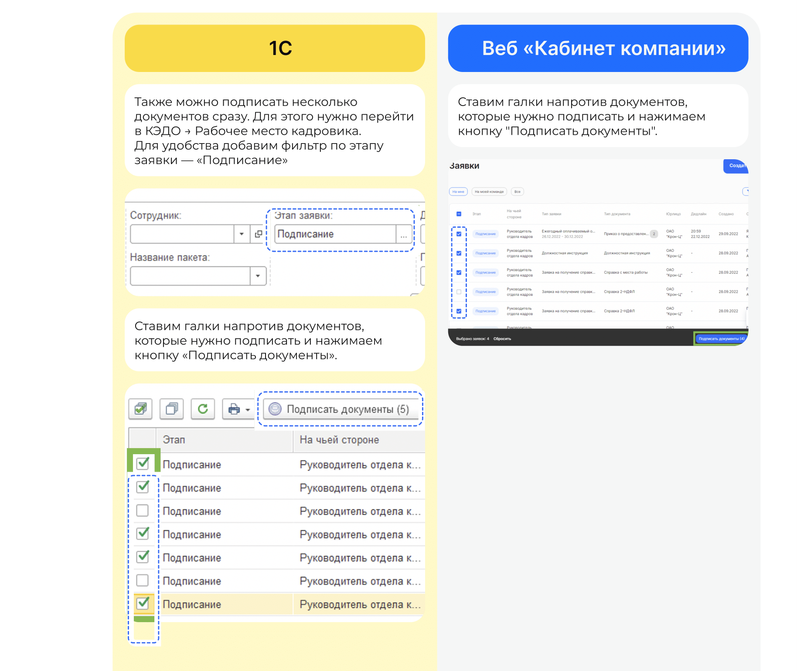

# Процесс «Приказ на отпуск»

# Этап 1. Загрузка приказа сотрудниками Отдела кадров

Есть два варианта добавления приказа в **1С**. С помощью создания документа через **1С** или с помощью кнопки **Создание заявки** через **КЭДО**.

# Этап 2. Подписание приказа Руководителем отдела кадров

Руководитель отдела кадров может работать с заявкой и в **1С**, и в **Сервисах компании веб-сервиса VK HR Tek**.

# Этап 3. Подписание приказа Сотрудником

1. Сотруднику поступает уведомление на телефон о том, что нужно подписать документ. 
2. Сотрудник переходит в **Сервисы сотрудника в веб-сервисе**, в раздел **Заявки**.
3. Открывает заявку.
4. Нажимает **Подписать**.

Чтобы подтвердить подписание документа, на телефон поступает смс сообщение, код из которого Сотрудник вводит в открывшемся окне и нажимает кнопку **Подписать**.
