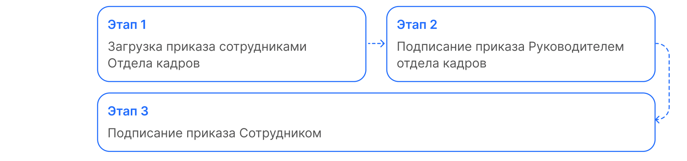
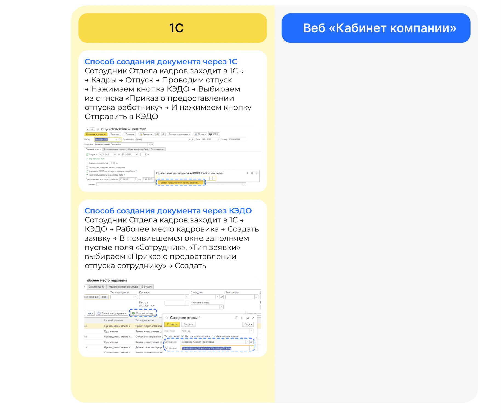
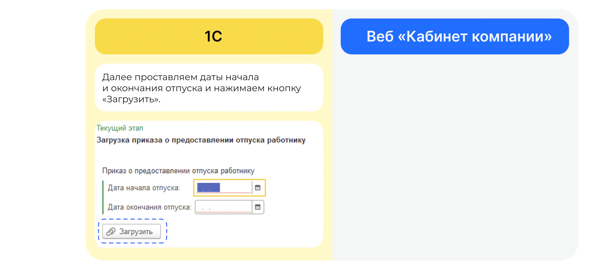
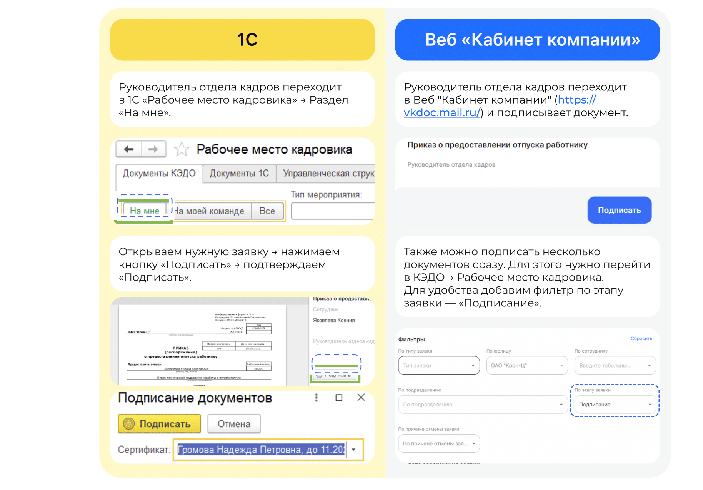
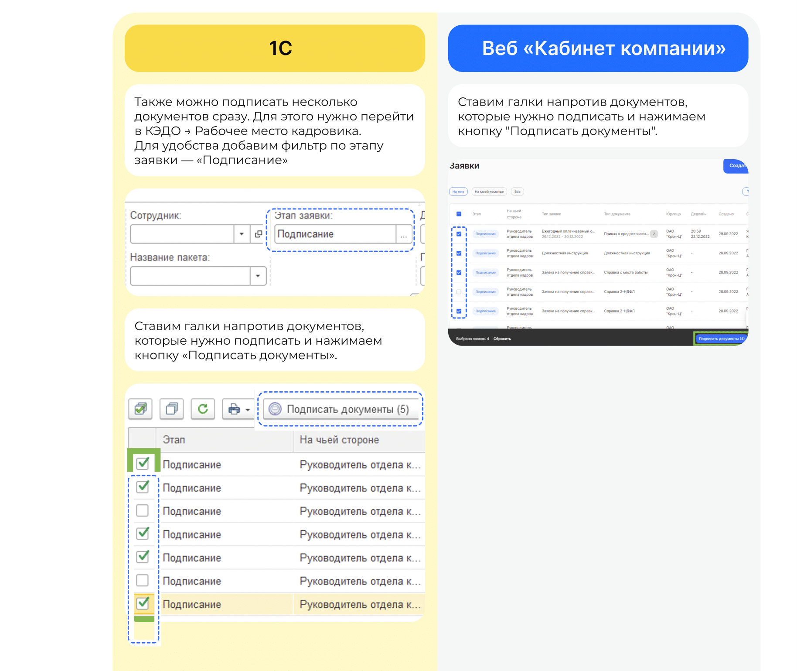

# Процесс «Приказ на отпуск»

# Этап 1. Загрузка приказа сотрудниками Отдела кадров

Отдел кадров может создавать заявки и в 1С, и в **Сервисах компании** веб-сервиса, и отправлять документ на одного сотрудника или массовой рассылки на сотрудников подразделения при юридической/управленческой оргструктуре.

Есть два варианта добавления приказа в **1С**. С помощью создания документа через **1С** или с помощью кнопки **Создать заявки** через **КЭДО**. Специалист должен загрузить заявление не позднее, чем за 4 дня до даты начала отпуска.. 

# Этап 2. Подписание приказа Руководителем отдела кадров

Руководитель отдела кадров может подписывать заявки и в **1С**, и в **Сервисах компании** веб-сервиса VK HR Tek, с помощью УКЭП. Руководитель должен подписать заявление не позднее, чем за 3 дня до даты начала отпуска. 

# Этап 3. Подписание приказа Сотрудником

1. Сотруднику поступает уведомление на телефон о том, что нужно подписать документ. 
2. Сотрудник переходит в **Мои сервисы** в веб-сервисе, в раздел **Заявки**.
3. Открывает нужную заявку.
4. Нажимает **Подписать**. Тип подписи: ПЭП. Сотрудник должен подписать заявление не позднее, чем за 1 день до даты начала отпуска. 