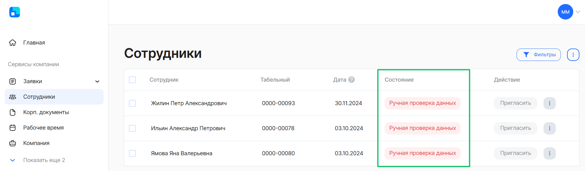
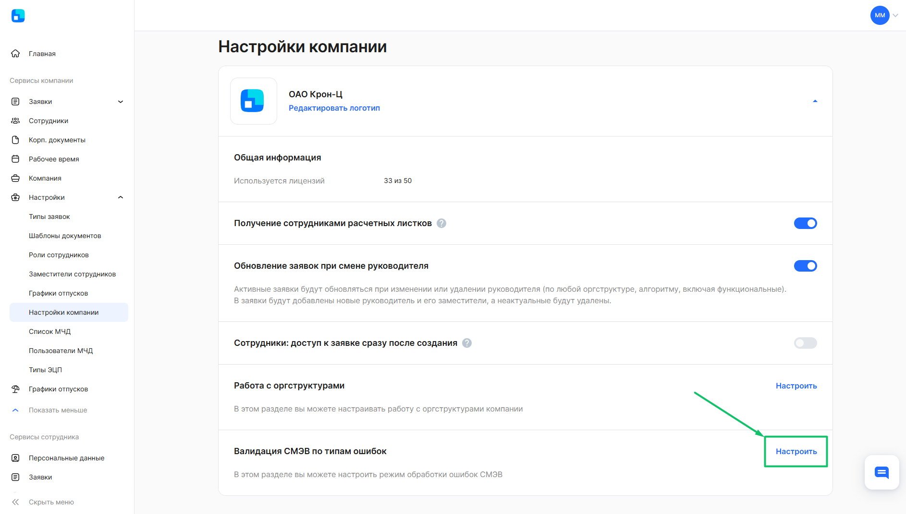
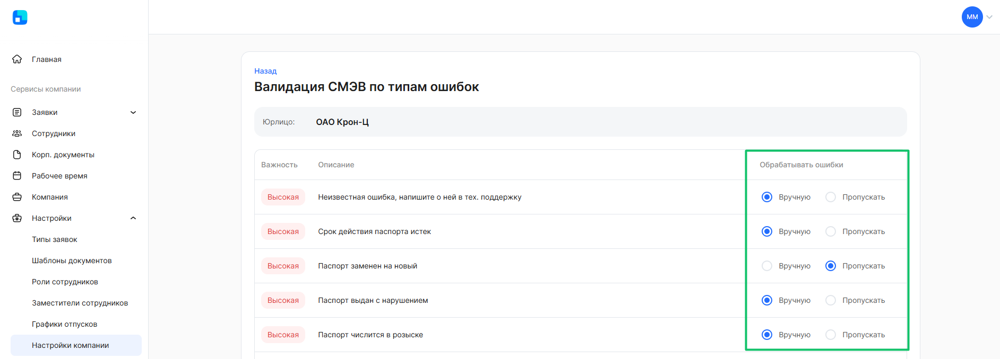
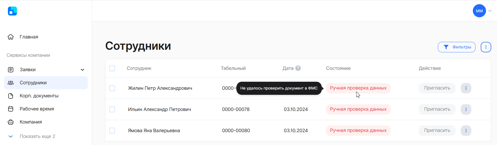
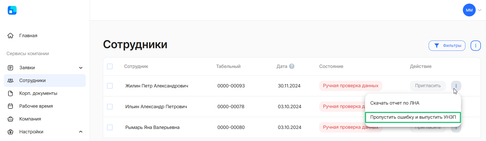
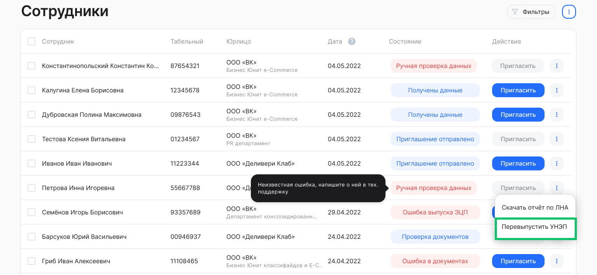

При выпуске усиленной неквалифицированной электронной подписи (УНЭП) сотрудника может возникнуть ошибка «Ручная проверка данных». Это значит, что данные сотрудника, который пытается авторизоваться в сервисе VK HR Tek и выпустить электронную подпись, не прошли проверку СМЭВ. 

Система межведомственного электронного взаимодействия (СМЭВ) — это информационная система, с помощью которой федеральные, региональные и местные органы власти обмениваются данными для оказания госуслуг гражданам и организациям. При выпуске усиленной подписи Удостоверяющий центр обращается к СМЭВ, чтобы проверить данные на валидность.

 

Если данные сотрудника не прошли проверку СМЭВ, это может означать, что они являются неактуальными в кадровой системе его компании. Такие случаи зачастую происходят из-за замены паспорта, его утраты или по причине других обстоятельств. Однако если данные были сверены и их корректность была подтверждена, можно констатировать ошибочный результат проверки со стороны СМЭВ.

Ранее такие проблемы решались посредством обращения в службу технической поддержки для пропуска таких ошибок. Команда VK HR Tek осуществляла подтверждение корректности данных со стороны отдела кадров по сотруднику компании.

<warn>

В рамках [релиза 2024.08.00](/ru/release_notes/saas/20240800Core#dlya_predstaviteley_kompanii) был добавлен механизм пропуска ошибок «Ручная проверка данных» на клиентской стороне.

</warn>

## **Как обойти ошибку «Ручная проверка данных»?**

### **Для сотрудников компании**

В случае ошибки выпуска УНЭП сотрудник должен обратиться в отдел кадров для проверки актуальности данных в системе учета кадров организации. В случае обнаружения ошибок в таких документах, как паспорт, ИНН или СНИЛС, выпуск УНЭП запустится автоматически, как только ошибки будут исправлены.

Если в ходе проверки будет установлено отсутствие каких-либо ошибок в перечисленных документах, отдел кадров может пропустить предупреждение и запустить повторную процедуру выпуска УНЭП.

### **Для представителей компании**

Для обработки ошибок СМЭВ необходимо выполнить следующие действия под ролью «Отдел кадров»:

1. Перейти в **Сервисы компании → Настройки → Настройки компании**.
1. Зайти в настройку **Валидация СМЭВ по типам ошибок**. Настройка содержит типы и описания ошибок, которые может передать СМЭВ по сотруднику.

3. По каждому типу ошибки установить одно из значений:
- **Вручную** — при возникновении ошибки «Ручная проверка данных» отдел кадров сможет пропускать такие ошибки и выпускать УНЭП вручную;
- **Пропускать** — ошибка «Ручная проверка данных» будет пропущена автоматически.

 

В случае выбора значения «Вручную» пропуск ошибок осуществляется в разделе **Сервисы компании** → **Сотрудники**.

Для пропуска ошибки вручную:

1. Перейдите в раздел **Сотрудники**.
1. Наведите курсор на поле «Состояние» по сотруднику и ознакомьтесь с причиной возникновения ошибки.

3. Если вы удостоверились, что ошибка в вашей кадровой системе исправлена по сотруднику, нажмите кнопку  и  пункт **Пропустить ошибку и выпустить УНЭП**.

## **Что делать, если функция «Пропустить ошибку и выпустить УНЭП» недоступна?**

Обратите внимание, что в ряде случаев будет недоступен выбор функции **Пропустить ошибку и выпустить УНЭП**. Это означает, что при выпуске УНЭП произошла фатальная ошибка, которая может свидетельствовать о двух ситуациях: 

- Паспортные данные в кадровой системе вашей компании невалидны. Их необходимо скорректировать на новые и запустить процедуру выпуска подписи повторно, выбрав функцию **Перевыпустить УНЭП**.
- Паспортные данные сотрудника в кадровой системе компании корректны, но не обновились в МВД РФ. Чтобы ускорить обновление, сотруднику рекомендуется выполнить алгоритм, представленный ниже. После подтверждения корректности данных со стороны МВД представитель компании может повторно инициировать процедуру выпуска подписи, выбрав функцию **Перевыпустить УНЭП**.

## **Как ускорить обновление паспортных данных в МВД?**

Сотруднику необходимо выполнить следующий алгоритм:

1. Зайти на сайт МВД РФ по ссылке [https://мвд.рф/request_main](https://xn--b1aew.xn--p1ai/request_main). 
1. На главной странице выбрать подразделение для приема обращений — «Главное управление по вопросам миграции».
1. Нажать на кнопку «Продолжить» под списком подразделений.
1. Подать обращение, в котором загрузить скриншот страницы с сайта «Госуслуги» с паспортными данными, а также фото или скан главного разворота паспорта.

После того как сотрудник получит по электронной почте уведомление от МВД о том, что ошибки скорректированы, специалист отдела кадров может выполнить процедуру перевыпуска УНЭП.