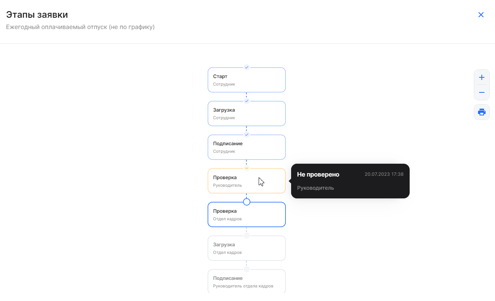
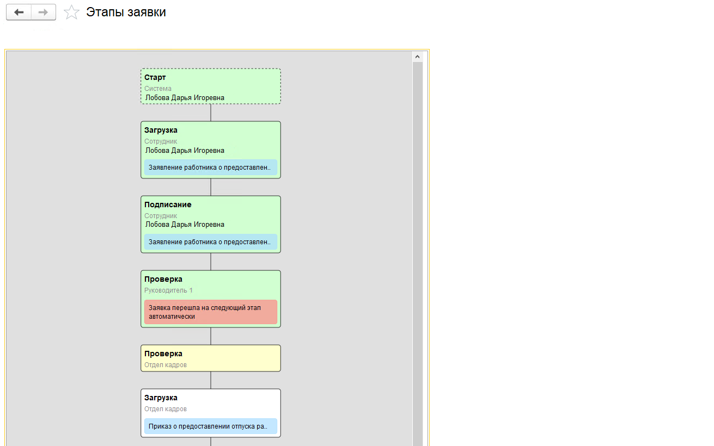
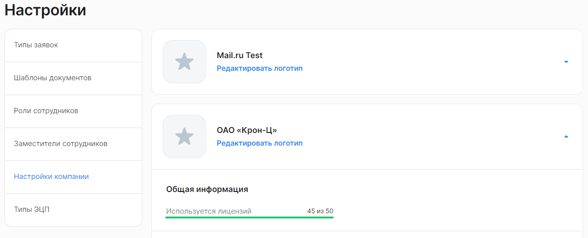
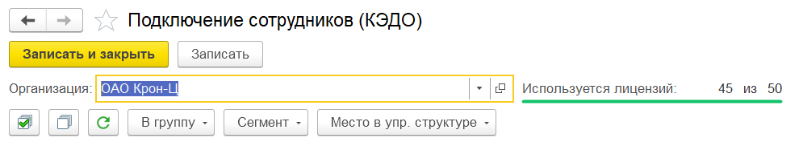
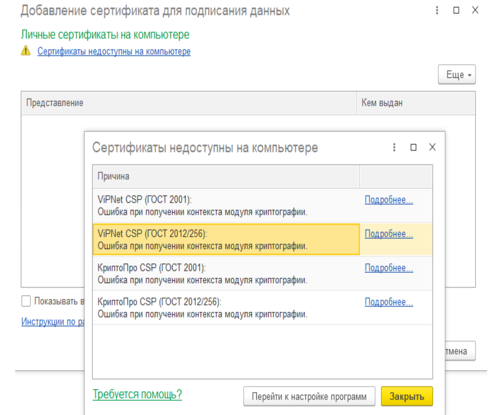
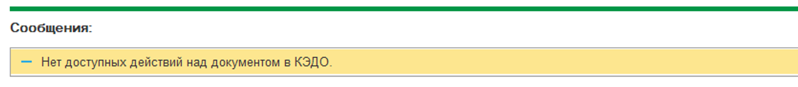
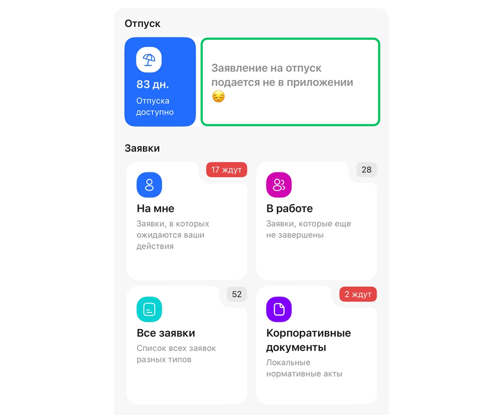

## Работа в веб-сервисе VK HR Tek

### Работа с заявками

Как посмотреть общее количество заявок?

В сервисе откройте **Кабинет компании** → **Заявки**, выберите все заявки (фильтр **Все**), в конце списка будет отображено количество заявок.

 

 

Заявка отменилась до подписания руководителем Отдела кадров, что делать?

Если на этапах заявки назначены дедлайны, то в случае просрочки на одном из этапов, заявка отменяется.

Если при отмене заявка попадает в список «В бумагу», то заявку можно найти в этом разделе — распечатать и подписать документ в бумажном виде.

Если опция «В бумагу» не была настроена, то заявка отменится без возможности подписать бумажный документ. В таком случае заявку нужно создавать заново.

 

 

Можно ли удалить лишние заявки из Личного кабинета?

Заявки удалить нельзя. Все заявки, созданные в КЭДО, сохраняются в Личном кабинете. 

Если заявка больше не актуальна, её можно [отменить](/ru/hr/company/application/cancel). Для этого в открытой заявке нажмите кнопку **Отменить заявку** и укажите причину. Заявка получит статус «Отменено».

 

 

У совместителя нет возможности подать заявку от второго табельного номера, что делать?

Если это внутренний совместитель (например, у сотрудника может быть две должности и два табельных номера в одной компании), то сотруднику нужно направить приглашение от нового табельного номера (должности). Он должен перейти по новой ссылке, тогда вторая должность добавится в КЭДО и ему будет доступен выбор должности при старте заявки.

Если это внешний совместитель, то сотруднику нужно направить приглашение в КЭДО от второй компании. Сотрудник должен пройти по новой ссылке-приглашению, чтобы второй табельный номер добавился в Личном кабинете сотрудника. Повторный выпуск УНЭП не требуется.

 

 

Как узнать, был ли документ согласован руководителем

Если в заявке есть этап согласования, сотрудник и его руководитель подключены к КЭДО, то заявка попадёт в Отдел кадров только после согласования руководителем. Если руководитель не подключен к КЭДО, заявка минует согласование с ним и попад1т сразу в Отдел кадров. В веб-сервисе доступно отображение цепочки этапов, по которой можно проверить, был ли этап заявки согласован с руководителем (раздел **Заявки** → **открыть заявку** → **кнопка Этапы заявки**) — так Отдел кадров сможет отследить, было ли согласование.

Чтобы просмотреть этапы заявки в 1С расширении КЭДО, нажмите кнопку **Этапы заявки** в нужной заявке.

 

 

### Работа с электронной подписью

Сотрудник не может выпустить УНЭП, что делать?

1. УНЭП может формироваться до суток — нужно подождать.
1. Возможно, есть ошибка в персональных данных сотрудника. В 1С проверьте корректность данных в карточке сотрудника.
1. Возможно, у сотрудника неподтверждённая учётная запись на Госуслугах — необходимо её подтвердить в вашем центре обслуживания.

Актуальный статус, на котором находится сотрудник, можно посмотреть в разделе «Сотрудники».

 

 

Как сотруднику выпустить/перевыпустить УНЭП?

Сначала сотруднику нужно подтвердить свою личность. Сотрудник может подтвердить свою личность через Госуслуги (ЕСИА).

После того, как сотрудник получил ссылку-приглашение от компании и перешёл по ней на Госуслуги, он может подтвердить выпуск УНЭП. Подробнее в статье [Выпуск электронной подписи через Госуслуги](/ru/hr/employee/registration#vypusk_elektronnoy_podpisi_cherez_gosuslugi).

Перевыпуск УНЭП инициируется автоматически при изменении персональных данных сотрудника или по истечении срока действия сертификата.

Специалист Отдела кадров может посмотреть статус сотрудника в разделе **Кабинет компании** → **Сотрудники**, в столбце **Состояние**.

 

 

Сотрудник поменял паспорт, Отдел кадров внёс новые данные и переподключил сотрудника в КЭДО, но ему не приходит приглашение

Сотруднику не должно приходить приглашение, ему приходит СМС о перевыпуске УНЭП. Сотрудник в зависимости от выбранного компанией способа должен перевыпустить УНЭП.

 

 

### Профиль сотрудника

Как настроить уведомления в Telegram сотрудникам?

Сотрудник должен самостоятельно подключить Telegram в **Профиле**. Компания совместно с менеджером VK HR Tek может настроить дополнительные уведомления. Для этого направьте заполненный файл [Параметры настройки уведомлений](./assets/Settings_notifications.xlsx "download") на адрес поддержки <support@hrtek.ru>.

Подробнее о видах уведомлений в [статье](/ru/hr/notifications).

 

 

Доступ уволенного сотрудника к документам в КЭДО

После увольнения у сотрудника остаётся доступ к своим документам в КЭДО без ограничений – он может войти в систему и скачать необходимые файлы. Однако создание новых заявок будет недоступно.

В **Профиле** уволенный сотрудник будет видеть статус «Уволен» рядом с названием компании.

 

 

### Уведомления

Почему не приходит уведомление об отпуске в КЭДО?

Если у сотрудника уже оформлен отпуск в одном юридическом лице, даже если это юрлицо **не подключено к КЭДО**, и на те же даты запланирован отпуск в другом юридическом лице, **подключенном к КЭДО**, то уведомление **не будет сформировано**, т.к. система КЭДО использует данные из общей базы 1С.

 

 

### Для представителей компании

Токен специалиста Отдела кадров не подходит, ошибка при вводе

Если это первичный ввод токена, то нужно проверить корректность ввода (без пробелов). 

Если токен уже использовался, скорее всего он устарел. Срок действия токена — 90 дней. Чтобы создать новый токен, перейдите в **Профиль** → **Токен** → **Генерация токена для 1С** и нажмите кнопку **Сгенерировать**. 

 

 

Не получается подписать документ УКЭП, что делать?

1. Проверьте, что на компьютере установлена программа КриптоПро с активной лицензией или пробным периодом.
1. Проверьте, что подписание производится той же УКЭП, публичный ключ которой в формате .p7b был выслан менеджеру VK HR Tek (подробнее [о выгрузке сертификата](/ru/hr/company/actions_eds/upload_ukep)). 
1. Сертификат должен быть добавлен в 1С тому пользователю, который будет подписывать документы (см. [Добавление сертификата электронной подписи)](/ru/1C/admin/initial_setup#dobavlenie_sertifikata_elektronnoy_podpisi).
1. Для подписания документов через веб-сервис на компьютере у подписанта должен быть установлен плагин [КриптоПро ЭЦП Browser plug-in](https://www.cryptopro.ru/products/cades/plugin). Корректность его работы можно проверить на [сайте](https://www.cryptopro.ru/sites/default/files/products/cades/demopage/cades_bes_sample.html) (все пункты диагностики должны быть отмечены зеленым).  
1. Дополнительно можно проверить срок действия ЭЦП.

 

 

Руководителю/Отделу кадров не приходят уведомления, что делать?

Для представителей компании базовые уведомления приходят в почту один раз в день, в 10:00 мск. 

Чтобы представитель мог получать письма, в его карточке сотрудника должна быть указана хотя бы одна действующая электронная почта. Дополнительно можно проверить отсутствие корпоративных блокировок для адреса, с которого приходят уведомления сервиса. 

Для настройки дополнительных уведомлений направьте заполненный файл [Параметры настройки уведомлений](./assets/Settings_notifications.xlsx "download") на адрес поддержки <support@hrtek.ru>.

 

 

Сотруднику не пришла ссылка-приглашение, что делать?

1. Проверьте, включены ли регламентные задания в 1С (см. [Проверка регламентного задания для обмена с КЭДО](/ru/1C/admin/initial_setup#proverka_reglamentnogo_zadaniya_dlya_obmena_s_servisom_vk_hr_tek)).
1. Посмотрите, указаны ли в 1С корректные номер телефона/электронная почта в карточке сотрудника (см. [статью](/ru/1C/user/employees/add_employees)).
1. В 1С проверьте исходящие пакеты по интересующему сотруднику — пакет мог уйти с ошибкой (см. [Добавление входящих и исходящих пакетов в быстрый доступ](/ru/1C/user/packages)). В случае обнаружения ошибки обратитесь [в службу поддержки](/ru/hr/support/contact_channels). 
1. Переподключите токен интеграции (см. [Подключение компании и ввод токена](/ru/1C/admin/initial_setup)).
1. В случае отправки на почту сотруднику нужно проверить папку «Спам». 
1. Если все вышеперечисленные пункты выполнены, то можно повторно отправить приглашение из раздела «Сотрудники».

 

 

Ошибка «Неавторизованный запрос 403» при переходе по ссылке из уведомления, как устранить?

Ошибка в основном возникает, когда Руководитель открывает ссылку как сотрудник. Чтобы согласовать заявку как Руководителю, нужно переключиться на **Кабинет компании**. 

 

 

Как посмотреть количество лицензий, которые используются?

В веб-сервисе, в разделе **Настройки компании** находится информация о количестве используемых и доступных лицензий. Чтобы посмотреть точное количество, выберите нужную компанию в настройках и найдите строку «Используется лицензий».

В 1C **КЭДО** → **Подключение сотрудников** доступна информация о количестве используемых и доступных лицензий в компании. Чтобы посмотреть точное количество, выберите нужную организацию из списка.

 

 

Как добавить в КЭДО нового специалиста Отдела кадров?

Проверьте, что сотрудник подключен в расширении КЭДО 1С (см. [Подключение сотрудников компании](/ru/1C/user/employees/connect)). 

Далее в веб-сервисе сотрудник с ролью «Администратор» [выдаст роль](/ru/admin_actions/settings/groups) Отдела кадров новому специалисту.

 

 

## Работа в расширении 1С

Если я фактически не оформлена в «Компании 1» (я оформлена только в одной из семи организаций, которые мы подключим к КЭДО), смогу ли я работать в 1С:ЗУП как сотрудник Отдела кадров, обрабатывать заявки, создавать и подписывать документы?

УКЭП должна быть выпущена для каждого юрлица. Тогда вы сможете обрабатывать заявки, создавать и подписывать документы как работодатель во всех юрлицах (при этом будете трудоустроены только в одном юрлице).

 

 

Как нужно добавлять сертификат с компьютера пользователя, чтобы в 1С не возникла ошибка при получении контекста модуля криптографии?

Сертификаты нужно добавлять с компьютера пользователя, для которого доступна роль «Администратор».

 

 

Сообщение в 1С: «Нет доступных действий над документом в КЭДО»

**Возможные причины появления сообщения**:
1. Некорректно настроено сопоставление документов. Убедитесь, что маппинг документов 1С и КЭДО установлен корректно в разделе **КЭДО** → **Начальная настройка** → **Соответствие документов** (см. [статью](/ru/1C/user/mapping)).
2. Данный документ уже был ранее отправлен в КЭДО, повторная отправка невозможна.
3. Сотрудник, чей документ пытаетесь отправить, не подключен к КЭДО. Подробнее о подключении сотрудника см. в [статье](/ru/1C/user/employees/connect).
4. У пользователя, который отправляет документ, нет нужных прав. Проверьте, назначены ли для пользователя необходимые роли в КЭДО (раздел **Сервисы компании** → **Настройки** → **Роли сотрудников**) и группы доступа в настройке 1С (**Администрирование**  → **Настройки пользователей и прав**).
5. Неверный этап отправки документа. Например, если маппинг настроен на процесс «Заявление на отпуск (старт от сотрудника)», а вы пытаетесь сразу отправить приказ, система запретит выполнить это действие, т.к. сначала должно быть сформировано заявление от сотрудника.

 

 

## Работа в мобильном приложении

Как сделать доступным заявление на отпуск в мобильном приложении?

**Для клиентов SaaS решения**:
1. Выбрать процесс отпуска(1), который компания хочет сделать доступным для своих сотрудников для быстрого оформления.
2. Сообщить об этом менеджеру по внедрению или аккаунтингу VK HR Tek.

**Для клиентов On-premise решения**:

В административной панели необходимо найти соответствующий процесс отпуска для компании и установить для него тег «Отпуск(1)».

 

 

