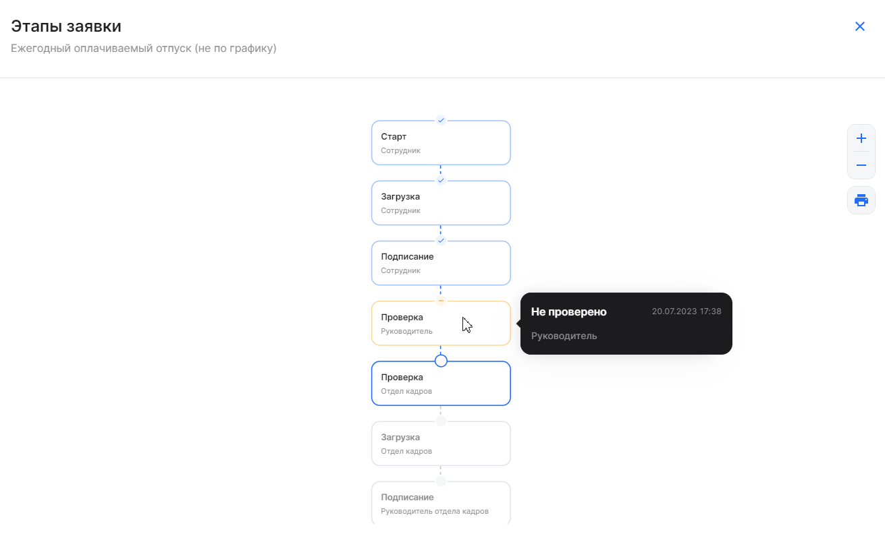
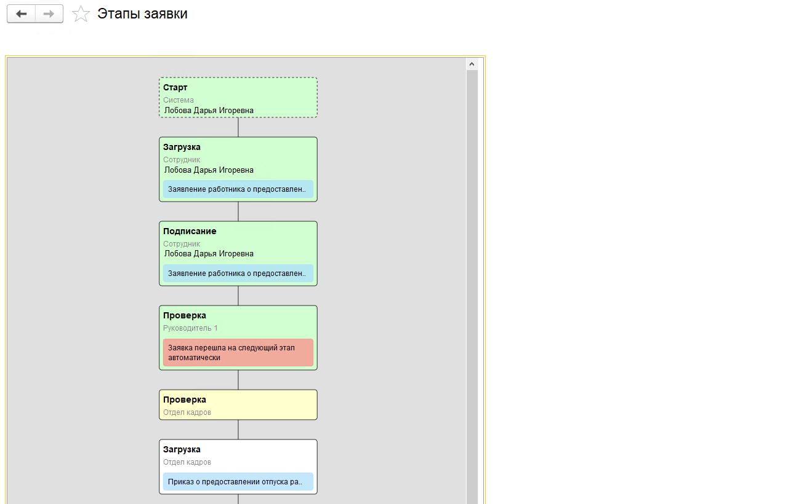
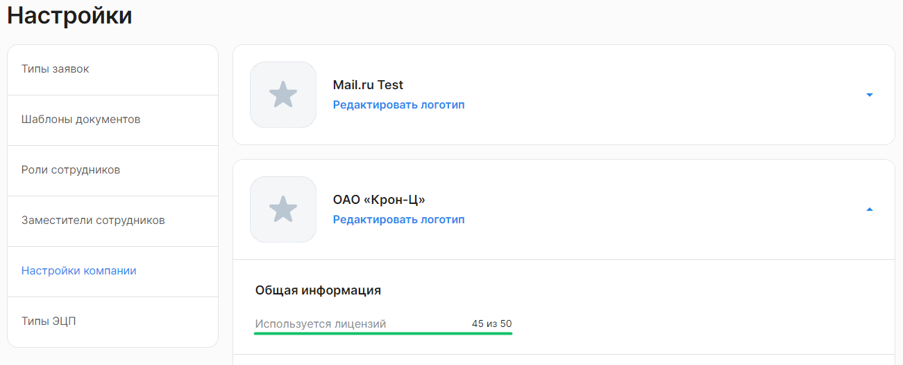
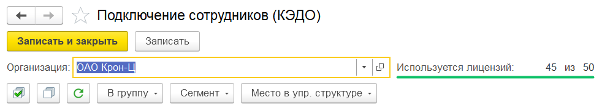
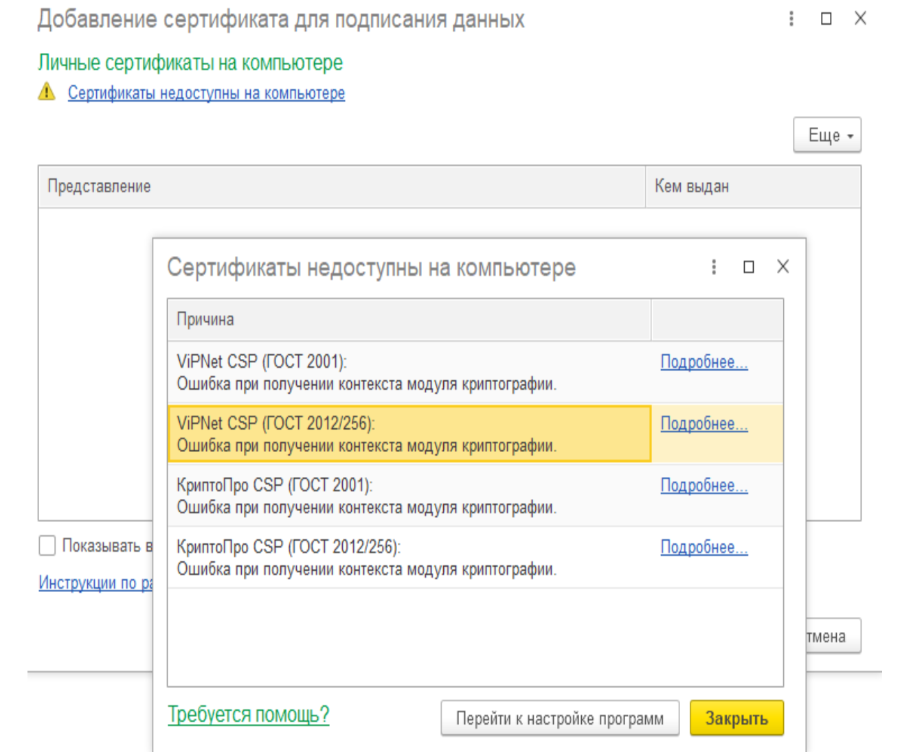
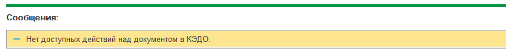
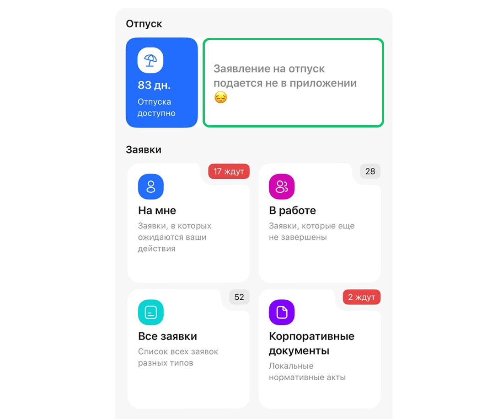

## Работа в веб-сервисе VK HR Tek

### Работа с заявками

#### **Как посмотреть общее количество заявок?**

В сервисе откройте **Кабинет компании → Заявки**, выберите все заявки (фильтр **Все**), в конце списка будет отображено количество заявок.

#### **Заявка отменилась до подписания руководителем Отдела кадров, что делать?**

Если на этапах заявки назначены дедлайны, то в случае просрочки на одном из этапов, заявка отменяется.

Если при отмене заявка попадает в список «В бумагу», то заявку можно найти в этом разделе — распечатать и подписать документ в бумажном виде.

Если опция «В бумагу» не была настроена, то заявка отменится без возможности подписать бумажный документ. В таком случае заявку нужно создавать заново.

#### **Можно ли удалить лишние заявки из Личного кабинета?**

Заявки удалить нельзя. Все заявки, созданные в КЭДО, сохраняются в Личном кабинете. 

Если заявка больше не актуальна, её можно [отменить](/ru/hr/company/application/cancel). Для этого в открытой заявке нажмите кнопку **Отменить заявку** и укажите причину. Заявка получит статус «Отменено».

#### **У совместителя нет возможности подачи заявки от второго табельного номера, что делать?**

Если это внутренний совместитель (например, у сотрудника может быть две должности и два табельных номера в одной компании), то сотруднику нужно направить приглашение от нового табельного номера (должности). Он должен перейти по новой ссылке, тогда вторая должность добавится в КЭДО и ему будет доступен выбор должности при старте заявки.

Если это внешний совместитель, то сотруднику нужно направить приглашение в КЭДО от второй компании. Сотрудник должен пройти по новой ссылке-приглашению, чтобы второй табельный номер добавился в Личном кабинете сотрудника. Повторный выпуск УНЭП не требуется.

#### **Как узнать, был ли документ согласован руководителем**

Если в заявке есть этап согласования, сотрудник и его руководитель подключены к КЭДО, то заявка попадет в Отдел кадров только после согласования руководителем. Если руководитель не подключен к КЭДО, заявка минует согласование с ним и попадет сразу в Отдел кадров. В веб-сервисе доступно отображение цепочки этапов, на которой можно проверить, был ли этап заявки согласован с руководителем (раздел **Заявки →** открыть заявку **→** кнопка **Этапы заявки**) — так Отдел кадров сможет отследить, было ли согласование.

Чтобы просмотреть этапы заявки в 1С расширении КЭДО, нажмите кнопку **Этапы заявки** в нужной заявке.

 

### Работа с электронной подписью

#### **Сотрудник не может выпустить УНЭП, что делать?**

1. УНЭП может формироваться до суток — нужно подождать.
1. Возможно, есть ошибка в персональных данных сотрудника. В 1С проверьте корректность данных в карточке сотрудника.
1. Возможно, у сотрудника неподтвержденная учетная запись на Госуслугах — необходимо её подтвердить в вашем центре обслуживания.

Актуальный статус, на котором находится сотрудник, можно посмотреть в разделе «Сотрудники».

#### **Как сотруднику выпустить/перевыпустить УНЭП?**

Сначала сотруднику нужно подтвердить свою личность. Сотрудник может подтвердить свою личность через Госуслуги (ЕСИА).

После того, как сотрудник получил ссылку-приглашение от компании и перешёл по ней на Госуслуги, он может подтвердить выпуск УНЭП. Подробнее в статье [Выпуск электронной подписи на портале Госуслуг](https://cloud.mail.ru/public/2NKM/wZarRZzJK/4.%20%D0%92%D0%B8%D0%B4%D0%B5%D0%BE%20%2B%20%D0%B8%D0%BD%D1%81%D1%82%D1%80%D1%83%D0%BA%D1%86%D0%B8%D0%B8%20%2B%20%D0%B2%D0%B5%D0%B1%D0%B8%D0%BD%D0%B0%D1%80%D1%8B/%D0%98%D0%BD%D1%81%D1%82%D1%80%D1%83%D0%BA%D1%86%D0%B8%D0%B8%20%D0%B4%D0%BB%D1%8F%20%D1%81%D0%BE%D1%82%D1%80%D1%83%D0%B4%D0%BD%D0%B8%D0%BA%D0%BE%D0%B2/%D0%9A%D0%B0%D0%BA%20%D0%B2%D1%8B%D0%BF%D1%83%D1%81%D1%82%D0%B8%D1%82%D1%8C%20%D0%A3%D0%9D%D0%AD%D0%9F%20%D1%87%D0%B5%D1%80%D0%B5%D0%B7%20%D0%93%D0%BE%D1%81%D1%83%D1%81%D0%BB%D1%83%D0%B3%D0%B8.pdf).

Перевыпуск УНЭП инициируется автоматически, в зависимости от варианта: смена персональных данных у сотрудника или истечение срока действия сертификата.

Специалист Отдела кадров может посмотреть статус сотрудника в разделе **Кабинет компании → Сотрудники**, в столбце **Состояние**.

#### **Сотрудник поменял паспорт, Отдел кадров внёс новые данные и переподключил сотрудника в КЭДО, но ему не приходит приглашение**
Сотруднику не должно приходить приглашение, ему приходит СМС о перевыпуске УНЭП. Сотрудник в зависимости от выбранного компанией способа должен перевыпустить УНЭП.

 

### Профиль сотрудника

#### **Как настроить уведомления в Telegram сотрудникам?**

Сотрудник должен самостоятельно подключить Telegram в **Профиле**. Компания совместно с менеджером ВК может настроить дополнительные уведомления. Для этого направьте заполненный файл [Параметры настройки уведомлений](https://cloud.mail.ru/public/2NKM/wZarRZzJK/%D0%9F%D0%B0%D1%80%D0%B0%D0%BC%D0%B5%D1%82%D1%80%D1%8B%20%D0%BD%D0%B0%D1%81%D1%82%D1%80%D0%BE%D0%B9%D0%BA%D0%B8%20%D1%83%D0%B2%D0%B5%D0%B4%D0%BE%D0%BC%D0%BB%D0%B5%D0%BD%D0%B8%D0%B9.xlsx) на адрес поддержки <support@hrtek.ru>.

Подробнее о видах уведомлений в [статье](/ru/hr/notifications).

#### **Доступ уволенного сотрудника к документам в КЭДО**
После увольнения у сотрудника остаётся доступ к своим документам в КЭДО без ограничений – он может войти в систему и скачать необходимые файлы. Однако создание новых заявок будет недоступно.
В **Профиле** уволенный сотрудник будет видеть статус «Уволен» рядом с названием компании.

 

### Уведомления

#### **Почему не приходит уведомление об отпуске в КЭДО?**
Если у сотрудника уже оформлен отпуск в одном юридическом лице, даже если это юрлицо **не подключено к КЭДО**, и на те же даты запланирован отпуск в другом юридическом лице, **подключенном к КЭДО**, то уведомление **не будет сформировано**, т.к. система КЭДО использует данные из общей базы 1С.

 

### Для представителей компании

#### **Токен специалиста Отдела кадров не подходит, ошибка при вводе**

Если это первичный ввод токена, то нужно проверить корректность ввода (без пробелов). 

Если токен уже использовался, скорее всего он устарел. Срок действия токена — 90 дней. Чтобы создать новый токен, перейдите в **Профиль** → **Токен → Генерация токена для 1С** и нажмите на кнопку **Сгенерировать**. 

#### **Не получается подписать документ УКЭПом, что делать?**

1. Проверьте, что на компьютере установлена программа КриптоПро с активной лицензией или пробным периодом.
1. Проверьте, что подписание производится тем же УКЭПом, публичный ключ которого в формате .p7b был выслан менеджеру ВК (подробнее [о выгрузке сертификата](/ru/hr/company/actions_eds/upload_ukep)). 
1. Сертификат должен быть добавлен в 1С тому пользователю, который будет подписывать документы (см. [Добавление сертификата электронной подписи)](/ru/1C/admin/initial_setup#dobavlenie_sertifikata_elektronnoy_podpisi).
1. Для подписания документов через веб-сервис на компьютере у подписанта должен быть установлен плагин [КриптоПро ЭЦП Browser plug-in](https://www.cryptopro.ru/products/cades/plugin). Корректность его работы можно проверить на [сайте](https://www.cryptopro.ru/sites/default/files/products/cades/demopage/cades_bes_sample.html) (все пункты диагностики должны быть отмечены зеленым).  
1. Дополнительно можно проверить срок действия ЭЦП.

#### **Руководителю/Отделу кадров не приходят уведомления, что делать?** 

Для представителей компании базовые уведомления приходят в почту один раз в день, в 10:00 мск. 

Чтобы представитель мог получать письма, в его карточке сотрудника должна быть указана хотя бы одна действующая электронная почта. Дополнительно можно проверить отсутствие корпоративных блокировок для адреса, с которого приходят уведомления сервиса. 

Для настройки дополнительных уведомлений направьте заполненный файл [Параметры настройки уведомлений](https://cloud.mail.ru/public/2NKM/wZarRZzJK/%D0%9F%D0%B0%D1%80%D0%B0%D0%BC%D0%B5%D1%82%D1%80%D1%8B%20%D0%BD%D0%B0%D1%81%D1%82%D1%80%D0%BE%D0%B9%D0%BA%D0%B8%20%D1%83%D0%B2%D0%B5%D0%B4%D0%BE%D0%BC%D0%BB%D0%B5%D0%BD%D0%B8%D0%B9.xlsx) на адрес поддержки <support@hrtek.ru>.

#### **Сотруднику не пришла ссылка-приглашение, что делать?**

1. Проверьте, включены ли регламентные задания в 1С (см. [Проверка регламентного задания для обмена с КЭДО](/ru/1C/admin/initial_setup#proverka_reglamentnogo_zadaniya_dlya_obmena_s_servisom_vk_hr_tek)).
1. Посмотрите, указаны ли в 1С корректные номер телефона/электронная почта в карточке сотрудника (см. [статью](/ru/1C/user/employees/add_employees)).
1. В 1С проверьте исходящие пакеты по интересующему сотруднику — пакет мог уйти с ошибкой (см. [Добавление входящих и исходящих пакетов в быстрый доступ](/ru/1C/user/packages)). В случае обнаружения ошибки обратитесь [в службу поддержки](/ru/hr/support/contact_channels). 
1. Переподключите токен интеграции (см. [Подключение компании и ввод токена](/ru/1C/admin/initial_setup)).
1. В случае отправки на почту сотруднику нужно проверить папку «Спам». 
1. Если все вышеперечисленные пункты выполнены, то можно повторно отправить приглашение из раздела «Сотрудники».

#### **Ошибка «Неавторизованный запрос 403» при переходе по ссылке из уведомления, как устранить?**
Ошибка в основном возникает, когда Руководитель открывает ссылку как сотрудник. Чтобы согласовать заявку как Руководителю, нужно переключиться на **Кабинет компании**. 

#### **Как посмотреть количество лицензий, которые используются?**
В веб-сервисе, в разделе **Настройки компании** можно найти информацию о количестве используемых и доступных лицензий. Чтобы посмотреть цифры, выберите нужную компанию в настройках и найдите строку «Используется лицензий».

В 1C **КЭДО → Подключение сотрудников** доступна информация о количестве используемых и доступных лицензий в компании. Чтобы посмотреть цифры, выберите нужную организацию из списка.

#### **Как добавить в КЭДО нового специалиста Отдела кадров?**

Проверьте, что сотрудник подключен в расширении КЭДО 1С (см. [Подключение сотрудников компании](/ru/1C/user/employees/connect)). 

Далее в веб-сервисе сотрудник с ролью «Администратор» [выдаст роль](/ru/admin_actions/settings/groups) Отдела кадров новому специалисту.

 

## Работа в расширении 1С

#### **Если я фактически не оформлена в «Компании 1» (я оформлена только в одной из семи организаций, которые мы подключим к КЭДО), смогу ли я работать в 1С:ЗУП как сотрудник Отдела кадров, обрабатывать заявки, создавать и подписывать документы?**
УКЭП должен быть выпущен для каждого юрлица. Тогда вы сможете обрабатывать заявки, создавать и подписывать документы как работодатель во всех юрлицах (при этом будете трудоустроены только в одном юрлице).

#### **Как нужно добавлять сертификат с компьютера пользователя, чтобы в 1С не возникла ошибка при получении контекста модуля криптографии?**
Сертификаты нужно добавлять с компьютера пользователя, для которого доступна роль «Администратор».

#### **Сообщение в 1С: «Нет доступных действий над документом в КЭДО»**
**Возможные причины появления сообщения:**
1. Некорректно настроено сопоставление документов. Убедитесь, что маппинг документов 1С и КЭДО установлен корректно в разделе **КЭДО** → **Начальная настройка** → **Соответствие документов** (см. [статью](/ru/1C/user/mapping)).
2. Данный документ уже был ранее отправлен в КЭДО, повторная отправка невозможна.
3. Сотрудник, чей документ пытаетесь отправить, не подключен к КЭДО. Подробнее о подключении сотрудника см. в [статье](/ru/1C/user/employees/connect).
4. У пользователя, который отправляет документ, нет нужных прав. Проверьте, назначены ли для пользователя необходимые роли в КЭДО (раздел **Сервисы компании** → **Настройки** → **Роли сотрудников**) и группы доступа в настройке 1С (**Администрирование**  → **Настройки пользователей и прав**).
5. Неверный этап отправки документа. Например, если маппинг настроен на процесс «Заявление на отпуск (старт от сотрудника)», а вы пытаетесь сразу отправить приказ, система запретит выполнить это действие, т.к. сначала должно быть сформировано заявление от сотрудника.

 

## Работа в мобильном приложении

#### **Как сделать доступным заявление на отпуск в мобильном приложении?**

**Для клиентов SaaS решения:**
1. Выбрать процесс отпуска(1), который компания хочет сделать доступным для своих сотрудников для быстрого оформления.
2. Сообщить об этом менеджеру по внедрению или аккаунтингу VK HR Tek.

**Для клиентов On-premise решения:**

В админ-панели необходимо найти соответствующий процесс отпуска для компании и установить для него тег «Отпуск(1)».
