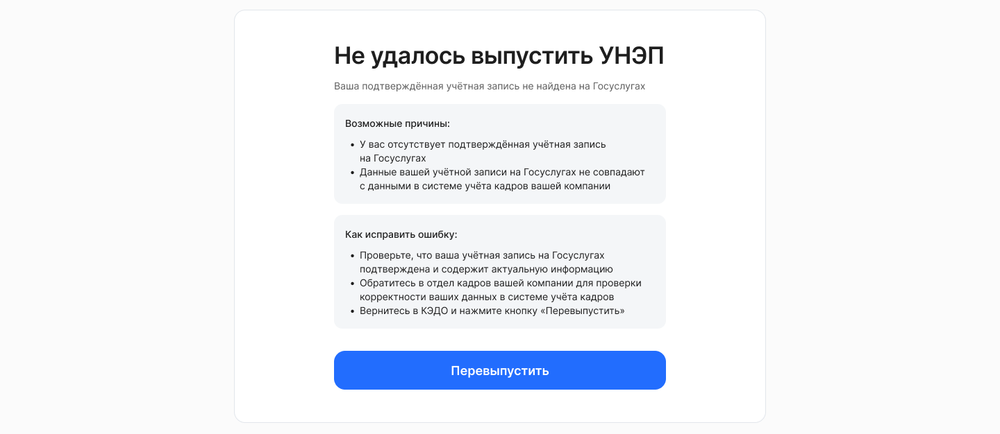
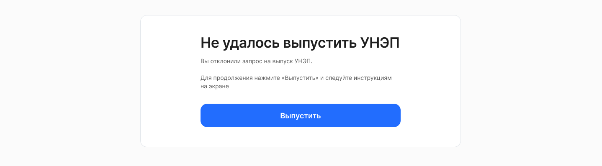
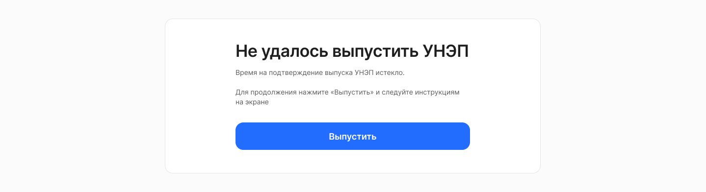
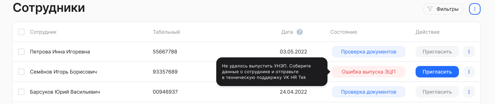
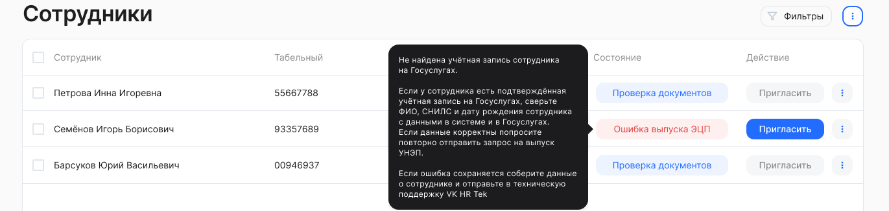

В сервисе реализована обработка ошибок выпуска УНЭП. Сотрудник и представители компании с доступом к разделу **Сотрудники** видят не только статус ошибки, но и объяснение причины и следующий шаг.

Сервис повторно отправляет подтверждение на Госуслуги для части сценариев и напоминает сотруднику, если он не завершил выпуск УНЭП через ЕСИА вовремя.

## Примеры ошибок для сотрудника

Код ошибки: Unknown / UnknownConfirmationError  
Произошла неизвестная ошибка / Произошла неизвестная ошибка подтверждения

 

Код ошибки: UserNotFoundInEsia
Пользователь с подтвержденной учетной записью не найден

 

Код ошибки: ConfirmationRejected
Пользователь отклонил запрос на подтверждение

Код ошибки: ConfirmationTimeout
Время на подтверждение личности истекло

## Примеры ошибок для представителей компании

Код ошибки: Unknown / UnknownConfirmationError 
Произошла неизвестная ошибка / Произошла неизвестная ошибка подтверждения  

  

 

Код ошибки: UserNotFoundInEsia
Пользователь с подтвержденной учетной записью не найден

  

