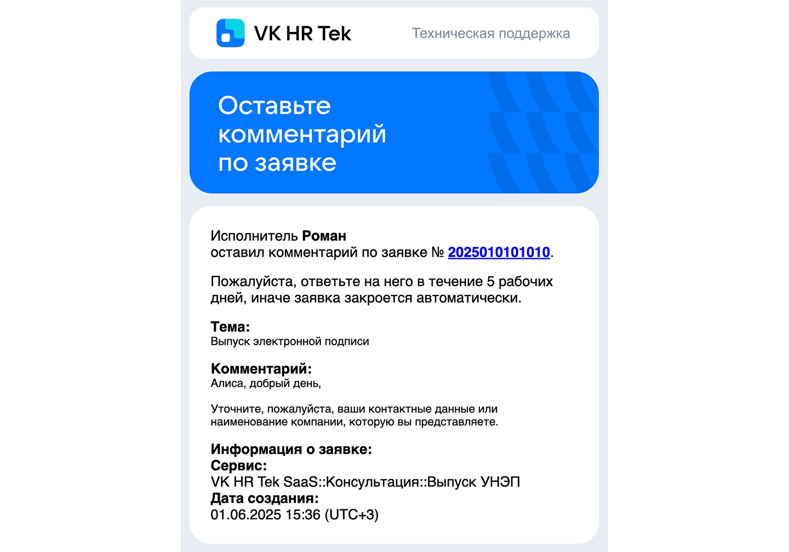

Направьте письмо с описанием вашей проблемы по электронной почте support@hrtek.ru.

## **Этапы обработки обращения** 

#### **1. Регистрация обращения.**  
После получения обращения служба поддержки отправит уведомление о его регистрации, присвоении номера и начале обработки. 

#### **2. Классификация обращения.**  
Обращение проходит предварительную оценку: специалист поддержки определяет тип и приоритет обращения. 

#### **3. Комментарии по обращению.**   

Если по вашему обращению потребуется дополнительная информация, вы получите уведомление с запросом необходимых сведений. Уведомления поступят с адреса support@hrtek.ru.

#### **4. Эскалация обращения.**  
Если специалист поддержки затрудняется самостоятельно решить запрос, он передаёт обращение профильным специалистам с необходимой информацией: деталями обращения и проделанной работы, историей общения с заявителем.  

#### **5. Решение обращения.**  
По завершении обработки обращения вы получите уведомление с результатом. При необходимости возможно вернуть обращение в работу.

## **Типы уведомлений, которые могут поступать на почту заявителя от службы поддержки VK HR Tek**

1. Ваше обращение зарегистрировано.

 

2. Закончили работы по вашей заявке.  

 

3. Ваше обращение отклонено.

 

4. Ожидаем ответ по обращению.

 

5. Комментарий по вашей заявке.

 

6. Оставьте комментарий по заявке.

 

7. Оцените работу технической поддержки.

 
