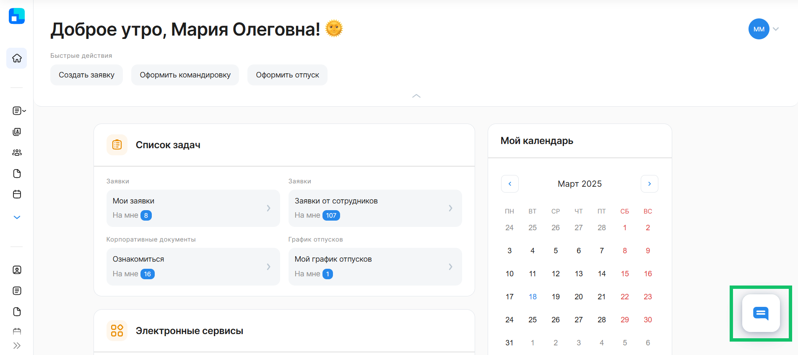
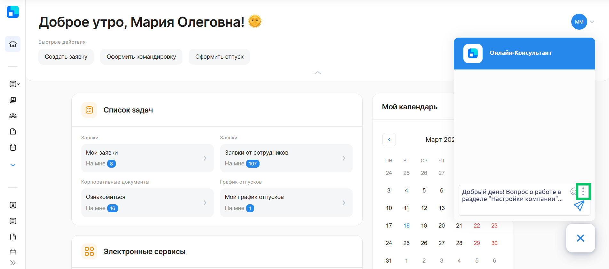
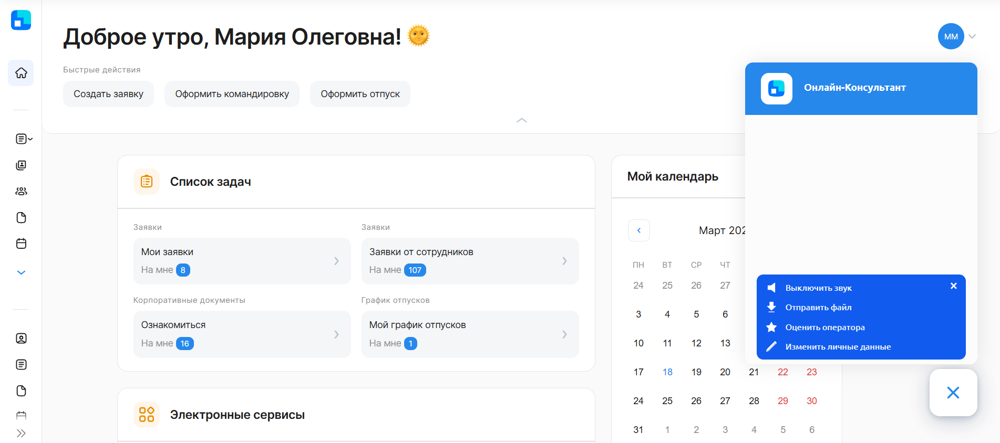
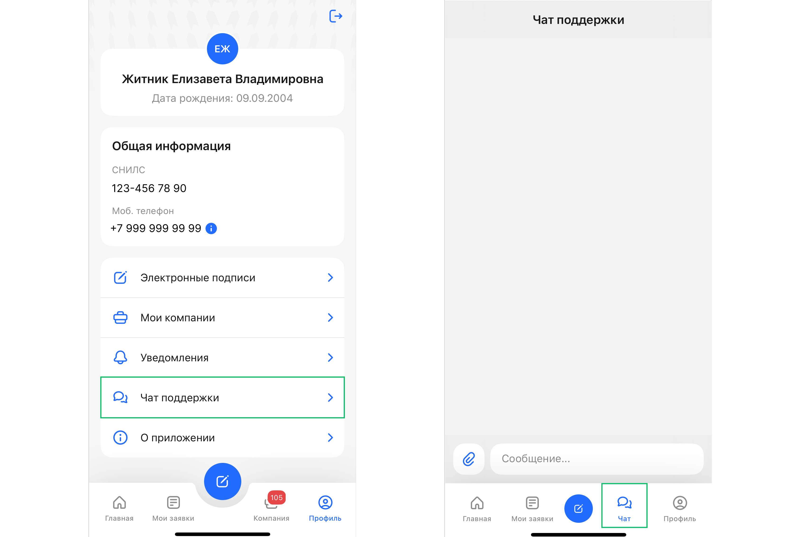

## **Онлайн-Консультант в веб-сервисе VK HR Tek**

1. Нажмите кнопку Онлайн-Консультанта в нижнем правом углу.  
2. Опишите вашу проблему в поле чата. Возможные проблемы, которые могут возникнуть при работе в сервисе представлены в [таблицах](/ru/hr/support/contact_channels/request_format#trebovaniya_k_informacii_dlya_raznyh_tipov_problem). 
3. Получите консультацию в режиме реального времени.

 

Для просмотра дополнительных возможностей Онлайн-Консультанта нажмите кнопку с тремя точками.

## **Онлайн-Консультант в мобильном приложении VK HR Tek**

Если вы столкнулись с проблемой, связанной с работой в приложении, откройте вкладку **Профиль → Чат поддержки** или вкладку **Чат** и задайте свой вопрос специалисту. Вам оперативно помогут решить вопрос.

