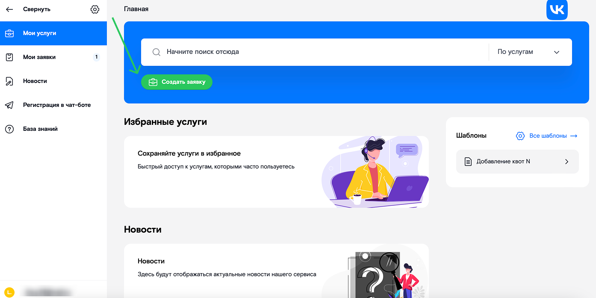
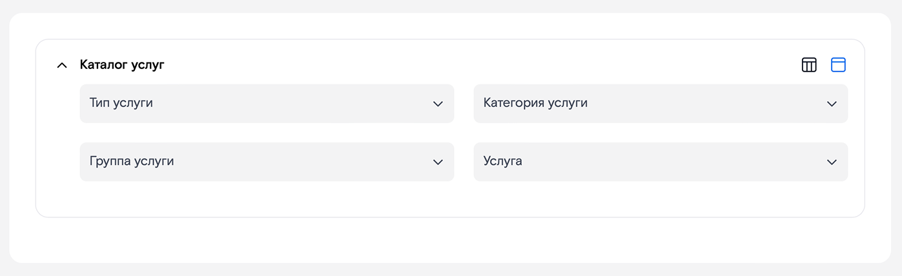
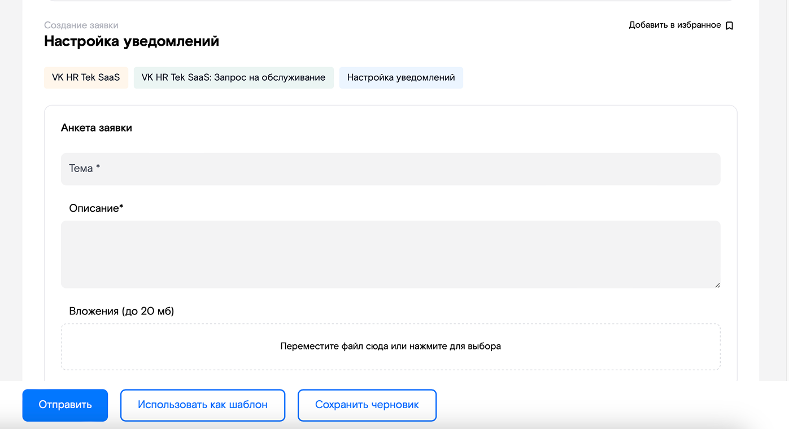
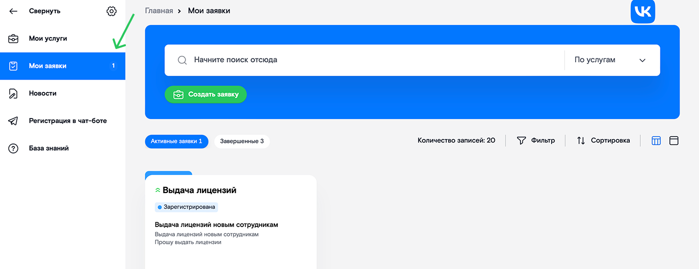
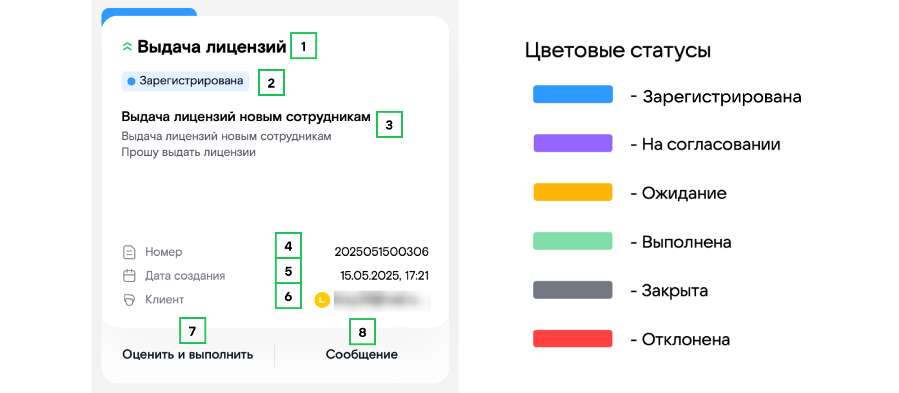
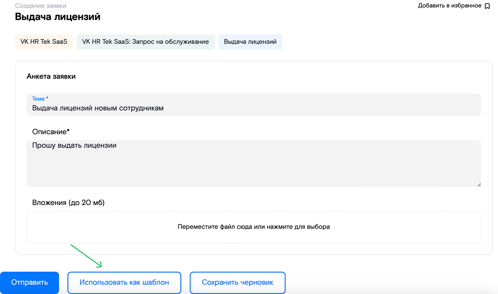
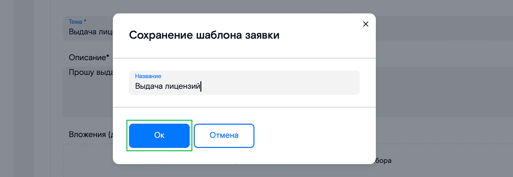
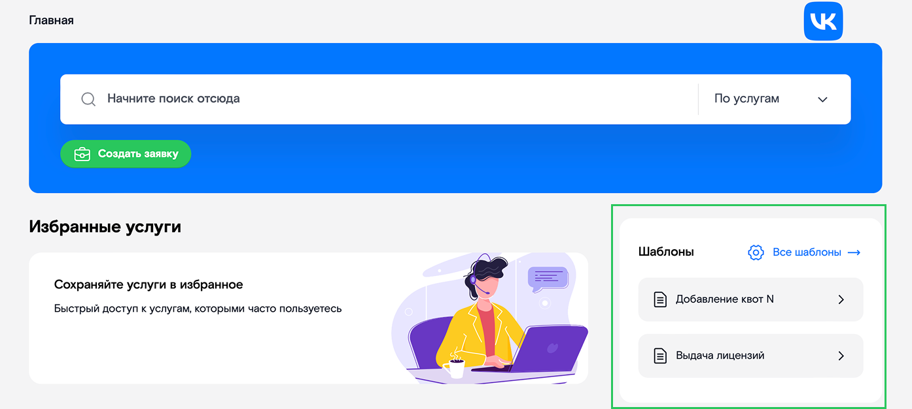

Откройте Портал самообслуживания [support.mcs.mail.ru](https://support.mcs.mail.ru/login).

Для работы с обращениями в меню доступны следующие разделы:

* **Мои услуги** (главная страница) — список избранных услуг и созданных шаблонов.  
* **Мои заявки** — список всех заявок, созданных пользователем.  
* **Регистрация в чат-боте** — возможность подключения уведомлений от Портала через Telegram-бот.

## **Cоздание заявки**

1. На главной странице нажмите кнопку **Создать заявку**.

 

2. Выберите нужную услугу в каталоге и заполните следующие поля:  
* **Тип услуги** — продукт, по которому создаётся обращение. Для пользователей VK HR Tek (SaaS/OnPrem) значение этого поля определяется автоматически.  
* **Категория услуги** — тип обращения, определяющий тематику запроса.  
* **Группа услуги** — верхнеуровневая функциональность и/или услуга, по которой создается обращение.   
* **Услуга** — конкретная функция в VK HR Tek.

 

3. После выбора значений в каталоге услуг откроется форма для заполнения деталей заявки. Заполните обязательные поля, остальные — по возможности. Рекомендуется указать как можно больше [информации по вопросу](/ru/hr/support/contact_channels/request_format#trebovaniya_k_informacii_dlya_raznyh_tipov_problem), чтобы ускорить решение обращения. При необходимости прикрепите файл.  

4. Отправьте заявку в работу.  

## **Просмотр заявки**

Заявка будет отображаться в разделе **Мои заявки**. Для детального просмотра нажмите на заголовок заявки.

Заявка содержит следующие данные:

1. Тип услуги.  
2. Статус заявки и исполнитель по заявке.  
3. Название и описание заявки.  
4. Номер заявки.  
5. Дата создания заявки.  
6. Инициатор заявки.  
7. Возможность оценить и закрыть заявку.  
8. Возможность оставить сообщение к заявке.

## **Создание шаблона**

1. Создайте заявку по [инструкции выше](/ru/hr/support/contact_channels/portal_instructions#cozdanie_zayavki).  
2. Нажмите кнопку **Использовать как шаблон**.

 

3. В открывшейся форме придумайте название шаблона и нажмите **ОК**.

 

4. Созданный шаблон появится в блоке **Мои шаблоны** на главной странице.

## **Роли пользователей на Портале**

1. **Обычный пользователь** – пользователь, который имеет доступ только к своим заявкам.  
2. **Суперпользователь** (кадровый специалист) – представитель компании, который может просматривать заявки всех сотрудников компании. Данная роль назначается по запросу в службу технической поддержки.