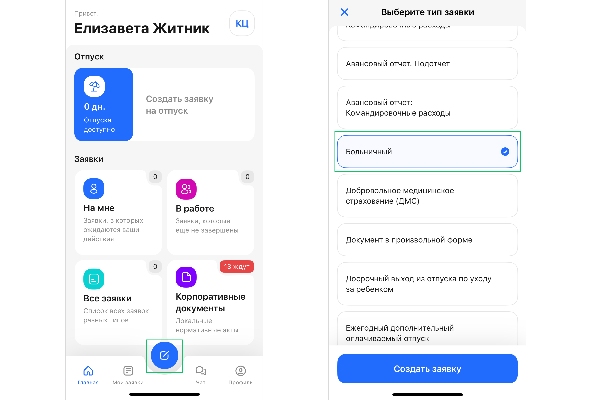
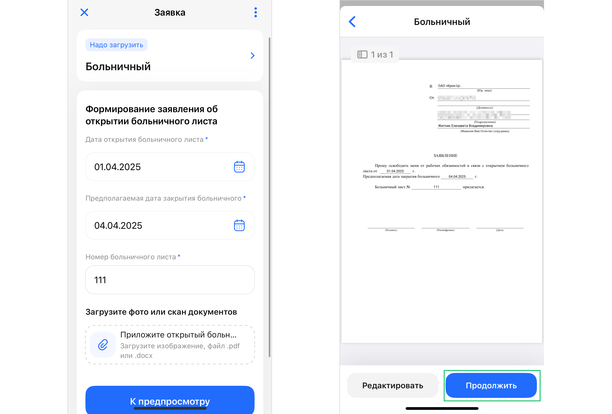

<warn>

Создание заявок на подчинённых пока доступно только в веб-интерфейсе сервиса VK HR Tek.

</warn>

Чтобы создать заявку, нажмите синюю кнопку в центре меню. 

Выберете тип заявки, который вы хотели бы инициировать. Нажмите кнопку **Создать заявку**. 

Далее заполните данные, которые запрашивает система. Также можете подгружать дополнительные документы с телефона, если они требуются. Для каждого документа доступен предпросмотр.

