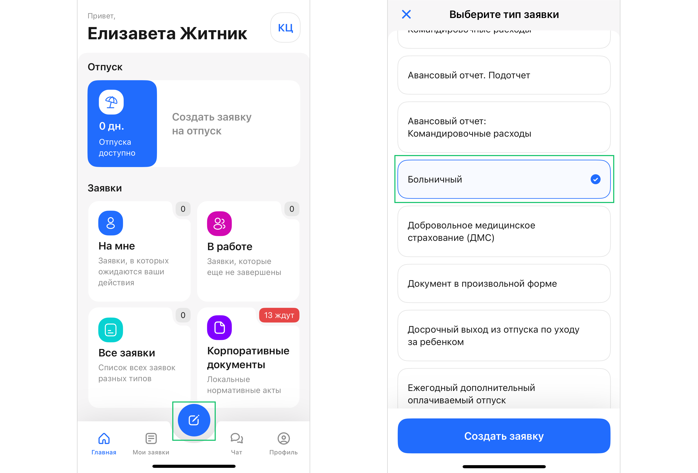
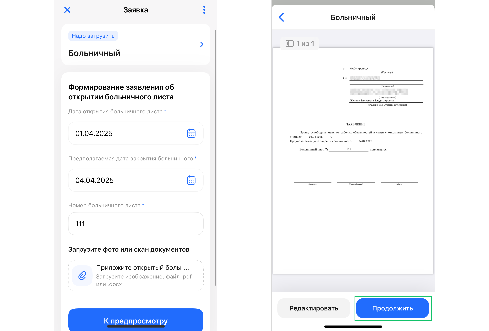
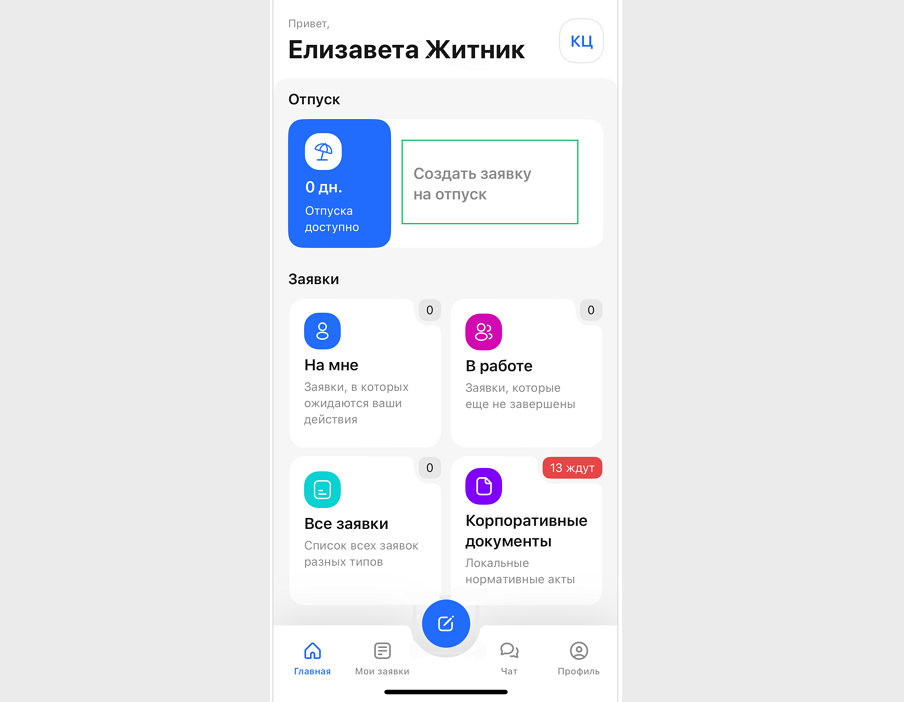
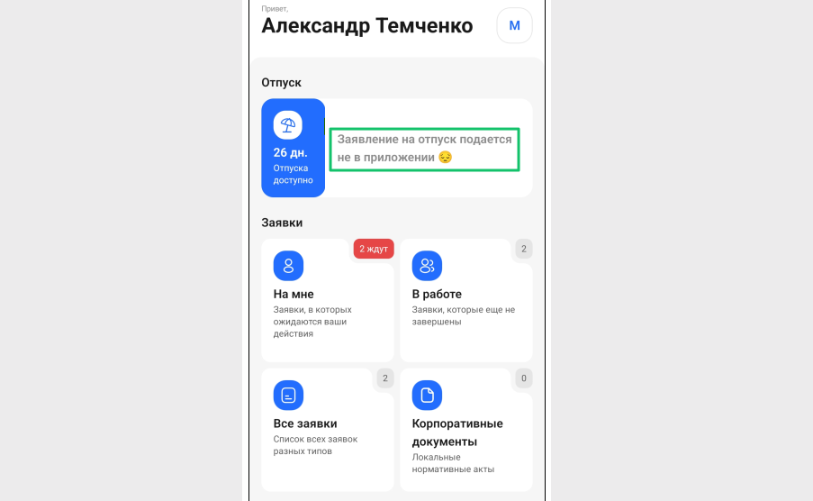

<warn>

Создание заявок на подчинённых пока доступно только в веб-интерфейсе сервиса VK HR Tek

</warn>

Чтобы создать заявку, нажмите синюю кнопку в центре меню. 

Выберите тип заявки, который вы хотели бы инициировать. Нажмите кнопку **Создать заявку**. 

Далее заполните данные, которые запрашивает система. Также можете подгружать дополнительные документы с телефона, если они требуются. Для каждого документа доступен предпросмотр.

Создать заявку на отпуск можно в виджете **Отпуск** — нажмите **Создать заявку на отпуск**. Далее заполните данные, которые запрашивает система.

Если в виджете **Отпуск** указано **Заявление на отпуск подается не в приложении**, это означает, что создать заявку на отпуск с помощью виджета невозможно, данная функциональность не настроена.

