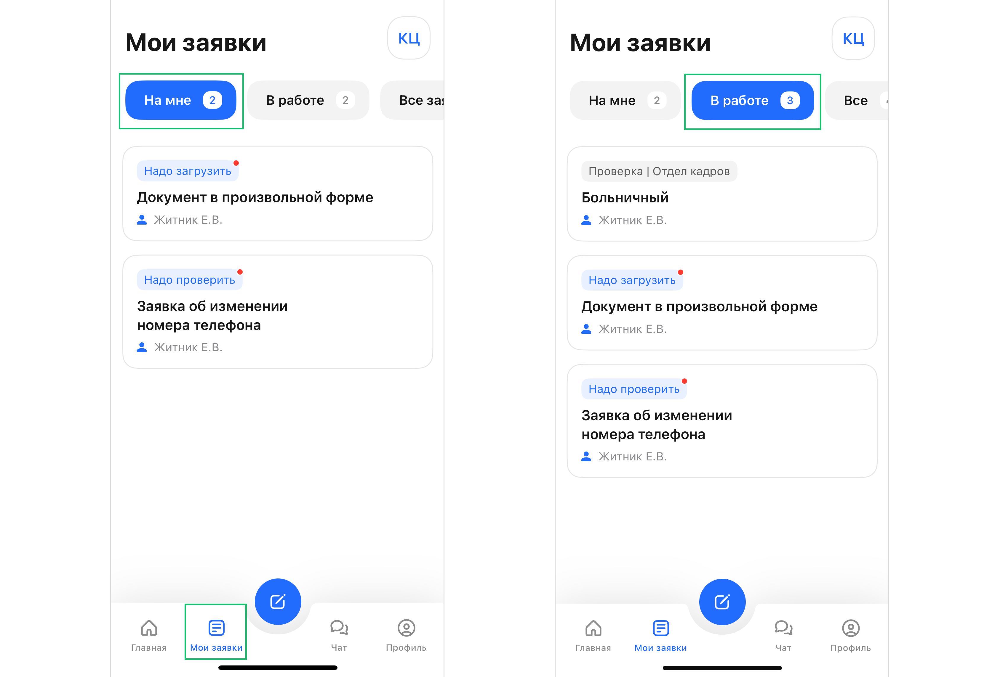
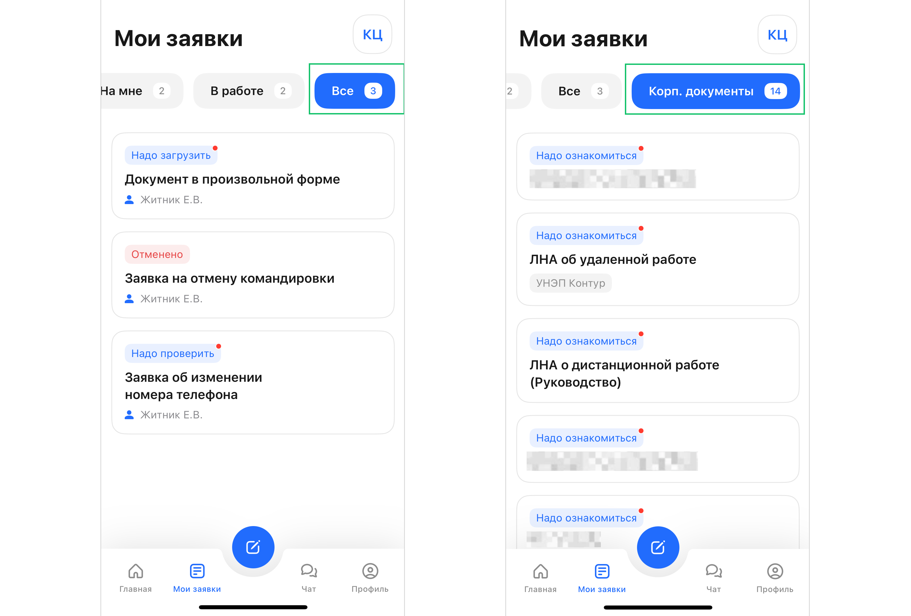

В личном кабинете мобильного приложения перейдите на вкладку **Мои заявки**. 

Для просмотра и обработки доступны следующие группы заявок и документов:

**На мне** — список заявок, которые требуют вашего согласования, подписания, заполнения или загрузки вложений. Это могут быть заявления от сотрудников, служебные записки или приказы, отправленные вам для выполнения определенного действия.  
**В работе** — список заявок, которые вы инициировали. Здесь отображаются все активные процессы, которые находятся в работе на разных этапах у других исполнителей.  
**Все заявки** — полный список заявок в работе, отменённых или завершённых.  
**Корпоративные документы** — список локальных нормативных актов (ЛНА), внутренних приказов, регламентов и политик компании, доступных для ознакомления.

