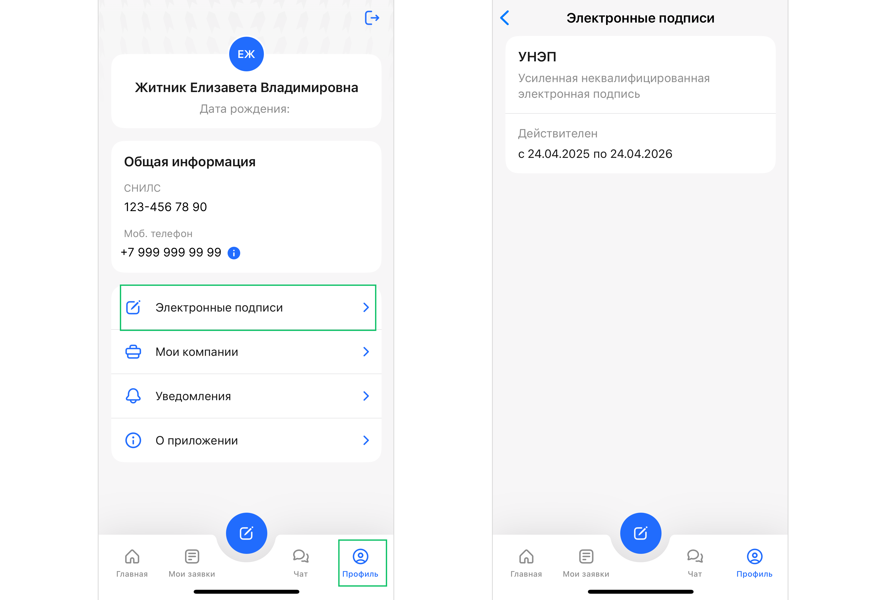
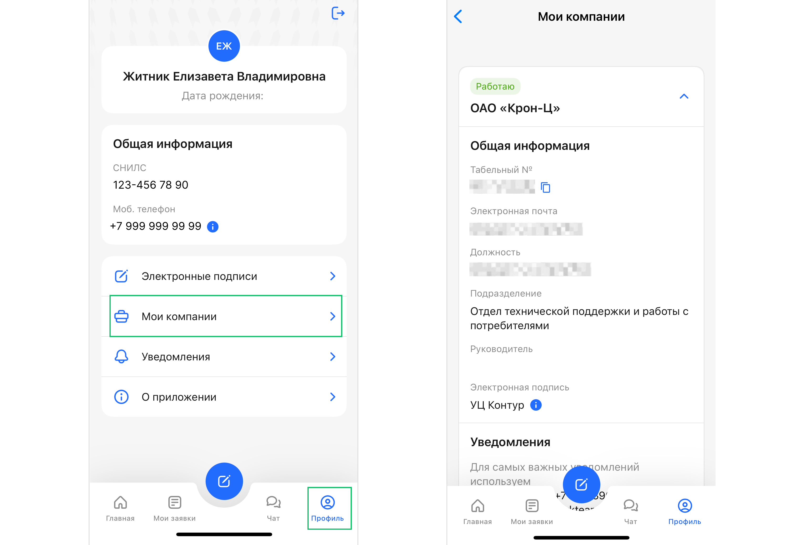

В личном кабинете мобильного приложения откройте вкладку **Профиль**. 

## **Шаг 1. Проверьте срок действия УНЭП**

Перейдите на вкладку **Профиль → Электронные подписи**. Здесь вы можете проверить срок действия усиленной неквалифицированной электронной подписи (УНЭП).

## **Шаг 2. Проверьте информацию о юридическом лице, должности, табельном номере**

Вы можете посмотреть информацию о должности и юридическом лице, в котором работаете. Для этого перейдите на вкладку **Профиль → Мои компании**. Здесь вы можете посмотреть общую информацию: табельный номер, электронную почту, должность, подразделение, руководителя.

