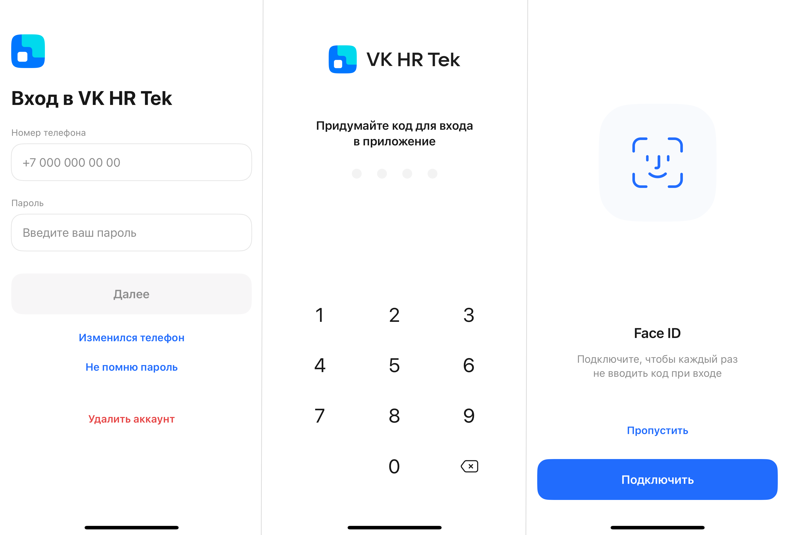

## **Шаг 1. Скачайте мобильное приложение**

Скачайте приложение через любой магазин приложений — App Store, Google Play, RuStore, AppGalery.

## **Шаг 2. Войдите в систему**

После установки приложения:  
1. Откройте приложение.  
2. Введите номер телефона, который был указан при регистрации или при последней смене номера.  
3. Введите действующий пароль.  
4. Подтвердите вход через код из СМС-сообщения, которое поступило на указанный номер.  
5. Войдите в систему.

## **Шаг 3. Задайте способ для входа** 

При первом входе задайте код для дальнейшего использования приложения.

<info>

Для пользователей мобильного приложения, установленного на устройствах с операционной системой iOS: дополнительно можно включить функцию быстрого входа — Face ID. 

</info>

