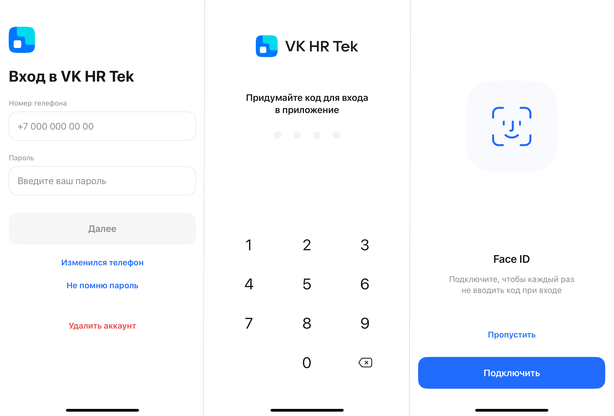

## **Шаг 1. Скачайте мобильное приложение**

### Android

Скачайте приложение VK HR Tek и получайте обновления в [RuStore](https://www.rustore.ru/catalog/app/ru.vk.hrtek) и [AppGallery](https://appgallery.huawei.com/#/app/C107531675). Рекомендуем [установить RuStore](https://www.rustore.ru/instruction), если вы еще этого не сделали.

### iOS

Компания Apple удалила приложение VK HR Tek из магазина приложений App Store. 

Для удобства использования мобильной версией на iOS: добавьте ярлык VK HR Tek на домашний экран через браузер Safari.

1. Откройте Safari и перейдите на сайт [vkdoc.mail.ru](https://vkdoc.mail.ru).
2. Нажмите на значок «Поделиться» (квадрат со стрелкой).
3. Листайте вниз, выберите «На экран «Домой».
4. Нажмите «Добавить» — ярлык появится на рабочем столе.

## **Шаг 2. Войдите в систему**

После установки приложения:  
1. Откройте приложение.  
2. Введите номер телефона, который был указан при регистрации или при последней смене номера.  
3. Введите действующий пароль.  
4. Подтвердите вход через код из СМС-сообщения, которое поступило на указанный номер.  
5. Войдите в систему.

## **Шаг 3. Задайте способ для входа** 

При первом входе задайте код для дальнейшего использования приложения.

<info>

Для пользователей мобильного приложения, установленного на устройствах с операционной системой iOS: дополнительно можно включить функцию быстрого входа — Face ID. 

</info>

