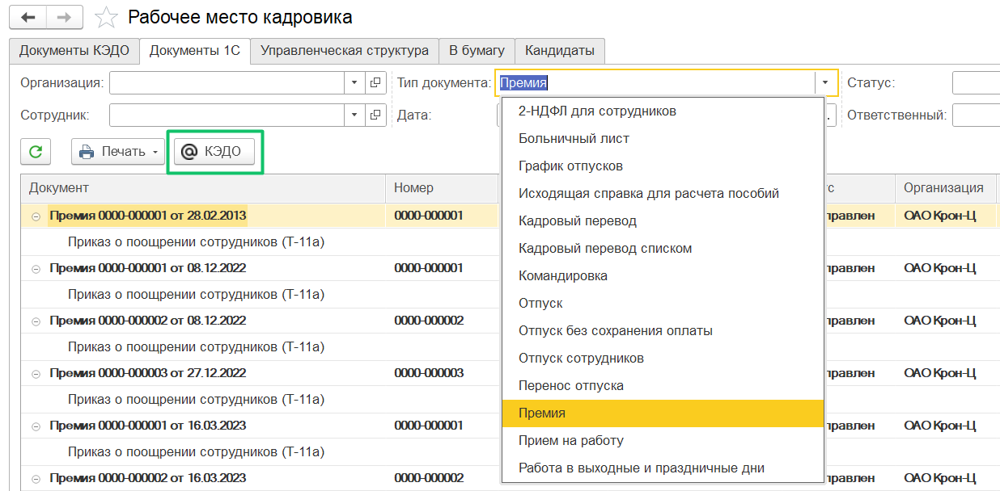

## **Подписание документов в заявках без СМС** 
В **КЭДО → Рабочее место кадровика** пользователи могут подписывать документы УНЭП Контур в заявках без подтверждения вторым фактором — без кода из СМС.

Настройка этой функции является платной. Чтобы подключить подписание без СМС для конкретного типа заявки, необходимо указать данную опцию в JSON-файле бизнес-процесса на этапе подписания. Для подключения обратитесь к вашему менеджеру внедрения VK HR Tek.

## **Отправка в КЭДО некадровых документов**
В **КЭДО → Рабочее место кадровика** на вкладке «Документы 1С» доступна кнопка «КЭДО», даже если отображается список некадровых документов.

К некадровым документам относятся «Премия», «Исходящая справка для расчета пособий» и другие документы, отсутствующие в разделе **Кадры → Все кадровые документы**.

## **Загрузка документов в заявках**
Добавлена возможность перезапустить загрузку файлов в заявках со статусам «Завершено», если предыдущая загрузка документов завершилась с ошибками (например, ошибки ответа от сервера КЭДО).

## **Рассылка уведомлений об отпусках**
В рассылке уведомлений об отпусках:

1. Дата утверждения отпуска теперь указывается из документа планирования графика отпусков, а не из документа о переносе отпуска. 
1. Для расчета даты выхода сотрудника на работу теперь учитывается региональный производственный календарь (если он используется в компании).