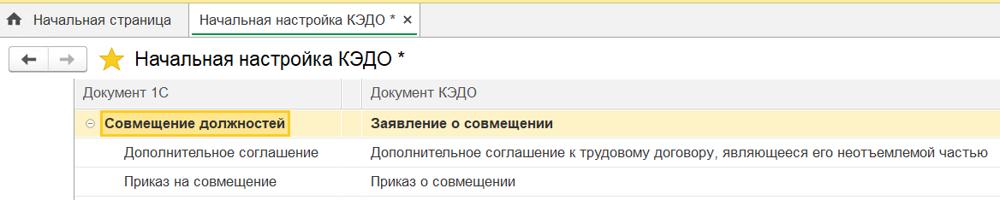
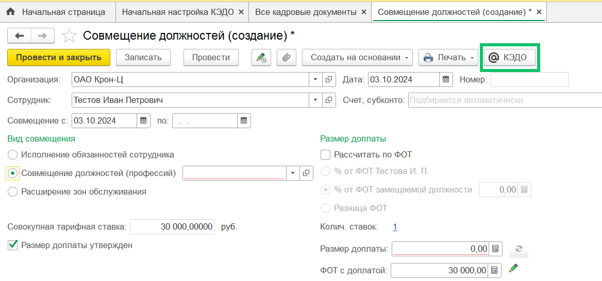

## **Отправка документа «Совмещение должностей» в КЭДО**
Из 1С:ЗУП в КЭДО можно отправлять документ «Совмещение должностей», созданный на одного сотрудника.

Перед отправкой проверьте, что в разделе **КЭДО → Начальная настройка → Соответствие документов** добавлен документ 1С «Совмещение должностей», с которым можно настроить сопоставление процессов КЭДО. 

## **Атрибут с типом «Непополняемый справочник»**
Добавлен новый тип атрибута, который будет отображаться в заявке как текстовое поле с кнопкой выбора значений. При нажатии кнопки выбора откроется форма со всеми доступными значениями из справочника и можно выбрать одно из значений.

В поле атрибута можно вводить произвольный текст с возможностью поиска этого текста в справочнике и без пополнения справочника новыми значениями.

Настройка атрибутов с непополняемыми справочниками является платной. Чтобы добавить такой атрибут к конкретному типу заявки, необходимо прописать данную опцию в JSON-файле бизнес-процесса. Для подключения обратитесь к вашему менеджеру внедрения VK HR Tek.

## **Отсутствие настроек подключения к КЭДО**
Если отсутствует начальная настройка КЭДО, то в формах подсистемы КЭДО отобразится сообщение: «Не заполнены настройки подключения к КЭДО. Перед работой с формой выполните подключение в КЭДО / Начальная настройка».

В этом случае для работы недоступны формы:

- Подключение сотрудников;
- Публикация расчетных листков;
- Рабочее место кадровика.