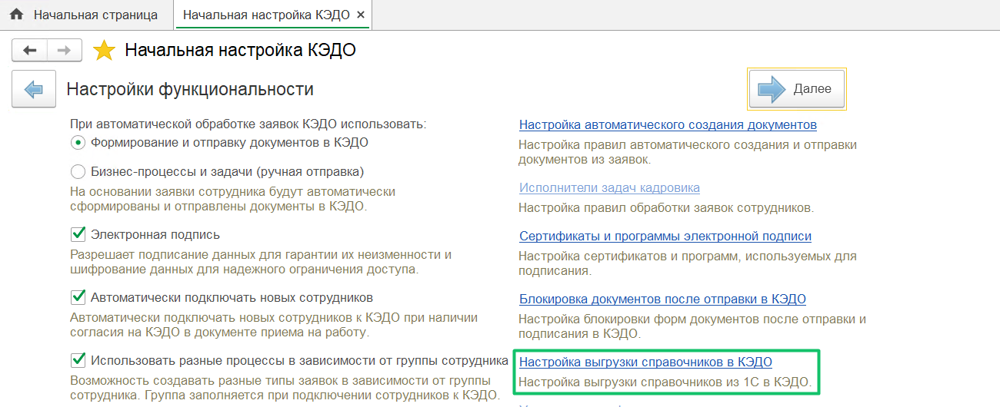
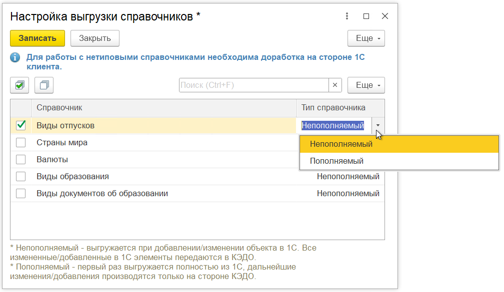
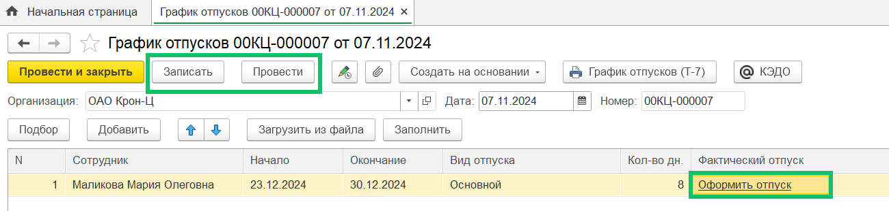
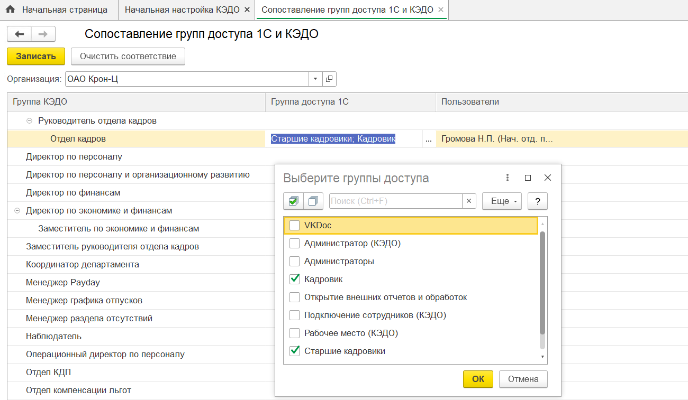
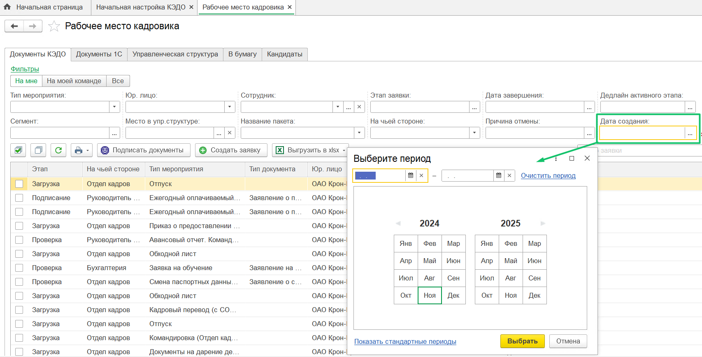

## **Выгрузка справочников** 
В **КЭДО → Начальная настройка → Настройки функциональности** добавлен механизм выгрузки справочников из 1С в КЭДО. Значения из выгруженных справочников будут использоваться в атрибутах заявок в КЭДО, если в бизнес-процессах прописана связь с этими справочниками.

Включение справочника является платной опцией. За настройкой обратитесь к вашему менеджеру VK HR Tek.  

## **Выгрузка отсутствий сотрудников**
Добавлена выгрузка отсутствий и плановых графиков отпусков сотрудников из 1С в КЭДО. На основании планируемых отсутствий сотрудники могут создавать в КЭДО заявки на отпуск.

## **Персональные данные**
Добавлены новые блоки персональных данных сотрудников, передаваемые в КЭДО:

- образование,
- история трудовой деятельности,
- данные трудового договора,
- дополнительные соглашения,
- визы,
- контакты,
- загранпаспорта,
- военный билет.

Состав блоков персональных данных настраивается на стороне КЭДО в настройках компании.

## **Настройка «Управление профилями доступов»**
В **КЭДО → Начальная настройка → Настройки функциональности** добавлена настройка «Управление профилями доступов» для соответствия профилей доступа 1С и КЭДО.

Для тех, кто использует профили доступа в 1С, обратитесь за инструкциями по настройке импорта к вашему менеджеру VK HR Tek. Настройка импорта профилей из 1С в КЭДО является платной.

## **Фильтр «Дата создания»**
В раздел **КЭДО → Рабочее место кадровика** добавлен фильтр по дате создания заявки.

