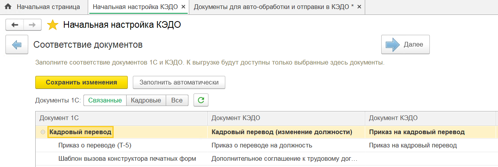
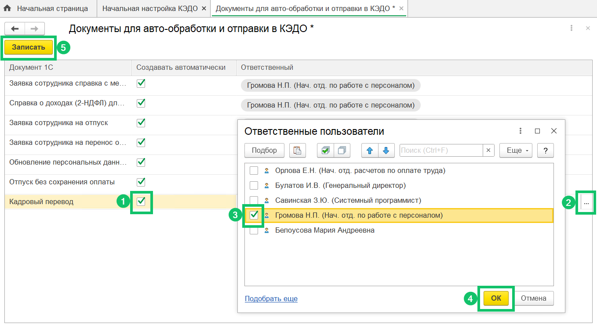
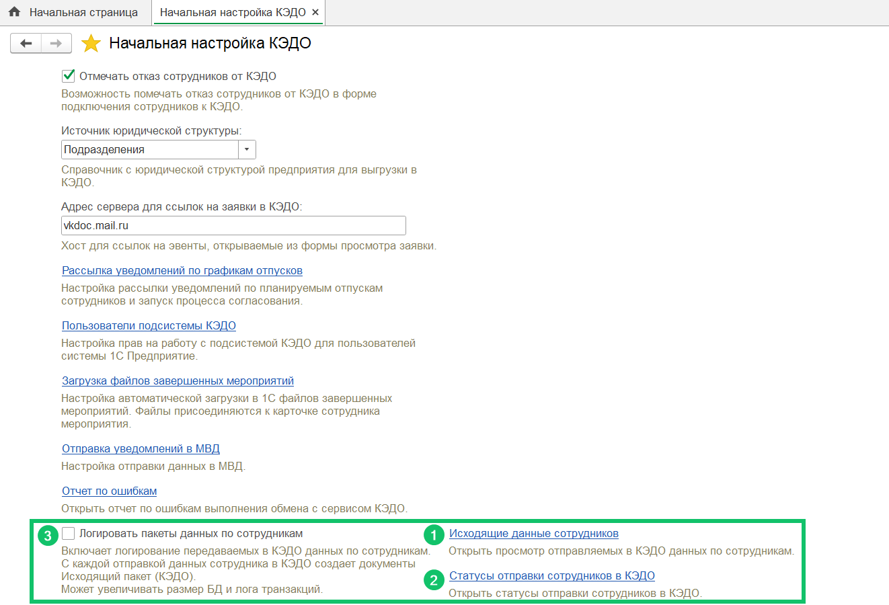
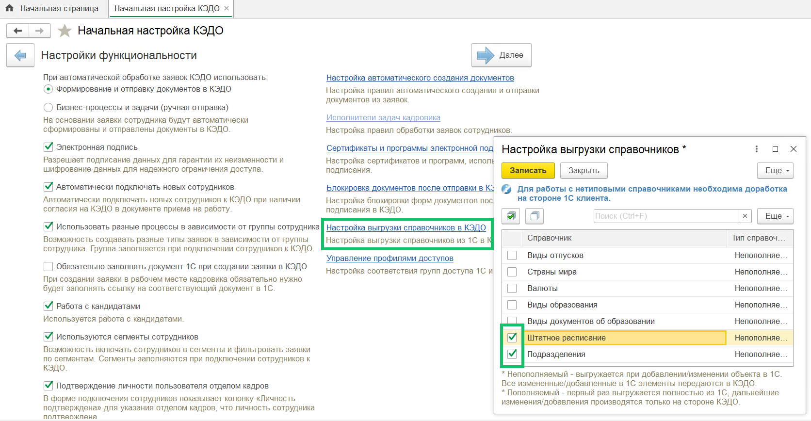
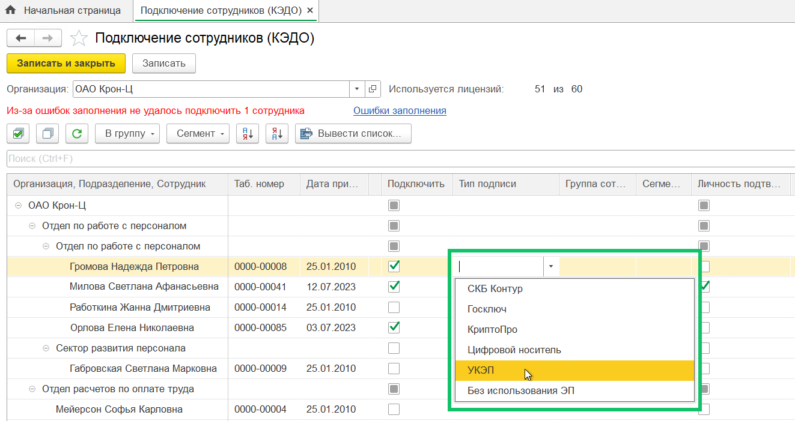
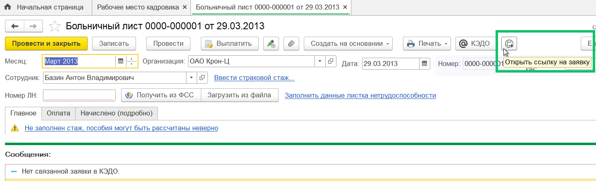
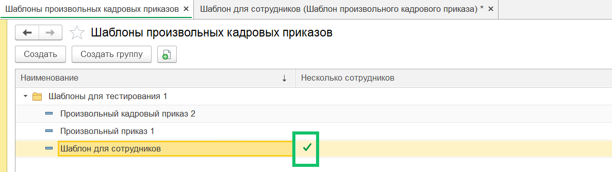
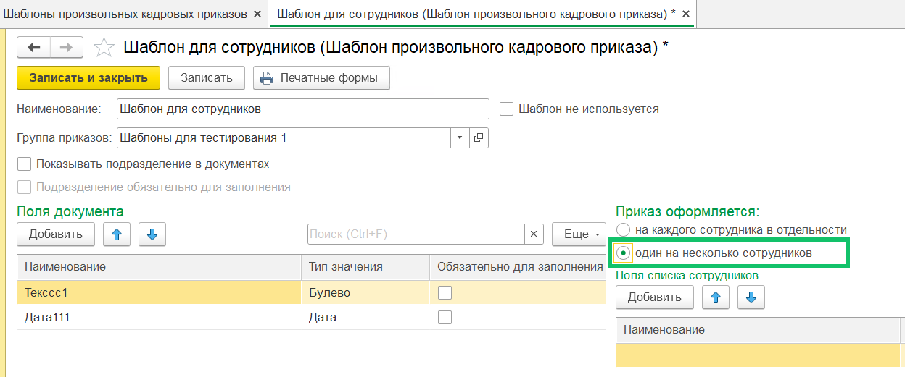

## **Автосоздание документа «Кадровый перевод»**
Добавлено автоматическое создание документа «Кадровый перевод» в 1С:ЗУП по данным заявки в сервисе VK HR Tek.

Проверьте, что в **КЭДО → Начальная настройка → Соответствие документов** настроено сопоставление документа 1С «Кадровый перевод» с любым доступным типом мероприятия КЭДО.

Для включения автосоздания документа перейдите в **КЭДО → Начальная настройка → Настройки функциональности → Настройка автоматического создания документов**, установите флажок для документа «Кадровый перевод» и выберите ответственного.

## **Исходящие данные сотрудников**
В целях экономии размера базы данных 1С отключено автоматическое формирование документов «Исходящий пакет (КЭДО)» по каждому запросу с данными сотрудников.

Исходящие пакеты не создаются при выключенной настройке **Логировать пакеты данных по сотрудникам** (**КЭДО → Начальная настройка → Настройки функциональности**).

В **КЭДО → Начальная настройка → Настройки функциональности**:

1\. Чтобы просмотреть отчет с актуальным исходящим пакетом по сотруднику, нажмите на **Исходящие данные сотрудников**.

2\. Для просмотра статуса отправки пакетов по сотрудникам воспользуйтесь формой **Статусы отправки сотрудников в КЭДО**.

3\. При необходимости формирования документов «Исходящий пакет (КЭДО)» можно включить настройку **Логировать пакеты данных по сотрудникам**.

Компаниям, использующим доп. расширение «Managers (КЭДО)», нужно обязательно включить настройку **Логировать пакеты данных по сотрудникам**.

## **Отправка справочников в КЭДО**
Добавлена возможность подключить отправку справочников «Штатное расписание» и «Подразделения» из 1С:ЗУП в сервис VK HR Tek. Для этого перейдите в **КЭДО → Начальная настройка → Настройки функциональности**, выберите **Настройку выгрузки справочников КЭДО**, установите флажки рядом с названием справочников, нажмите на кнопку **Записать**.

## **Остаток доступных дней отпуска и награды**
В пакет данных по сотруднику, передаваемый в сервис VK HR Tek, добавлены оставшееся количество дней по видам отпусков и данные по наградам сотрудников.

В 1С:ЗУП остаток отпуска и список наград можно посмотреть в карточке сотрудника, на вкладках **Отсутствия** и **Трудовая деятельность**.

## **Электронная цифровая подпись**
В **КЭДО → Подключение сотрудников** можно выбрать новый тип подписи документов — УКЭП.

<warn>
В настройках компании должен быть включен тип подписания «УКЭП».
</warn>

Перед выбором УКЭП проверьте, что на форме **Подключение сотрудников** доступна колонка «Тип подписи». Для отображения колонки Администратор VK HR Tek должен выбрать источник данных «1С» в разделе **Настройки → Типы ЭЦП**.

## **Уведомления о начале отпуска**
При формировании уведомлений о начале отпуска добавлена проверка того, что сотрудник досрочно вышел из отпуска по уходу за ребенком.

## **Ссылка на заявку в КЭДО**
На форму документов 1С, доступных к отправке в сервис VK HR Tek, добавлена кнопка для открытия связанной заявки в КЭДО (рядом с кнопкой «КЭДО»).

Если связанная заявка отсутствует, то появится сообщение «Нет связанной заявки в КЭДО».

## **Отправка произвольного кадрового приказа**
Добавлена возможность отправлять документ «Произвольный кадровый приказ» со списком сотрудников из 1С:ЗУП КОРП в сервис VK HR Tek. Шаблоны таких приказов обозначены зеленой галочкой.

Чтобы произвольный кадровый приказ был отправлен нескольким сотрудникам, в шаблоне приказа выберите настройку «один на несколько сотрудников».

 
