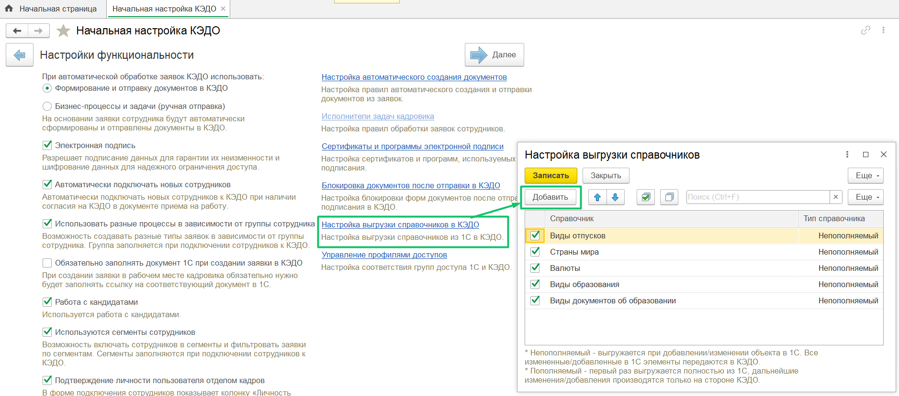
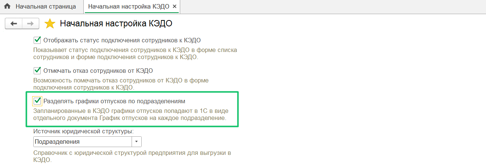
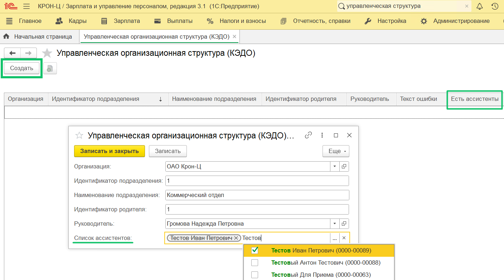

## **Выгрузка справочников**
Добавлена возможность выгружать из 1С:ЗУП в КЭДО любой справочник, у которого есть наименование.

Справочники можно использовать, например, в бизнес-процессе: у участника процесса будет возможность выбрать значение из справочника 1С. Для настройки конкретного бизнес-процесса обратитесь к вашему менеджеру VK HR Tek.

Чтобы добавлять справочник для выгрузки, нажмите на кнопку «Добавить» в форме **Настройка выгрузки справочников** (**КЭДО → Начальная настройка → Настройки функциональности**). В список можно добавить любой справочник, в том числе кастомный справочник клиента в 1С.

Затем установите флажок рядом с наименованием справочника и нажмите на кнопку «Записать».

Для кастомных справочников убрали регистр «Справочники для передачи в КЭДО», в который раньше эти справочники записывались.

### **Выгрузка справочника «Штатное расписание»**
При выгрузке справочника «Штатное расписание» из 1С:ЗУП в КЭДО теперь не выгружаются элементы-группы.

Например, «Руководство» — это группа позиций, в рамках которой задаются конкретные позиции как «Генеральный директор». Системное поле «ГруппаПозицийПодразделения» показывает, является ли запись справочника «Штатное расписание» именно позицией или группой позиций, и заполняется программно при записи.

## **Графики отпусков по подразделениям**
Добавлена настройка «Разделять графики отпусков по подразделениям» для создания в 1С отдельных графиков отпусков по каждому подразделению сотрудников (по данным планирования из КЭДО).

Также ускорено заполнение графиков отпусков в 1С по данным планирования из КЭДО.

## **Ассистенты подразделений**
В управленческую организационную структуру добавлены ассистенты подразделений.

Чтобы добавить хотя бы одного ассистента в подразделение, нажмите на кнопку «Создать», заполните необходимые поля, в т.ч. поле «Список ассистентов», нажмите на кнопку «Записать и закрыть». Сохраненные значения появятся в таблице, добавленные ассистенты отобразятся в колонке «Есть ассистенты».  

## **Произвольный кадровый приказ**
В 1С:ЗУП КОРП добавлена возможность создавать типы мероприятий КЭДО по каждому шаблону произвольного кадрового приказа.

## **Исправления**
1. Исправлена ошибка, когда в форме просмотра мероприятия в Рабочем месте кадровика не проставлялось значение ранее выбранного атрибута для атрибутов с типом "choice" (в поле с выбором нескольких значений).
1. Исправлена ошибка, при которой не удавалось выгрузить измененную управленческую структуру из-за одновременной выгрузки сотрудников в управленческой структуре или из-за того, что запись новой структуры еще не завершена. Теперь при изменении выгружается только сама оргструктура.
