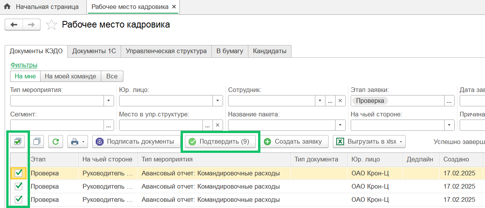
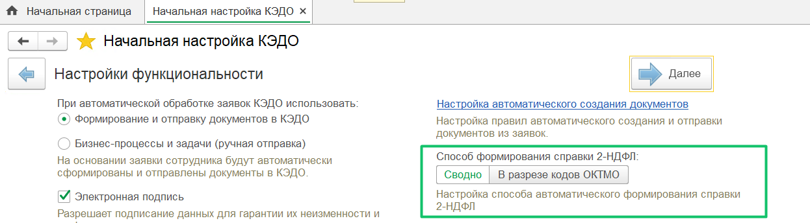
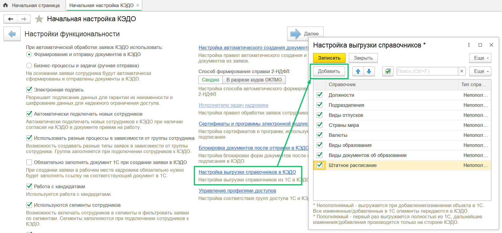

## **Массовое согласование заявок**
В **Рабочее место кадровика** добавлено массовое согласование заявок, в которых нет обязательных незаполненных данных и нет действий возврата на доработку или отказа от подписания. Чтобы согласовать несколько заявок из списка, установите флажки для необходимых заявок на этапе «Проверка» и нажмите кнопку **Подтвердить**.

## **Формирование справки 2-НДФЛ**
В автоматическое формирование справки 2-НДФЛ по заявке сотрудника добавлен способ формирования «В разрезе кодов ОКТМО». Справки будут сформированы по всем местам работы сотрудника за запрошенный год и соединены в один общий pdf-документ, который будет отправлен в заявку. 

Способ формирования справки «В разрезе кодов ОКТМО» можно выбрать на форме **КЭДО → Начальная настройка → Настройки функциональности**, по умолчанию установлен вариант «Сводно».

## **Выгрузка справочников**
При выгрузке справочников «Подразделения» и «Штатное расписание» из 1С в КЭДО теперь не выгружаются расформированные подразделения и закрытые позиции. Также добавлен отбор по организации, в которую выгружается справочник.

Чтобы выгрузить справочники «Подразделения» и «Штатное расписание», необходимо их добавить на форме **Настройка выгрузки справочников** в **КЭДО → Начальная настройка → Настройки функциональности.** 

## **Доступные дни отпуска**
Чтобы избежать расхождения в округлении, общее количество доступных дней отпуска по сотруднику передаётся из 1С в КЭДО как сумма дней (целых чисел) по видам отпусков.

## **Исправления**
1. Исправлена ошибка «Не предусмотрено открытие нескольких конструкторов печатных форм», когда документ 1С был сопоставлен с несколькими бизнес-процессами КЭДО и была одна печатная форма с конструктором.
1. На форме **Сотрудники в управленческой структуре** исправлена ошибка «Данные сотрудника еще не переданы в КЭДО» при отключенном логировании исходящих пакетов по сотрудникам. Чтобы настроить логирование пакетов данных, перейдите в **КЭДО → Начальная настройка → Настройки функциональности.** 

