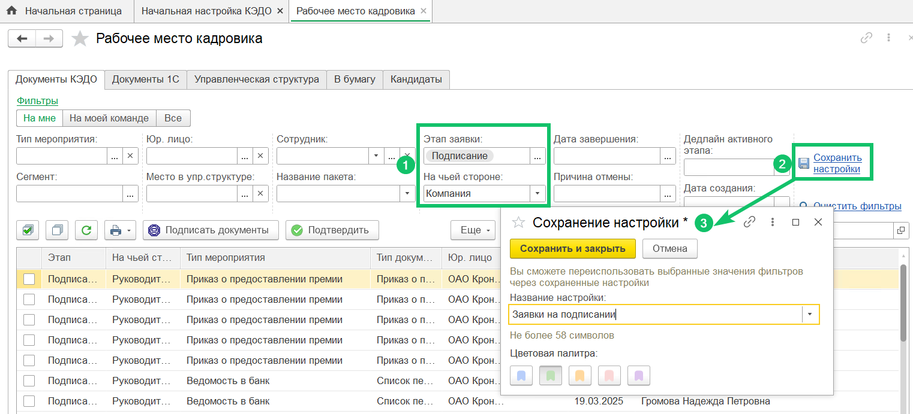
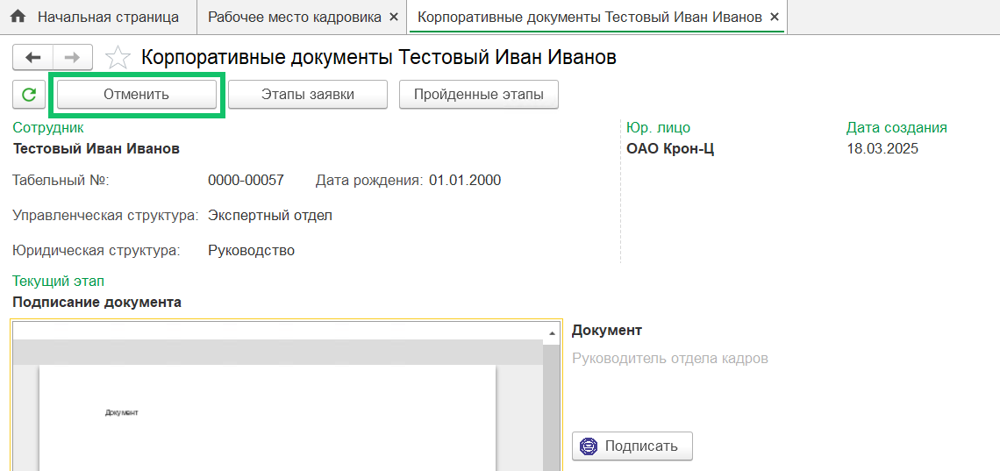
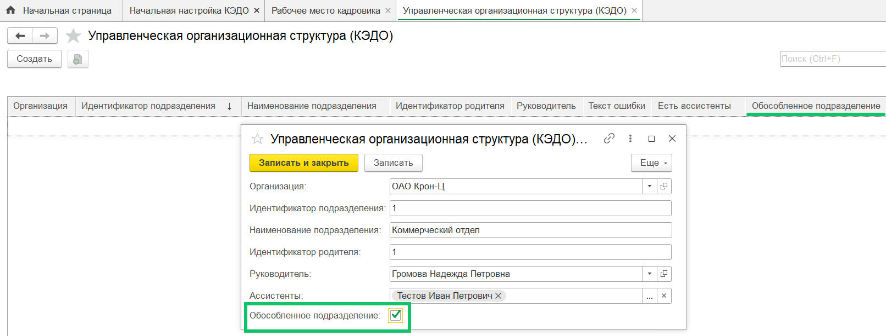
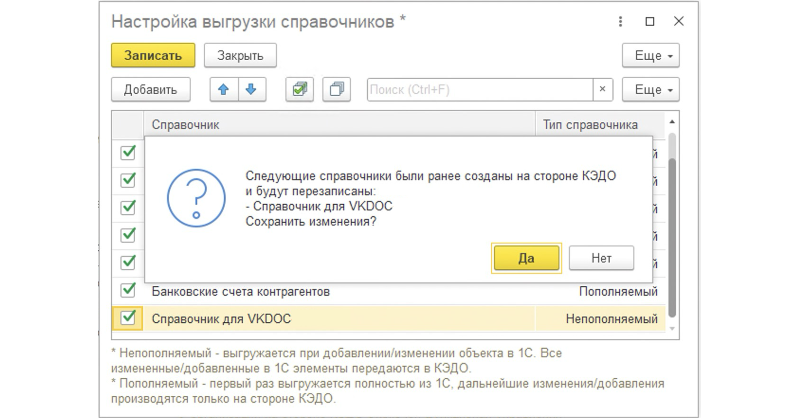
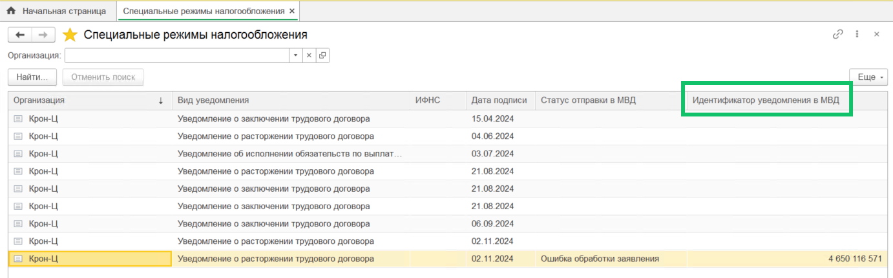

## **Выборка значений из списка заявок**
В **Рабочее место кадровика → Документы КЭДО** добавлено сохранение фильтров в настройки и быстрое заполнение фильтров из ранее сохраненных настроек пользователя.

После установки фильтров нажмите кнопку **Сохранить настройки**, укажите название и выберите цвет для нового фильтра или перезапишите значения фильтра в ранее созданную настройку. Созданные настройки отобразятся над фильтрами заявок.

## **Отмена заявки на определенном этапе**
Видимость кнопки **Отменить** в форме просмотра заявки в **Рабочем месте кадровика** зависит от настройки бизнес-процесса, который связан с заявкой КЭДО.

## **Работа с обособленными подразделениями**
В выгрузку юридической и управленческой оргструктур добавлен признак «Обособленное подразделение». Чтобы добавить этот признак в раздел **Управленческая организационная структура (КЭДО)**, установите флажок **Обособленное подразделение** при создании подразделения.

## **Перезапись справочника в КЭДО**
При включении выгрузки нового справочника из 1С в КЭДО проверяется наличие такого справочника в КЭДО (**КЭДО → Начальная настройка → Настройки функциональности → Настройка выгрузки справочников в КЭДО**). Если справочник был выгружен в КЭДО ранее, появится предупреждение о его перезаписи.

## **Отправка уведомлений в МВД**
В список уведомлений в МВД добавлен вывод номера обращения.

## **Доступ к регистру «Документы отправленные (КЭДО)»**
Убрали возможность ручного удаления записей в регистре **Документы отправленные (КЭДО)** для пользователей без полных прав Администратора 1С.

## **Исправления**
1. Улучшили качество отображения документов в форме просмотра заявки в **Рабочем месте кадровика**.
1. Исправлена ошибка обращения к регистру КЭДО при записи группы доступа без наличия полных прав Администратора 1С.
1. Исправлена ошибка, возникающая при попытке выгрузить документы об увольнении сотрудников как виды отсутствий. Теперь документы об увольнении не выгружаются.

