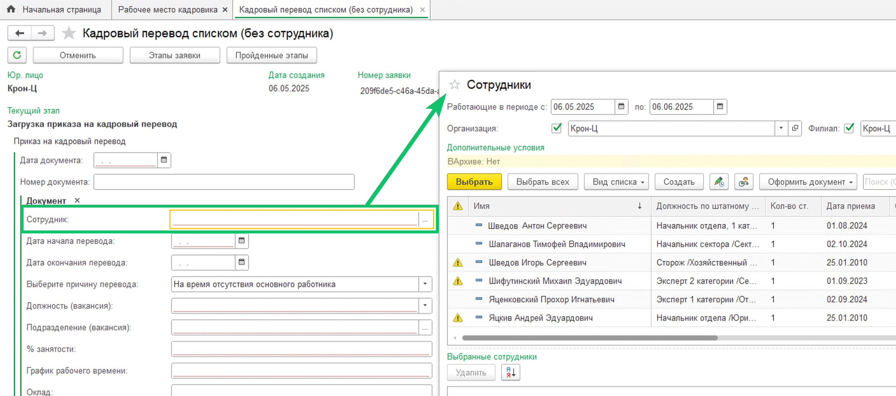

## **Автосоздание документа «Кадровый перевод списком»**
Добавлено автоматическое создание 1С документа «Кадровый перевод списком» по данным заявки КЭДО. В разделе **КЭДО → Начальная настройка → Настройки функциональности** откройте **Настройку автоматического создания документов**, для строки **Кадровый перевод (списком)** установите флаг **Создавать автоматически** и выберите ответственных исполнителей.

Проверьте, что в **КЭДО → Начальная настройка → Соответствие документов** настроено сопоставление документа 1С **Кадровый перевод списком** с доступным типом мероприятия КЭДО.

## **Работа в документе «Отпуск»**
Добавлено заполнение флага **Отпуск** на вкладке **Основной отпуск** в документе «Отпуск», созданном в модуле 1С автоматически по данным заявки КЭДО.

## **Публикация расчётных листков**
В раздел **КЭДО → Публикация расчётных листков** добавлен вывод списка сотрудников, которым будут отправлены расчётные листки в сервис VK HR Tek, раздел **Доходы**. Таким образом, можно отправить расчётные листки отдельным сотрудникам, которые по каким-то причинам не смогли получить их при общей отправке.

## **Массовая отмена заявок**
В **КЭДО → Рабочее место кадровика** добавлена массовая отмена заявок. Массово отменить можно только те заявки, в бизнес-процессах которых на активном этапе возможна отмена.

Для отмены заявок выберите в списке несколько заявок, нажмите кнопку **Отменить** и выберите причину.

## **Статус заявки «В бумагу»**
Добавили новый этап «В бумагу» для заявок, которые были отменены по дедлайну и должны быть проведены в бумажном виде. Теперь в **КЭДО → Рабочее место кадровика** в фильтре **Этап заявки** появилось новое значение «В бумагу».

## **Выбор сотрудника в атрибуте заявки**
На форму мероприятия в **Рабочем месте кадровика** добавлен новый атрибут **Сотрудники**.

## **Этапы заявки**
На форме этапов заявки в **Рабочем месте кадровика** изменено местоположение полосы регулирования масштаба картинки — она перенесена наверх формы над изображением.

## **Количество дней отпуска**
Оставшееся количество дней отпуска по сотрудникам передаётся в КЭДО в дробном виде.
## **Рассылка уведомлений о графиках отпусков**
В очередь с рассылкой уведомлений по графикам отпусков добавлен промежуточный статус «В обработке», чтобы исправить проблему с дублированием уведомлений.

