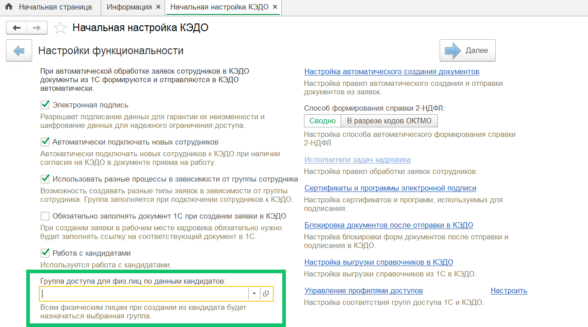

## **Соответствие реквизитов документа 1С и атрибутов заявки**
Добавлена возможность вручную настраивать соответствие реквизитов документа 1С и атрибутов заявки из КЭДО. Для этого в разделе в **КЭДО → Начальная настройка → Настройки функциональности** включите функцию **Использовать соответствие реквизитов**. После этого на форме **Соответствие документов** рядом со столбцом **Документ 1С** появится столбец, включающий ссылку **Соответствие реквизитов**.

 

## **Загрузка документов**
В разделе **КЭДО → Рабочее место кадровика** для заявок с несколькими параллельными этапами «Загрузка» добавлена возможность одновременной загрузки нескольких документов.

## **Ограничение символов в атрибуте заявки**
В **КЭДО → Рабочее место кадровика**, в текстовом поле заявки невозможно ввести лишние символы, если в бизнес-процессе настроено ограничение на максимально допустимую длину текстового атрибута.

## **Превышение доступного количества дней**
В **КЭДО → Рабочее место кадровика**, в заявку на отпуск добавлена подсказка о превышении доступного количества дней отпуска. Предупреждение доступно только в заявках, для бизнес-процессов которых был настроен валидатор, подсчитывающий общее количество дней во всех указанных периодах отсутствия сотрудника. 

## **Фильтр по пакету заявки**
В **КЭДО → Рабочее место кадровика** в фильтр **Название пакета** добавлена возможность выбирать несколько значений.

## **Заявки без сотрудника**
Из документов 1С можно создавать заявки без сотрудника в КЭДО. Для этого достаточно настроить соответствие документа 1С с нужным типом заявки в КЭДО и отправить печатные формы по кнопке **КЭДО**.

 

## **Подключение сотрудника к КЭДО**
Если в административной панели компании настроен способ авторизации по электронной почте (Email), то достаточно заполнить адрес электронной почты сотрудника для подключения к КЭДО. Сотрудник должен будет указывать этот адрес при входе в сервис VK HR Tek.

При этом необязательно заполнять номер телефона сотрудника для подключения к КЭДО.

## **Автоматическое создание документов**
Из **КЭДО → Начальная настройка → Настройки функциональности** убрали настройку, позволяющую включить создание бизнес-процессов по данным заявки в КЭДО.

Теперь по данным заявки всегда будет использоваться автосоздание документов. Настройка автосоздания находится в разделе **КЭДО → Начальная настройка → Настройка функциональности → Настройка автоматического создания документов**.

## **Группа доступа для физических лиц**
В **КЭДО → Начальная настройка → Настройки функциональности** добавлено поле **Группа доступа для физ.лиц по данным кандидатов** для выбора группы доступа, которая будет проставляться по умолчанию всем физическим лицам в компании.

Кадровые специалисты добавляют физических лиц в 1С по данным кандидатов из КЭДО.

## **Исправления**
Исправлена ошибка при обработке данных отсутствий в КЭДО при наличии более одного проведенного документа переноса на один запланированный отпуск.
