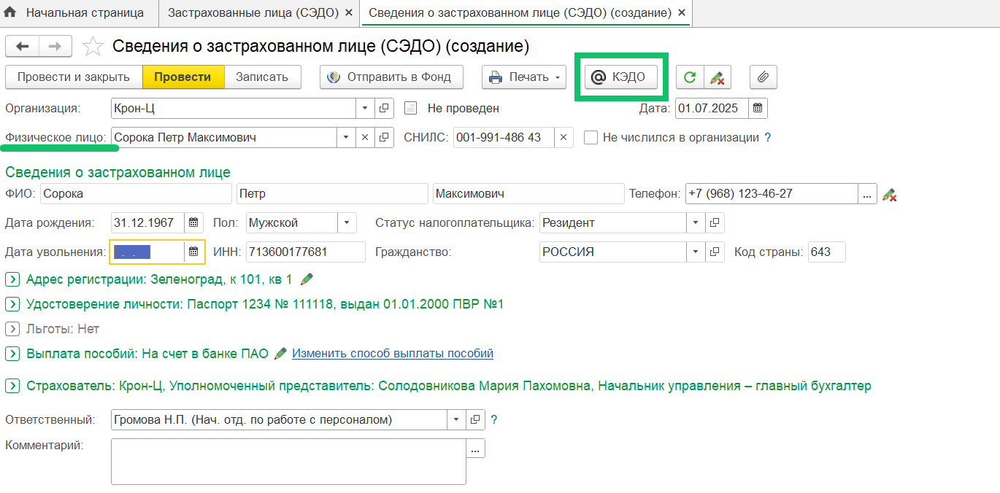
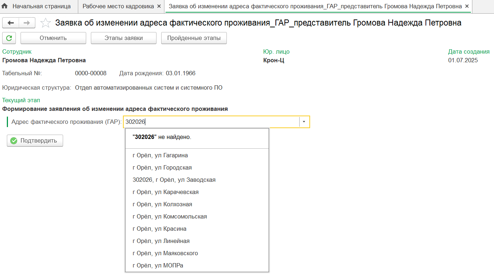
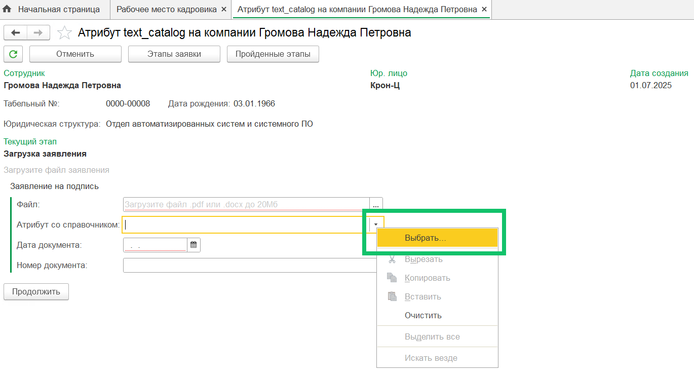
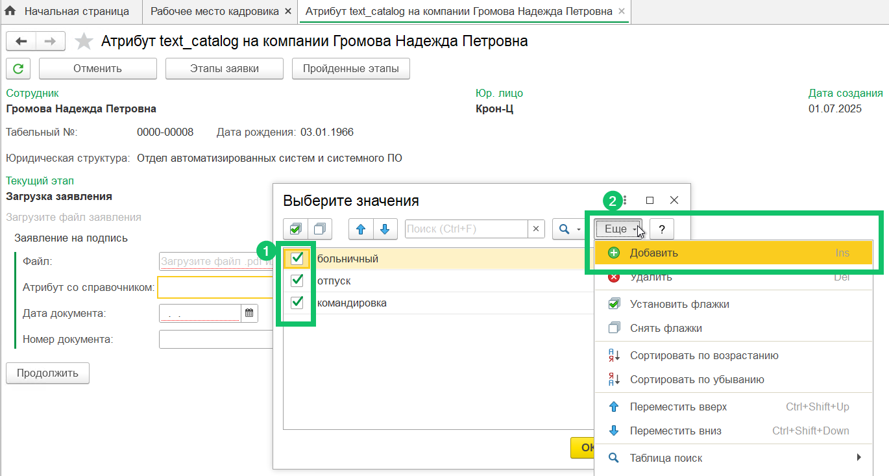
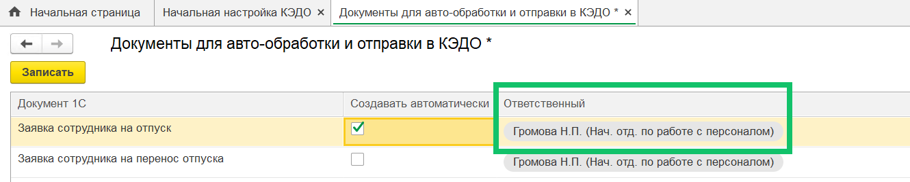
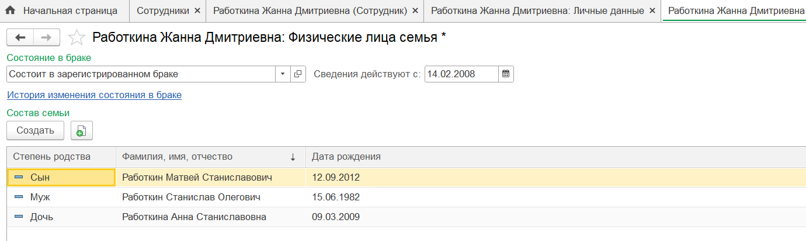
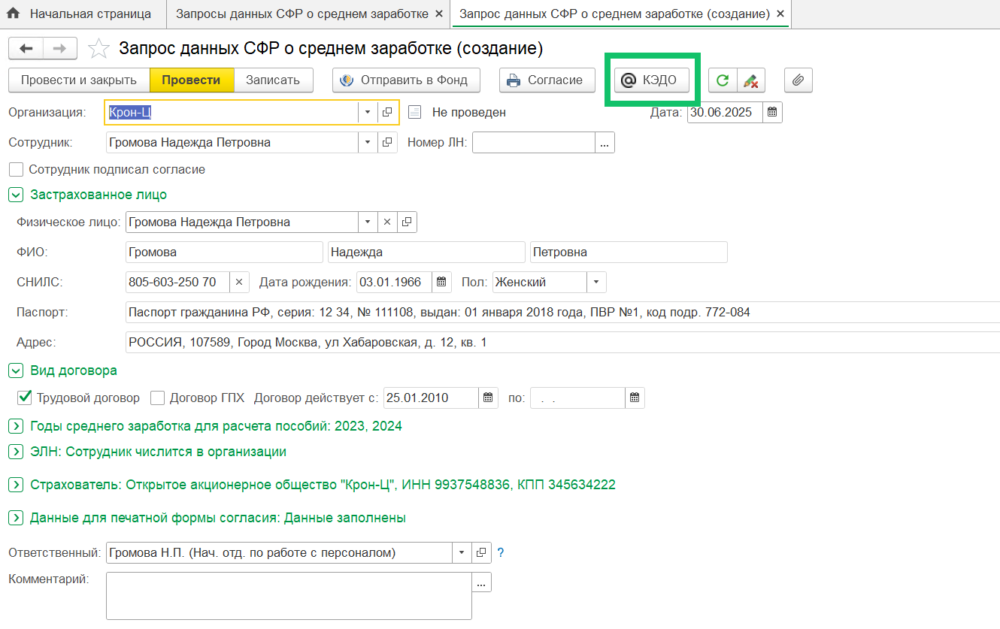
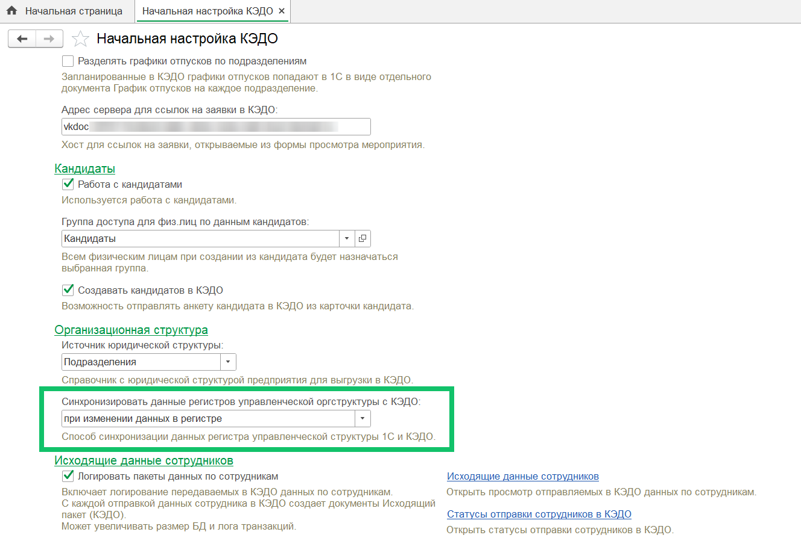

## **Повторная отправка документа в КЭДО**
Добавлена возможность повторно отправлять документы, которые ранее были отправлены из 1С в КЭДО, в другой  бизнес-процесс, т.е. с новым типом заявки. Для этого в разделе **КЭДО → Начальная настройка → Соответствие документов** у документа 1С должно быть настроено соответствие с несколькими типами заявок в КЭДО. При отправке документа в КЭДО нужно выбрать, будет ли производиться действие над ранее отправленной заявкой или создать новую заявку.  

Ограничения:

- Запрещено отправлять повторно списочные документы.
- Отправленные до обновления документы нельзя будет отправить в новые типы заявок, так как по ним нет данных, необходимых для контроля дублей отправки. Документы, отправляемые после установки обновления, можно будет отправлять в несколько типов заявок.
- Если у текущего пользователя нет прав на чтение данных уже созданных из документа 1С заявок, то в списке заявок для выбора могут быть проблемы с отображением заявки.
- Если из документа 1С перейти по ссылке, ведущую на заявку КЭДО, то будет открыта первая попавшаяся заявка в сервисе VK HR Tek.
- Если документ отправлен по одному типу заявки, а сейчас в разделе **КЭДО → Начальная настройка → Соответствие документов** установлено несколько других типов заявок, но нет исходно отправленного типа заявки, то не будут доступны действия над уже отправленным в КЭДО документом, даже если ещё остались активные этапы, так как сопоставление документов 1С и бизнес-процессов КЭДО удалено у исходной группы типов заявок.
- Если выбрано к отправке несколько документов (даже одного вида), каждый из которых уже отправлен в КЭДО, и при этом есть выбор группы типов заявок, то возникнет ошибка, что такие документы нужно отправлять отдельно друг от друга.

## **Отправка данных сотрудника в КЭДО**
Добавлена возможность отправлять из 1С в КЭДО документы, в которых нет реквизита «Сотрудник», но есть реквизит с типом «СправочникСсылка.ФизическиеЛица». В таком случае в заявку КЭДО будет передан документ с данными основного подключенного к КЭДО сотрудника физического лица.

## **Поддержка справочника ГАР в заявке**
В **Рабочем месте кадровика** в заявке можно вводить и выбирать адрес для атрибута типа «Справочник ГАР», если такой атрибут присутствует в бизнес-процессе.

## **Мультивыбор в атрибутах для пополняемых справочников**
В заявке при заполнении поля можно выбирать несколько значений, а также вводить и выбирать новые произвольные значения для атрибута с типом «Пополняемый справочник», если такой атрибут присутствует в бизнес-процессе.

Чтобы добавить в справочник произвольное значение, правой кнопки мыши нажмите на поле атрибута и выберите пункт **Выбрать…** В открывшемся справочнике выберите необходимое количество доступных значений и/или добавьте новое произвольное значение.

## **Документ «Отпуск»**
При автоматическом создании документа «Отпуск» по данным заявки в КЭДО подписант заполняется по данным настроек ответственного пользователя.

## **Персональные данные сотрудника**
В личные данные сотрудника, передаваемые в КЭДО, можно добавлять информацию о семейном положении и составе семьи. 

Для передачи этих данных должна быть включена настройка импорта данных о семье по компании в административной панели КЭДО. Чтобы включить импорт данных о семье, обратитесь в техническую поддержку VK HR Tek support@hrtek.ru.

## **Документ «Запрос данных в СФР о среднем заработке»**
Документ 1С «Запрос данных в СФР о среднем заработке» теперь можно отправлять в КЭДО.

## **Настройки функциональности**
В **КЭДО → Начальная настройка → Настройки функциональности** добавлена настройка **Синхронизировать данные регистров управленческой оргструктуры с КЭДО** для выбора способа обновления управленческой структуры в КЭДО.

Для выбора доступны следующие способы синхронизации:

- при изменении данных в регистре 1С;
- один раз в сутки по регламенту.

Также в разделе **Настройки функциональности** изменён интерфейс формы настроек: некоторые настройки объединены в группы.

## **Исправления**
1. В **Рабочем месте кадровика** вкладка **Кандидаты** стала доступна не только пользователям с ролью «Администратор (КЭДО)», но и пользователям с другими ролями.
1. При загрузке файлов завершенных мероприятий убрано ограничение в 1 000 заявок.
1. После создания массовой рассылки из формы **КЭДО → Рабочее место кадровика** название нового пакета сразу добавляется в список доступных значений фильтра **Название пакета**.
