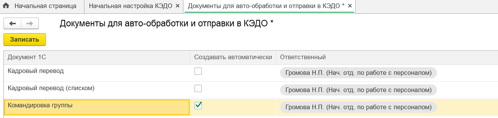
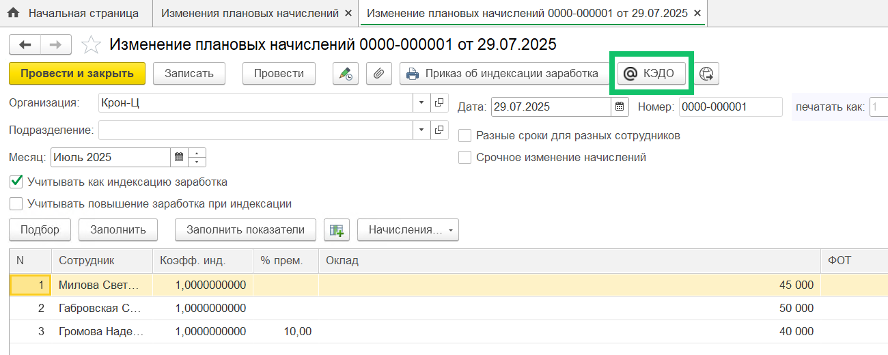
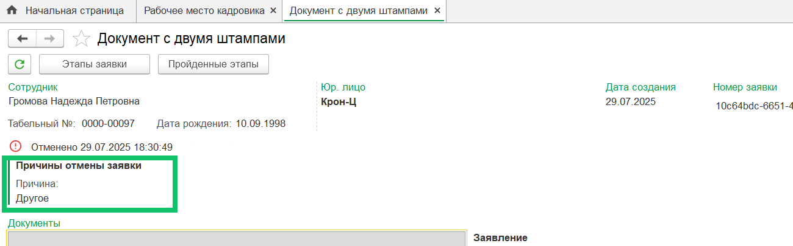
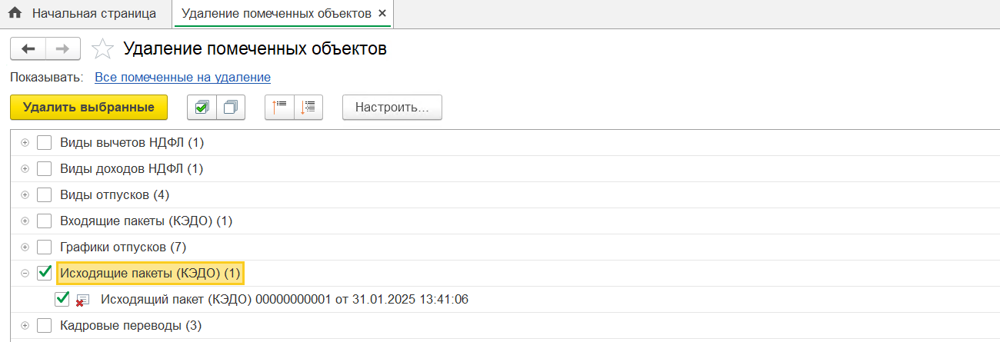
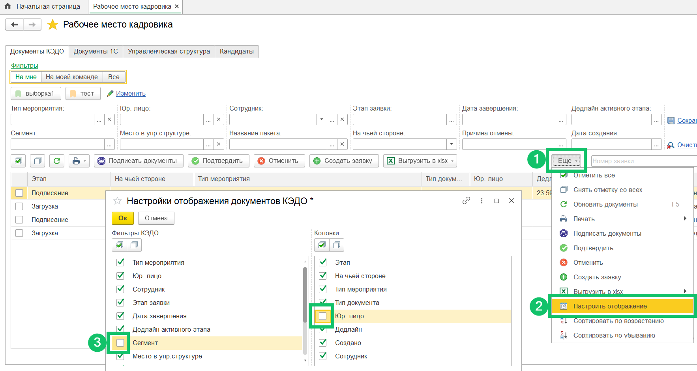

## **Входящие пакеты КЭДО**
В рамках одной компании выгрузка данных из 1С в КЭДО по всем **Входящим пакетам** одного типа выполняется один раз, а не по каждому пакету отдельно.

Например, если в системе есть несколько пакетов с типом "unit_sync" по одной компании в статусе «Новый», то выгрузка организационной структуры будет выполняться один раз, а не по каждому пакету отдельно.

## **Автосоздание документа «Командировка группы»**
Добавлено автоматическое создание 1С документа «Командировка группы» по данным заявки в КЭДО. При этом заявка в КЭДО должна иметь тип «Без сотрудника», а сотрудники в этой заявке должны быть указаны в атрибуте с типом «Сотрудники».

В разделе **КЭДО → Начальная настройка → Настройки функциональности** откройте **Настройку автоматического создания документов**, для строки **Командировка группы** установите флаг **Создавать автоматически** и выберите ответственных исполнителей.

Проверьте, что в **КЭДО → Начальная настройка → Соответствие документов** настроено сопоставление документа 1С «Командировка группы» с доступным типом мероприятия КЭДО.

## **Отправка документа «Изменение плановых начислений» в КЭДО**
Добавлена возможность отправлять из 1С документ «Изменение плановых начислений» в пакетную заявку КЭДО и разделять печатную форму «Приказ об индексации заработной платы» на отдельные печатные формы для каждого сотрудника.

Перед созданием документа необходимо:

1. Проверить, что включена опция **Выполняется индексация заработка сотрудников** в разделе **Настройка → Расчет зарплаты**.
1. Выполнить сопоставление документа 1С «Изменение плановых начислений» с доступным типом мероприятия КЭДО в разделе **КЭДО → Начальная настройка → Соответствие документов**.

## **Отмена заявки**
Если в расширении 1С автоматически отменяется заявка (например, когда пришли неправильные атрибуты в заявке на справку 2-НДФЛ), то в заявке будет указана причина отмены «Другое» вместо причины «Ошибка в данных заявления».

## **Роли пользователей**
Пользователям с ролями «Полные права» и «Администратор (КЭДО)» добавлены права на удаление документов «Исходящий пакет (КЭДО)». 

Чтобы удалить эти документы, перейдите в раздел **Удаление помеченных объектов**, установите флажок напротив нужного названия исходящего пакета и нажмите кнопку **Удалить выбранные**.

## **Расчётные листки**
Расчётные листки будут автоматически переотправляться из 1С в КЭДО, если они находятся в статусе «В процессе». Такая возможность будет доступна только для расчётных листков, отправляемых после обновления расширения 1С на версию 2025.07.00.

Все расчётные листки, оставшиеся в статусе «В процессе» до момента обновления, будут автоматически переведены в статус «Ошибка».

## **Настройки отображения в Рабочем месте кадровика**
Добавлена возможность настраивать видимость колонок таблицы и фильтров в форме **КЭДО → Рабочее место кадровика → Документы КЭДО**.

Чтобы скрыть ненужные колонки и фильтры, перейдите в командную панель **Еще**, выберите пункт **Настроить отображение** и уберите флажки из формы настроек. Произведённые изменения будут сохранены для текущего пользователя при закрытии формы **Рабочее место кадровика**.

## **Подключение сотрудников**
В разделе **КЭДО → Подключение сотрудников** скрыты сотрудники, выполняющие краткосрочную дополнительную работу и по которым оформлен документ «Подработка».

