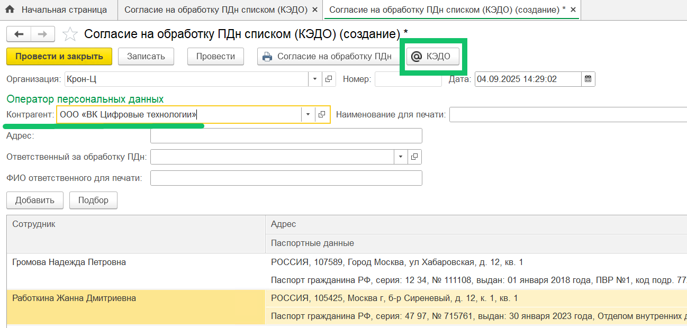

## **Отправка документов в КЭДО**
При создании заявки КЭДО из документа 1С добавлена возможность пропустить необязательные печатные формы.

Если в создаваемом типе заявки есть необязательные печатные формы, то после нажатия кнопки **КЭДО** из документа 1С будет показан список для выбора печатных форм. Необходимо снять флажки с печатных форм, которые не нужно отправлять в КЭДО. Снятие флажков недоступно с обязательных печатных форм.

Настройка бизнес-процесса с необязательными печатными формами является платной. Для подключения обратитесь в [службу поддержки VK HR Tek](/ru/hr/support/contact_channels).

## **Согласие на обработку персональных данных списком**
Добавлен документ «Согласие на обработку ПДн списком (КЭДО)» для получения согласий сотрудников на использование КЭДО по списку сотрудников. Сотрудникам будут отправлены печатные формы этих согласий через пакетную заявку в КЭДО.

В качестве оператора персональных данных в документе нужно выбрать контрагента ООО «ВК Цифровые технологии». По вопросу заполнения данных о контрагенте вы можете обратиться в [службу поддержки VK HR Tek](/ru/hr/support/contact_channels).

Документ доступен пользователям с правами «Рабочее место (КЭДО)», «Администратор (КЭДО)», «Полные права».

## **Графики работы**
Добавлена отправка графиков работы сотрудников из 1С в КЭДО. График работы будет учитываться при создании заявок, связанных с отсутствиями.

Для передачи графиков работы в КЭДО в настройках компании должен быть включен импорт графиков работы в административной панели сервиса VK HR Tek. Для настройки обратитесь в [службу поддержки VK HR Tek](/ru/hr/support/contact_channels).

## **Расчётные листки**
Добавлена возможность публиковать расчётные листки по отдельным подразделениям компании. Для этого в разделе **КЭДО → Публикация расчетных листков** выберите необходимые подразделения, и тогда список сотрудников для публикации будет ограничен только сотрудниками выбранных подразделений.

Выбранные подразделения влияют только на изменение количества сотрудников в **Списке сотрудников для отправки** (под кнопкой **Опубликовать**) и не влияют на данные в таблицах опубликованных расчётных листков и сотрудников.

## **Автоматическое проведение документов**
В **Настройку автоматического создания документов** раздела **КЭДО → Начальная настройка → Настройки функциональности** добавлена опция **Проводить документы**. Включенная опция позволяет автоматически проводить документ 1С после его создания по данным заявки КЭДО. Если документ не удалось провести, то он будет записан.

## **Отправка отсутствий в КЭДО**
Если при отправке отсутствий из 1С в КЭДО возникла ошибка, что данные сотрудника не найдены в КЭДО (ошибка 404), то данные отсутствий будут переотправлены позже — по регламентному заданию после устранения этой ошибки.
