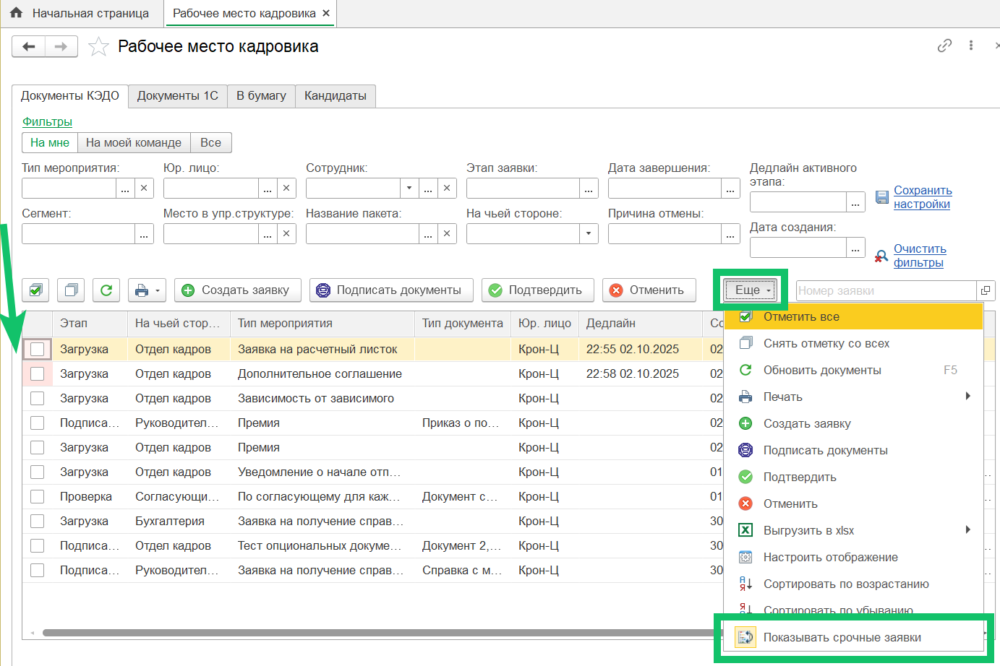
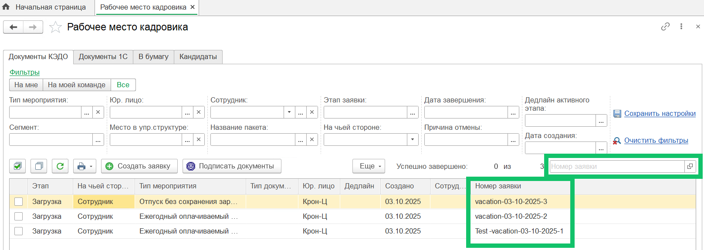
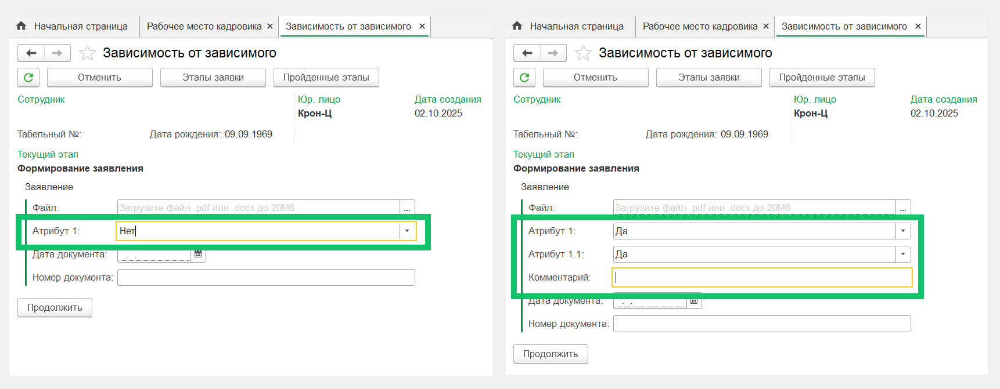
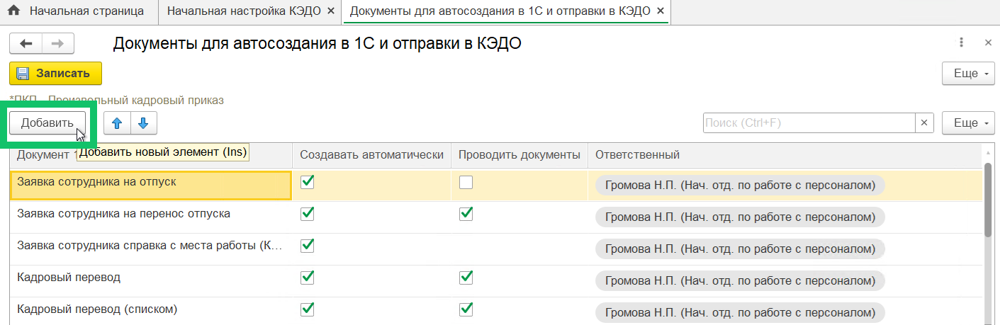

<info>

Новая версия расширения 1С КЭДО была протестирована на платформе 1С:Предприятие 8.3.26 с конфигурацией ЗУП КОРП, ред. 3.1.35.47.

</info>

## **Срочные заявки**
В раздел **КЭДО → Рабочее место кадровика → Документы КЭДО** добавили опцию **Показывать срочные заявки**. По умолчанию опция включена.

Срочные заявки будут показаны в начале списка, а колонка с флажком выбора будет выделена розовым цветом. Внутри этой части списка они сортируются от ближайшей даты дедлайна к более отдалённой.

Чтобы включить или отключить опцию, нажмите кнопку **Еще → Показывать срочные заявки**. 

Срочными считаются заявки, дедлайн которых наступит до 9:00 по Мск утра следующего рабочего дня. В будущем планируем доработку для учёта часового пояса сотрудника. 

 

В веб-сервисе КЭДО работа с [опцией для показа срочных заявок](/ru/release_notes/saas/20250900Core#srochnye_zayavki_24421725) доступна в разделе **Заявки**.

## **Сквозной номер заявки**
Добавили опцию для автоматического присвоения заявкам коротких уникальных номеров — [сквозных номеров](/ru/release_notes/saas/20250900Core#skvoznye_nomera_zayavok_f1227861). 

Сквозные номера заявок отображаются в разделе **КЭДО → Рабочее место кадровика** и на форме мероприятия. В поле для поиска **Номер заявки** специалист может указать одно из значений:

- идентификатор заявки (после корректного ввода откроется форма заявки),
- сквозной номер заявки (после ввода 3-х и более символов, список заявок будет отфильтрован с учётом указанного значения).

Настройка работы со сквозными номерами заявок должна быть включена в КЭДО на стороне компании или группы компаний.

## **Атрибуты в заявках**
В разделе **КЭДО → Рабочее место кадровика**, на форме мероприятия можно просмотреть заявку, для которой настроена [видимость атрибутов](/ru/release_notes/saas/20250900Core#atributy_v_zayavkah_c19120b0) на этапе заявки. Например, видимость атрибута «Комментарий» будет зависеть от выбора значений в предыдущих атрибутах «Атрибут 1» и «Атрибут 1.1».

## **Автоматическое создание документов**
В раздел **КЭДО → Начальная настройка → Настройка автоматического создания документов** можно добавить любой документ в список для автоматического создания документов 1С по данным заявки в КЭДО.

Для добавленного документа 1С должно быть настроено соответствие с документом КЭДО в списке **КЭДО → Начальная настройка → Соответствие документов** и при необходимости — соответствие реквизитов 1С и атрибутов КЭДО.

